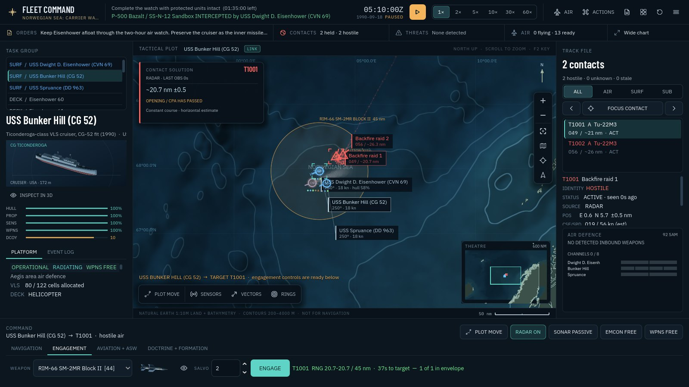

# Naval Fleet Command / Cold War 1990

A naval command game in Godot 4.7.2, inspired by the tactical decisions in classic fleet-command games. Build an uncertain contact picture, protect a convoy, operate a carrier air wing and decide when to commit your weapons. Original art and code; no Jane's assets or affiliation.

## Play

**[Play in your browser → jjnell95.github.io/naval-fleet-command](https://jjnell95.github.io/naval-fleet-command/)**. Nothing to install: it runs in Chrome, Edge, Firefox or Safari on a desktop or laptop with a keyboard. The first visit downloads about 71 MB, which the browser then caches.

Locally, open **Launch Preview.command** for the included browser build, or open `project.godot` in Godot. Choose **Cold War 1990 → Northern Convoy → Read briefing → Take command**. The cargo ship already steers toward its handover box; your first job is protecting it.

The mission desk puts the task, first orders, period, difficulty and estimated play time beside the chart. The briefing separates **Orders & Objectives**, **Situation**, and **Command Reference**. Modern missions and custom scenarios remain available through the era filters. The 1990 conflicts and deployments are alternate history, not historical battles.



## The 1990 operations

| Operation | Command problem | How the mission ends |
|---|---|---|
| Northern Convoy | Two Perry frigates screen a reinforcement merchant against a missile corvette | Cargo reaches the handover; protected losses or the deadline mean defeat |
| The Iceland-Faroe Barrier | Dallas, Spruance and patrol aviation search for a Victor III | Hold the watch or neutralize the boat; a breakout or protected loss means defeat |
| Norwegian Sea: Carrier Watch | Eisenhower's air detachment and Bunker Hill counter a Soviet strike | Survive the watch or remove its named threats; carrier/cruiser loss means defeat |
| Baltic: The Narrow Water | Stop a Sovremennyy while protecting neutral traffic | Neutralize the destroyer before it reaches the exit |

The period catalogue contains **20 platforms, 28 weapons and 25 sensors**, with separate identities so modern equipment cannot enter through a ship's default aircraft or loadout. It includes Perry, Spruance, Ticonderoga, Nimitz, Los Angeles, Victor III, Sovremennyy, Udaloy, Slava, Nanuchka, F-14A+, E-2C, P-3C, S-3A and period ASW helicopters. All have illustrative recognition art and inspectable models.

The complete game retains 15 built-in missions, 94 platform variants, 98 weapon definitions and 106 sensor definitions. Public identities and broad fits are documented in [the historical source and model ledger](docs/COLD_WAR_1990.md). The 20–30 minute play estimates assume time compression and are design estimates; mission deadlines use simulated time.

## Command the force

- **Select and move:** click a friendly symbol or roster row. Press **G**, then click water to plot a route. Shift adds waypoints; Escape cancels. Wheel/pinch zooms; middle/right/Option-drag pans. **Home** fits the force, **C** frames your selection and target, **F** follows it, and **B** expands/restores the chart.
- **Build the picture:** **R** toggles radar, **E** emissions control, **P** active sonar. Contacts begin uncertain and classify through observation. A passive bearing is not a measured range. **N / Shift-N** cycles the current contact filter.
- **Engage:** select a shooter and a held contact, then choose weapon, salvo and **Engage**. Automatic ship defence depends on detection, channels, ammunition, damage and weapons state. Unknown and neutral contacts are not free targets.
- **Fly:** **F3** opens Air Operations. Select a host, aircraft type and quantity, then launch. **Execute & Resume** runs the clock. Choose an airborne airframe and compatible **Land At** destination, then **Return & Land**. Recovery, refuelling and rearming precede relaunch.
- **Manage the watch:** **Space** pauses; **1–6** selects 1×–60× time. Combat interrupts acceleration. The status rail under the top bar opens mission orders, the next filtered contact, an inbound threat, aircraft controls or the wide chart.
- **Find a command:** **Command-K / Control-K** opens Actions from anywhere. **F1** orders and help, **F2** symbol key, **F4** sensors, **F5** trails, **F6** terrain, **F7** fleet gallery, **F8** editor, **F9** missions, **F10** restart (press twice to confirm).

The interface targets a desktop/laptop with keyboard and mouse/trackpad and is laid out for 1600 × 900 or larger; wider windows get a wider chart. Browser play requires WebGL 2. Touch-only phone play is not supported, and the browser build says so before it downloads.

## What realism means here

The game models radar horizons, ESM, passive/active sonar, thermal layers, sonobuoys, uncertain and stale tracks, target-motion estimates, layered defence, channel limits, decoys, damage control, terrain masking, ship turning, aircraft fuel and deck cycles. The AI uses its held tracks and detected threats. A breakout ship keeps its route while building a usable radar picture rather than silently losing its ability to classify and defend.

Historical variants preserve meaningful differences: Perry's shared Mk 13 magazine, Spruance's point defence and ASW role, Bunker Hill's period SPY-1A/SM-2 fit, separate hull and towed-array sonar, and SH-60B sonobuoys without a dipping set. The carrier wing uses F-14A+, E-2C, S-3A and SH-3H; Soviet missiles use period names and variants.

Performance, signatures, magazines, aircraft detachments, hit probabilities and timings remain game estimates. Illustrative models evoke classes, not exact construction drawings. Datalink latency/topology, continuous illumination, mechanical launcher conflicts and some weapon trajectories remain simplified. Rastrub is represented through the existing ASW-weapon mechanic; Tomahawk land attack and Sparrow illumination are omitted from the period loadouts. Logistics, replenishment and save games remain future work. Natural Earth coastlines and bathymetry are generalized, not navigation data.

## Develop and verify

```sh
godot --headless --path . --editor --import --quit
godot --headless --path . --script tests/run_tests.gd      # 319 regression tests
godot --path . -- --cold-war-smoke                          # 29 command-deck checks
godot --path . -- --aviation-smoke                          # 19 air-operations checks
godot --path .
```

GitHub Actions runs the same tests and both interface suites on every pull request (`.github/workflows/tests.yml`).

Regenerate the period resources and scenarios with `python3 tools/scenarios/build_cold_war.py`; the optional geography dependency is pinned in `tools/scenarios/requirements.txt`. Generated files are committed, so playing needs neither Python packages nor network access. `tools/blender/build_platform_art.py` and `build_presentation_assets.py` generate the recognition and gallery art; historical builders live in `cold_war_models.py`.

The repository includes the matching Godot 4.7.2 browser runtime. After changing the game, run `tools/web/build_web.sh` to rebuild `docs/play/index.pck` and record its size in the loader page (set `GODOT=/path/to/Godot` if `godot` is not on your PATH). The loader shell in `docs/play/index.html` and the landing page `docs/index.html` are hand-written and share the game's fonts from `docs/fonts/`. GitHub Pages serves `main:/docs`, so merging to `main` publishes the browser build.

See [the release notes and validation](docs/2026-09-24-cold-war-1990.md), [source ledger](DATA_SOURCES.md), [architecture](ARCHITECTURE.md), and earlier [air operations](docs/2026-09-23-air-operations.md) and [contact fidelity](docs/2026-09-23-contact-fidelity.md) releases. Godot licensing is in `docs/play/GODOT-LICENSE.txt`. No new source-license grant is inferred.
