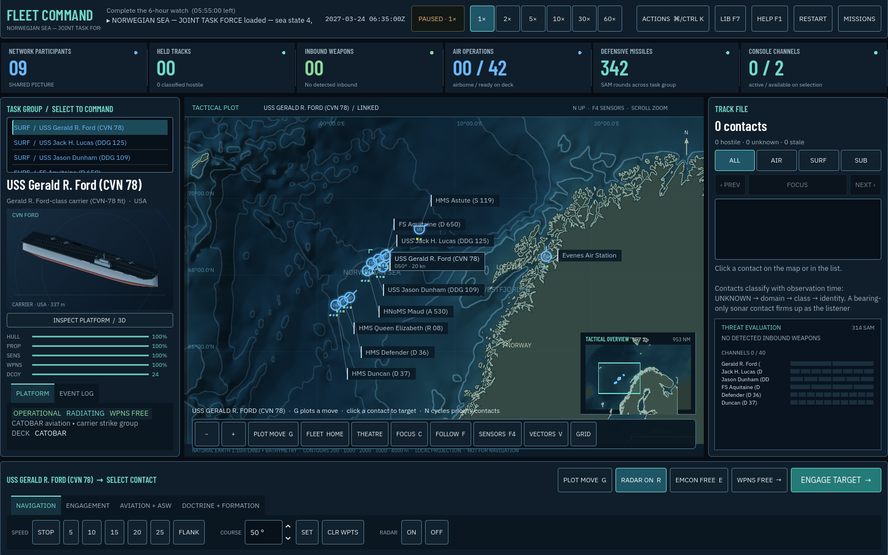
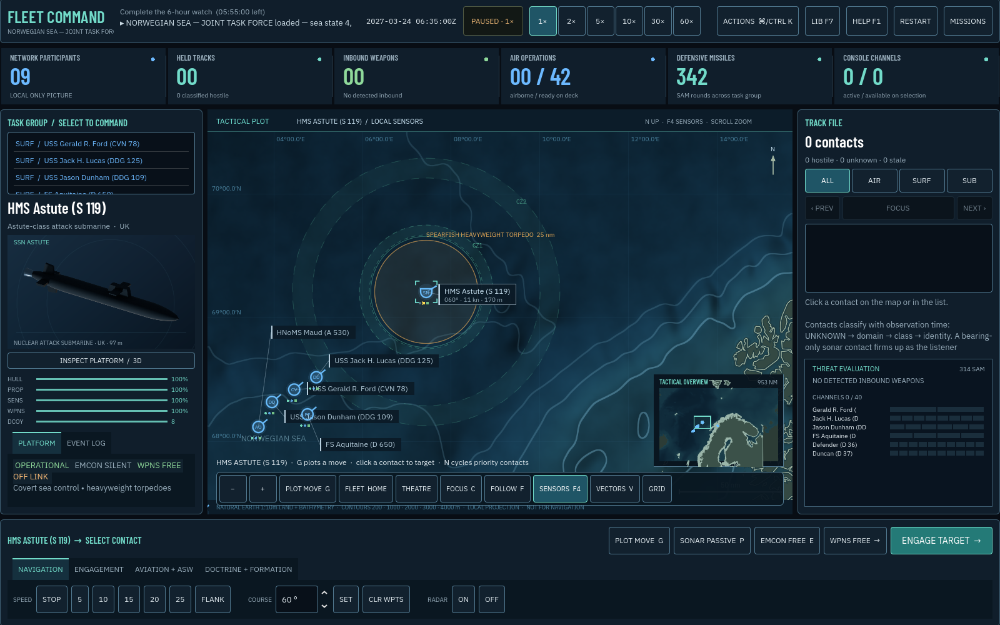
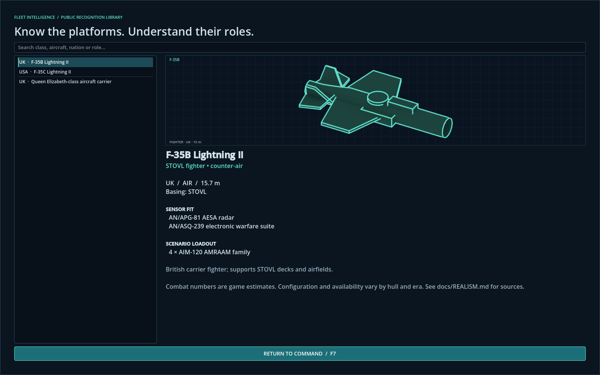

# Naval Fleet Command — Aegis Combat Information Center

[Play in your browser](https://jjnell95.github.io/naval-fleet-command/play/) · [Launch page](https://jjnell95.github.io/naval-fleet-command/)

A modern naval command simulation in Godot 4.7.2. Command a task group through an Aegis-inspired combat information display: build an uncertain picture, manage emissions, hold the screen together and decide when to shoot. Original 3D fleet art, tactical vector graphics, procedural sound and fictional scenarios; no Jane's assets or affiliation.

## M18 the sea floor, the water column and the fight for the ship

**The chart has a bottom.** Natural Earth 1:10m bathymetry (0–5,000 m contours) is interpolated offline into one regional depth raster that every mission reads through its map anchor. The plot now shows shelf and basin tint, relief, and anti-aliased 200/1,000/2,000/3,000/4,000 m contours drawn by a shader behind the symbols. Past the scenario's coastline polygons, the coast carries on, dimmed behind a *Limit of charted coast* neatline, instead of ending in a straight clip line. The Tactical Overview uses the same tint, and the cursor readout gives depth, layer and convergence-zone water.

**The water hides boats.** Each mission sets a March thermal layer: deep in the Norwegian Sea and Iceland Basin, absent on the Barents shelf, and a strong halocline in the Baltic. Sound crossing it loses most of its range. Hull sonars sit above it. Variable-depth bodies (CAPTAS, Sonar 2087), dipping sets and sonobuoys are lowered through it. Shelf water muffles listening and smears pings. In deep basins, large arrays hear loud sources in **convergence zones** 30 and 60 nm out, shown as dashed bands with the sensor layer (F4), and contacts arrive as bearings with a bracketed range. Submarines cannot dive past the floor. The AI hides under the layer and comes up to hold a surface contact, and the player has an **UNDER LAYER** depth order.

**A hit starts a fight for the ship.** Missiles usually start fires and torpedoes flood. Damage control, sized by the ship and weakened by damage, wins or loses over the next hour. A consort within a mile helps, and a ship lost to fire is credited to whoever set it. Knocked-out systems wait until the ship is safe. Burning ships trail smoke downwind. Chaff now **moves** a missile rather than deleting it: a seduced seeker can lock the next ship down its track.





Read [the M18 model, calibration and limits](docs/REALISM_M18.md).

## M17 command-deck UX

The tactical workflow now keeps the next useful action in sight. **Plot Move (G)** is an explicit mode with a live route and land-crossing preview; Shift chains waypoints and Escape or right-click cancels. A clickable **Tactical Overview** shows the current viewport and recentres the main plot, while trackpad pan/pinch, follow mode, force/theatre fits, and group-aware focus make a lost camera easy to recover.

The persistent command dock shows the selected shooter, target, radar, sonar, EMCON and weapons state—including mixed multi-selection state—above the specialist tabs. Contacts are prioritized and can be stepped with **N / Shift-N** or visible Previous/Next buttons. Selecting a contact opens its engagement solution; accepted group orders report a receipt; the inbound-threat banner focuses the most urgent weapon when clicked.

Press **Command-K / Control-K** or **Actions** for a searchable, context-aware command palette. Keyboard focus, visible focus treatment, 44 logical-pixel primary targets at the 1,600 × 1,000 reference canvas, stronger boundaries, modal input isolation, and pause-state restoration were applied throughout the mission flow. See the [M17 UX notes and validation](docs/UX_M17.md).


## M16 geography and realism

All ten missions now use Natural Earth coastline geometry with separate islands and straits, latitude/longitude grids, geographic labels, and clear mission areas. The theatre control restores the full regional view; range rings are optional.

Escort, submarine-hunt, passage-denial and carrier-defence missions have distinct success and failure conditions. Protected ships and civilians matter, supporting aircraft no longer turn every mission into a hunt for the last enemy, and passage-denial missions end on a breakthrough or a completed watch.

Corrected baseline fits include Flight IIA Burkes, Type 45, Nansen, Udaloy, Slava, Gorshkov and Project 20380. An older Project 877 Kilo is separate from Improved Kilo. Standard scenarios no longer assume MQ-25 detachments or prospective frigates. Read the [corrections, public sources and model limits](docs/REALISM_M16.md).

## M14 visual overhaul

**42 platforms and 41 weapons now have original, inspectable 3D models.** Open **Fleet + Ordnance Gallery (F7)**, or use **Inspect Platform / 3D** on a selected unit. Drag to orbit, scroll to zoom, use the profile/plan presets, or enable auto rotation. Click a fitted weapon to inspect it, then click a carrying platform to return. The gallery pauses the mission and restores its previous pause state on exit.

The fleet has coloured hulls, decks, glazing, radar faces and metalwork; revised Burke and F-35 geometry; flight-deck markings; launcher hatches; and distinct missile, torpedo and gun forms. The interface has new typography, rendered unit cards, weapon previews, a redesigned mission menu and quieter map lines. Zoom closer for colour hull and aircraft silhouettes; moving surface ships leave visual wakes. These are illustrative game models, not exact technical replicas. See [the art pipeline](assets/README.md).



## M13 update

The command screen now has a watch overview, clickable fleet roster, domain filters, command tabs and a searchable platform library (**F7**). Try **Northern Vigil** for the new 34-actor joint task group. Read [the fidelity review and sources](docs/REALISM.md) for the 12 new platforms, deck compatibility, protected neutral identities, independent local tracks, unified SAM channels, corrected aircraft art and BMD altitude gates.

## Play

Desktop/laptop with keyboard and mouse, WebGL 2 browser. The engine download is approximately 38 MB, plus the game and fleet-art package. Pick **Aegis Bastion** for the first watch and **Arctic Shield** for the regimental raid, then **Brief and Deploy** and **Take Command**. The game starts at real time. Space pauses; 1–6 changes time speed. Combat events drop acceleration to real time.

- Select a friendly symbol, then press **G** or **Plot Move** and left-click water. Shift appends waypoints; Escape/right-click cancels the tool, while right-clicking a waypoint removes that leg. A ship will not take an order onto land, and the preview turns red beyond the first coast crossing. Wheel/pinch or +/- zooms; middle/right/Option-drag pans; the Tactical Overview recentres by click or drag; Home fits the force, C frames the selection and target, and F follows one platform or the hooked contact. Hover over any symbol, waypoint, or land for a quick card.
- Select the carrier, open **AVIATION + ASW**, and press **Launch** to launch the next ready aircraft (E-2D first, then the fighters and the Growler). Select an airborne aircraft to direct it.
- Select a friendly shooter, then a contact; the Engagement tab opens with weapon, envelope and time-of-flight context. Choose a salvo and **Engage**, or hold Ctrl/Cmd and right-click a contact to use the current legal solution immediately. Use **N / Shift-N** or the contact-panel buttons to cycle the priority stack. Unknown classification matters, and neutral traffic is out there.
- Ship missile defence is automatic, subject to detection, weapon range, channels, ammunition, damage and weapons-hold settings. Ballistic rounds are only met by interceptors built for them.
- R toggles radar; P sonar; E emissions control. F2 toggles the symbol key; F4 sensors; F5 trails; F6 terrain; V vectors; M sound. F1 briefing/help; F7 fleet and ordnance gallery; F8 scenario editor; F9 missions; F10 restart. **Command-K / Control-K** opens common mission actions in a searchable palette. F3 is an explicitly optional debug truth overlay.
- The event log lives under the unit panel. The defence board on the right is the threat-evaluation view: inbound rounds, their targets, time to impact, interceptors up and channel load per ship.

## Build your own missions

Press **Scenario Editor** on the mission menu (or F8). Pick a platform from the palette and click the chart to place it; aircraft attach to the nearest deck or air station of their side. Select a unit to set its callsign, side, heading, speed, depth, radar state and AI posture, tick **Protect** to make its loss end the mission, and use **Patrol** mode to click out a route the AI will fly or sail. Pick **Coast** to trace a coastline: each click drops a point, **Finish** closes it and starts the next, **Undo Point** takes one back, and clicking inside a finished coast selects it for renaming or a new elevation. The editor refuses to place a ship, route a patrol leg or set an objective area on land, and says so before it saves. Choose an objective (hold for a time, destroy every hostile, or reach an area you click in **Area** mode), set the sea state and chart width, then **Save and Play**. Saved missions live in the browser's local storage (`user://scenarios`) and appear in the menu marked *custom*. **Export JSON** gives you the file to share or to commit under `data/scenarios`; **Import JSON** loads one back. Any built-in mission can be opened as a starting point.

## What is implemented

Ten missions including a free-play sandbox; 56 platform types, 58 weapon definitions and 65 sensor definitions. Every mission is sited in real water — the Iceland-Faroe gap, the Faroe-Shetland channel, the Gotland basin, Vestfjorden, the North Cape, the Barents — with coastlines and bases at their real positions. Northern Vigil combines two reduced air wings, a surface group and land-based air detachments at their geographic locations. Default air detachments follow the platform fit; a landing facility does not imply an embarked helicopter.

Radar horizon, passive/active sonar, ESM bearings, uncertain tracks, classification, stale tracks, target-motion analysis, layered missile interception, decoys, fire-control channel limits, gunfire, torpedoes, component damage, ROE, emissions control, datalinks, formations, aircraft launch/recovery/fuel, sonobuoys and opposing AI.

**Coastlines and land masking.** All ten missions use geographic land data. A scenario declares
landmasses as closed polygons in nautical miles, each with a height, and the whole game reads them:

- **Ships stop at the beach.** A hull ordered at a coast follows it rather than grinding into it, and
  a move order onto land is refused with a reason. Aircraft overfly land; a shore air station stands
  on it. The five air stations the scenarios already named now have ground under them.
- **Land masks the picture.** Radar, ESM and sonar are blocked when the ground stands above the line
  between two units, allowing for the same 4/3-earth curvature the radar horizon already used. A
  corvette in the lee of an island is invisible; the aircraft above it is not; a five-metre sandbar
  hides nothing. Sound does not go over a hill at all, so an acoustic path is simply cut.
- **A sea-skimmer dies against a headland.** Weapons that have to stay low — sea-skimming missiles,
  gunfire and torpedoes — are refused at launch with **NO LINE OF FIRE** and terminate against ground
  they meet in flight. A round that cruises at altitude clears it.
- **The AI knows about it.** Goals ashore are stood off into water, a withdrawal or a turn-away picks
  the nearest open bearing rather than the beach, a shadower slides its standoff point around the
  range ring, and a buoy is not dropped on dry land.

Milestone 11 added four systems and eleven actors:

- **Ballistic missile defence.** Rounds carry a flight profile; an aero-ballistic Kinzhal is a different defensive problem from a sea-skimmer and only suitable BMD interceptors can meet it. M13 adds altitude gates: SM-3 cannot engage the existing low aero-ballistic Kinzhal profile.
- **Electronic attack.** A jammer set on the EA-18G Growler degrades every hostile radar within its reach against targets lying in its direction, and is itself the loudest emitter on the air for ESM. The display marks jammed bearings with a `J`.
- **Environment.** Scenarios declare a sea state. A rough sea shortens passive sonar and hides small and sea-skimming radar targets in clutter. The briefing, the header strip and the sonar readouts show it.
- **Damage control.** Ships restore knocked-out subsystems over time to a cap; the hull is not patched. Repair shows as a lamp on the map and a mark on the readiness bars.

New actors: Ticonderoga-class cruiser (Aegis BMD, SM-3, Tomahawk), Constellation-class frigate (SPY-6(V)3), Type 45 (SAMPSON, Aster 30), EA-18G Growler, Slava-class cruiser (Vulkan, Fort), Udaloy-class destroyer, Yasen-M SSN (Kalibr, Zircon), Tu-22M3 with Kh-32, MiG-31K with Kinzhal, Su-35S with R-77, Tu-142 maritime patrol.

A third graphics pass replaces the code-drawn platform pictures with renders of original 3D models built in Blender (`tools/blender/build_platform_art.py`): every one of the 30 platforms has an elevated profile for the recognition card and a plan view for the map, drawn as monochrome line-and-shade and tinted in the display colours, and the map now zooms in far enough to show hull shape at true scale. The same profile heads the hover card over an own ship and previews the platform chosen in the scenario editor. The models are parametric stand-ins that evoke a class, not blueprints. See `assets/README.md`.

A second graphics pass adds living water (a procedural noise surface that grows with sea state), curved fading missile and torpedo trails, hull silhouettes scaled to real length at close zoom, an air-search ring for radars that reach further against aircraft, a firing-solution marker with time of flight when a weapon and a contact are both selected, a stale-track marker, and a red screen-edge flash when one of your ships is hit.

The visual layer was rebuilt: APP-6/NTDS-style frames with platform glyphs, own-ship-centred range rings, animated radar sweeps and sonar pulses, plot histories and trails, engagement and threat vectors with time to impact, transient impact and intercept effects, hover cards, a threat-evaluation defence board, readiness bars, a redesigned front end with an own-force disposition chart, and an after-action report. All sound is synthesised at start-up.

## Realism boundary

An ambitious game foundation, not a high-fidelity replica of real Aegis software. Public names and broad roles are sourced in DATA_SOURCES.md; numerical performance and loadouts are estimates. Carrier air group capacity is deliberately compressed. Carrier sensors are simplified. The renderer uses a local nautical-mile plane anchored to scenario geography; coastlines are generalized Natural Earth 1:10m cartography, not hydrographic or navigation data. Terrain masking is a straight line over a single declared landmass height, not a height field and not a diffraction model. Jamming, ballistic flight and sea-state effects are abstractions with no claim to any real system's behaviour.

Still absent: shoals and grounding on them (the chart has a 1:10m floor, not a navigation chart), a player-set towed-array depth, routing around a peninsula (a ship follows a coast, it does not plan a way round one), terrain-aware interceptor geometry and seeker masking, detailed radar scheduling/illumination, logistics/replenishment, save games, weather beyond sea state. Private observer histories and automatic defence now respect datalink access; manual and automatic SAM engagements share one channel budget. The network has no range, latency, or relay topology. No claim of operational fidelity or calibrated combat probability is made.

## Develop

Open `project.godot` in Godot **4.7.2**. Source and web build are committed together.

```sh
godot --headless --path . --editor --import --quit
godot --headless --path . --script tests/run_tests.gd
godot --path .
```

Install the official matching web export templates, then run `godot --headless --path . --export-release Web`. Pages serves `main:/docs`. Commit the updated `docs/play` build after changes. The engine uses Compatibility rendering, no web threads, and text resources to preserve all sensor/target arrays during export. Any script that declares a new `class_name` needs the import step before a headless run will see it.

## Validation

M18: see [the M18 validation record](docs/validation-m18.json) and [model notes](docs/REALISM_M18.md). New tests cover the raster against its build metadata, known basins and shelves, the floor limit on submarines, cross-layer loss, towed and dipping arrays, buoy depth selection, shelf losses, convergence zones end to end, fused-track precedence, AI depth decisions, fire and flooding dynamics, consort assistance and decoy seduction.

M17: **224 tests pass**, including 16 new interaction-model regressions for priority tracks, overview transforms, shared layer state, Plot Move arming/cancel and terrain legality, safe-area group focus, filtered contact cycling, selection-state truth, downstream order receipts, stowed-aircraft gating, and command-palette filtering/activation. The native command deck was rendered and inspected at 1,600 × 1,000 and at a 1,152 × 720 scaled laptop window; the native integration smoke passes 24 gallery, palette, focus and briefing pause/restore checks. The rebuilt Web package passed mission-menu, briefing, Take Command and Actions-palette checks with a clean browser console. See [M17 UX validation](docs/UX_M17.md).

M14: **190 tests pass**, including all 83 imported models, thumbnails, close-scale labels and weapon-trail privacy. **18 native gallery interaction checks pass**. The command screen, mission menu, aircraft and weapon galleries were captured from the running game. See [M14 verification](docs/VISUALS.md).

M13: 185 tests pass. All ten missions passed two 6,000-second AI smoke runs (seeds 2 and 13). Native UI inspected; browser verification blocked by the approval service usage limit. The prior milestone validation below is historical.


185 tests pass, including a custom-scenario round trip through user storage, ballistic-vs-BMD interceptor selection, directional jamming, sea-state effects, damage-control repair, full actor resolution for the new scenario, and twenty-five terrain tests covering point-in-polygon against a concave cape, elevation-aware masking, acoustic blocking, the launch refusal, a hull driven at a coast, a screen station reflected off it and the reset between scenarios.

Nine scenarios were advanced 30,000 simulated seconds with AI on both sides, seed 2, without script failures and with no unit aground. Every outcome is unchanged from before coastlines existed, checked against the same sweep run on the previous commit: Aegis Bastion, Arctic Shield, Northern Sentry, North Atlantic Shadow Line and the sandbox reach victory; in Arctic Shield the MiG-31Ks fire Kinzhal from standoff, the cruiser detects the rounds at about 95 nm and meets both with SM-3. Atlantic Gate reaches defeat; Baltic Sentinel, GIUK Passage and Northern Shield remain undecided. This is a regression smoke test, not a balance study.

Terrain cost was measured on a coastline the size of the largest shipped scenario — six landmasses, 336 edges: 4.2 µs for a masked sight line inside sensor range, 2.1 µs for a point-in-polygon, 11 ms to build the elevation raster at scenario load. The sensor cycle asks for masking only after a pair has already passed its range test. The web build was loaded in headless Chromium and boots to the mission menu.

Godot engine licensing is in `docs/play/GODOT-LICENSE.txt`. Source ownership remains with the project author; no new license grant is inferred.

## Local review build

On this Mac, double-click `Launch Preview.command`, or run `python3 tools/preview.py`. It opens the packaged browser game on an available localhost port. Keep the terminal running while playing. Open `project.godot` in Godot 4.7.2 for the editable native project.

The repository already contains the matching Godot 4.7.2 JavaScript and WASM runtime. Rebuild the data pack with `Godot --headless --path . --export-pack Web docs/play/index.pck`; update `fileSizes["index.pck"]` in the HTML after changing the pack. A full `--export-release Web` also works when the matching web export templates are installed. See `tools/scenarios/requirements.txt` for optional geography-build dependencies.
