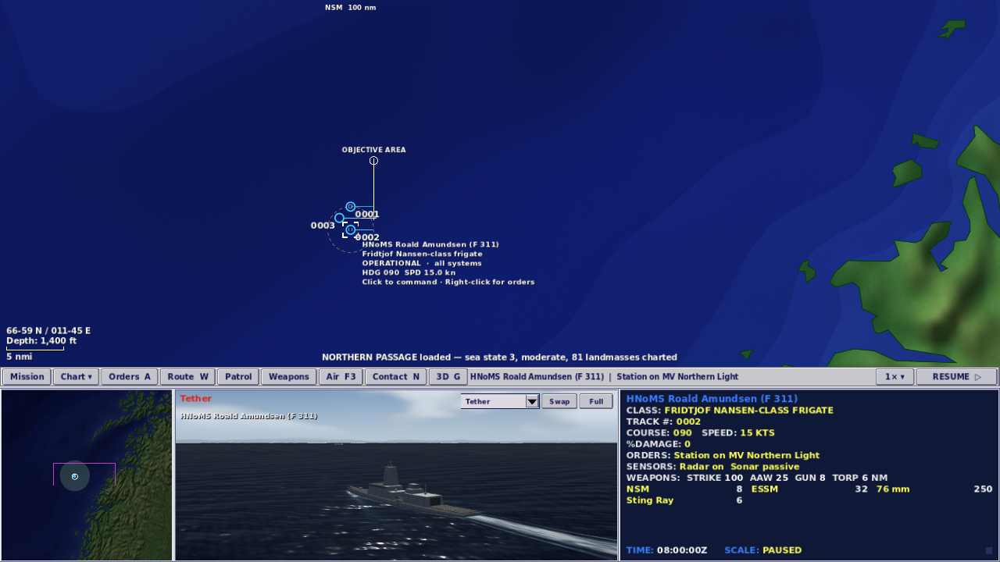

# Naval Fleet Command

**M34 The Command Loop:** hook a ship and right-click a hostile, and it closes to range, chooses the weapon and keeps firing until the contact is destroyed or lost, reporting INTERCEPT TRACK and ENGAGE on its orders line. Right-click an unknown to investigate it; Shift+right-click for the contact menu. The operations desk opens on the authored operations again, every mission ends with a graded **mission effectiveness** percentage, and a commander's log keeps your best result for each. See [why the game still missed Fleet Command, and what changed](docs/2026-10-01-fleet-command-command-loop.md).

**M33 Command Intent:** inspect a contact while retaining your shooter, order a persistent investigation, and fire a stated finite salvo directly from its menu. Mouse-accessible chart, time and camera controls, readable 3D framing, subject captions and scenario-driven clouds and rain connect orders to the battle. See the [Fleet Command research, controls and validation](docs/2026-09-30-fleet-command-intent.md).

**Combat cleanup:** direct Attack and Defence keys, clearer salvo receipts, live missile inspection and corrected interceptor guidance. See the [fixes and validation](docs/2026-09-30-combat-cleanup.md).

**M32 Command Watch:** a quieter relief chart, larger track numbers, persistent command keys, repeating patrol areas and rebuilt Nansen, Gorshkov and Steregushchiy models bring the command screen closer to its late-1990s inspiration. See the [controls, screenshots and validation](docs/2026-09-30-command-watch.md).

**Northern Passage:** start an original escort directly from the operations desk. Protect a freighter over an eight-mile route, investigate with a Seahawk, conserve defensive ammunition and avoid sinking neutral traffic. The debrief includes civilian accountability and the observed event timeline. See the [play guide and validation](docs/2026-09-30-northern-passage.md).

A naval command game in Godot 4.7.2, in the tradition of the late-1990s fleet-command games. Build an uncertain contact picture, protect the force, operate a carrier air wing, and decide when the salvo is worth the missiles. Create missions across the North Atlantic, the Western Pacific, the Gulf and the Mediterranean, in 2027 and in 1990. Original art and code; no Jane's assets or affiliation.

## Play

**[Play in your browser → jjnell95.github.io/naval-fleet-command](https://jjnell95.github.io/naval-fleet-command/)**. Nothing to install: it runs in Chrome, Edge, Firefox or Safari on a desktop or laptop with a keyboard. The first visit downloads the game once and the browser caches it.

Locally, open **Launch Preview.command** for the included browser build, or open `project.godot` in Godot. For the introductory operation, choose **Start Northern Passage**, read the paused briefing, then **Take Command**. The desk opens on **Operations**, the authored missions with their difficulty stars and your best result; **Training** holds the short exercises. To author a mission, use **My Missions**. Choose **Build a Fleet / Edit Mission**, open **Fleet Builder**, set the two forces, then **Save and Play**. Read the briefing before taking command.

The operations desk puts the task, first orders, theatre, difficulty and estimated play time beside the chart. The briefing separates **Orders & Objectives**, **Situation**, and **Command Reference**. All of the conflicts are fiction on real charts.



## Operations

The operations desk opens on the authored operations, as the late-1990s mission lists did: each with its theatre, difficulty stars and, once played, your best effectiveness. **Training** holds the exercises and short engagements; **My Missions** holds what you build.

| Shelf | Missions |
|---|---|
| **Operations · 2027** | North Cape: Ballistic Missile Defence · Barents Sea: Arctic Shield · Norwegian Sea: Joint Task Force · Bashi Channel: Silent Passage · Taiwan Strait: The Picket Line · Spratly Watch: Fiery Cross · Sea of Japan: Northern Guard · Strait of Hormuz: Tanker Transit · Eastern Mediterranean: The Tartus Line |
| **Operations · 1990** | Northern Convoy · The Iceland–Faroe Barrier · Norwegian Sea: Carrier Watch · Baltic: The Narrow Water · Sea of Japan: The Vladivostok Sortie |
| **Training** | Northern Passage · Norwegian Sea: Shadow Line · Gotland Basin · Iceland–Faroe Gap · Faroe–Shetland Channel · Vestfjorden Approaches · Norwegian Sea: Replenishment Group · Vestfjorden Exercise Area · Carrier Qualification |

Every mission ends with a graded **mission effectiveness** from 0 to 100%: the task is worth 60 and is credited only on a win, the force kept 20 and the enemy's points taken 20, with partial credit for damage; each neutral vessel your weapons sink costs 25. Before any civilian penalty, a victory grades between 60 and 100% and a defeat between 0 and 40%; a neutral your weapons damage but do not sink costs a pro-rata share of the 25. Platforms are worth points by type (a carrier 1,000, a destroyer 400, a frigate 250, a fighter 60), and a scenario can set its own. The commander's log in your browser or application storage keeps each mission's best result and date.

Every operation carries a commander's intent, numbered first orders, a difficulty and a play estimate. The Pacific and Gulf operations add coastal missile batteries, long-range SAM sites, ballistic anti-ship missiles, drone salvos, fast-attack-craft swarms, a ski-jump carrier and a Japanese task group under your command. Several give you Tomahawks and a battery ashore to think about: striking it first is a decision with rules of engagement attached, not a reflex.

## The forces

**139 platforms, 148 weapons and 164 sensors** across four catalogues, each with recognition art and an inspectable model:

- **Modern NATO and Russia**: Burke IIA and III, Ticonderoga, Constellation, Nimitz and Ford, Queen Elizabeth, Type 45 and Type 26, FREMM, Horizon, Charles de Gaulle, Mistral, Juan Carlos I, Nansen, Iver Huitfeldt, Sachsen, Braunschweig, Visby, Virginia, Astute, Suffren, Gotland; Gorshkov, Grigorovich, Slava, Udaloy, Steregushchiy, Buyan-M, Yasen-M, Kilo; carrier and land-based aviation on both sides.
- **PLAN**: Type 055, Type 052D, Type 054A, Type 056A, Type 022, the carrier Shandong with J-15s, Type 093B and Type 039A submarines, H-6J, J-16, KJ-500, Y-8Q, four helicopter types, a replenishment ship, YJ-12B and DF-21D batteries and an HQ-9B site.
- **Japan**: Maya, Akizuki, Mogami, the Izumo after her F-35B conversion, Taigei, P-1, SH-60K, F-35B and F-2, and a Type 12 coastal battery.
- **Iran**: Moudge and Alvand frigates, an export Kilo, Ghadir midget submarines, Peykaap III and Houdong craft, Mohajer-6, Qader and Khalij Fars batteries, a drone launch site and a Bavar-373 site.
- **1990**: Perry, Spruance, Ticonderoga, Nimitz, Los Angeles, Victor III, Sovremennyy, Udaloy, Slava, Nanuchka, F-14A+, E-2C, P-3C, S-3A and period helicopters, with their own weapons and sensors so nothing modern leaks in.

Public identities and broad fits are documented in the [2027 theatres ledger](docs/THEATRES_2027.md), the [1990 ledger](docs/COLD_WAR_1990.md) and [DATA_SOURCES.md](DATA_SOURCES.md). Performance values, signatures, magazines, detachments and hit probabilities are game estimates.

## Command the force

The command screen is laid out the way the late-1990s fleet-command games laid theirs out: the relief-shaded tactical chart across the top two-thirds of the window, and along the bottom the regional map, the 3D view of the hooked platform and the data display.

- **Patrol:** hook a deployed platform, choose **Patrol** on the command strip (or **Shift+W**), then click two opposite corners. The circuit repeats until retasked; aircraft still use fuel and return at bingo. The preview checks land and turning room. Right-click or Escape cancels drawing.
- **Hook and move:** left-click a symbol to hook it (Shift adds). **Right-click water** to send the hooked platform there at once; Shift+right-click adds a waypoint. **W** arms a multi-leg route. Right-drag, middle-drag or the arrow keys pan; the wheel zooms. **Home** fits the force, **C** centres the hook and its target, **F** follows it, **.** hooks the next own platform.
- **Give orders:** **right-click your own platform** for its Orders menu (speed, course, altitude or depth, sensors, EMCON, weapons state, flight deck, formation, route). **R** radar, **P** active sonar, **E** emission control.
- **Respond to an attack:** **Defence** on the command strip opens defensive controls; your platform's right-click menu also includes them. **D** deploys a radar countermeasure pack; **V** orders evasion against a detected inbound weapon. The **Defence** tab on the orders board adds infrared and acoustic packs, run-away steering, resume-plan, automatic/manual countermeasures and Conserve/Balanced/Saturation interceptor policies. Stores, active windows and reload times are finite. Evasion keeps the existing route and formation assignment.
- **Command large groups:** **J** opens Fleet Operations with group readiness, station error, defensive ammunition and group orders. **Ctrl+1 to 9** stores a selection and **Alt+1 to 9** recalls it. Screen, column, abreast, wedge and dispersed formations grow to fit the selection, pace slower consorts and pass command after a flagship is lost.
- **Attack:** hook a platform (or several) and **right-click a hostile contact**. The cursor shows a cross when a right-click will attack. Each platform closes to its best weapon's range (the orders line reads **Intercept track**), fires a salvo, waits for it to land and reads the plot, and fires again until the contact is destroyed or lost, its magazines are empty or weapons are put on hold; when one weapon runs out it moves on to the next. A move, course, stop, route, patrol, formation or investigate order replaces the attack; a speed order sets its closing speed, and evasion only pauses it. It never fires on a stale plot. An unclassified contact is investigated instead, and a neutral, a friendly or a classified contact of unknown allegiance gets the menu.
- **Engage:** **Shift+right-click a contact** for its menu: **Attack track N**, **Attack with** a chosen weapon, a ready **Fire N × weapon**, **Engage with** weapon and salvo, or choose **Attack** on the command strip for the firing board. Each system shows available, queued and airborne rounds; group salvo quantities apply per eligible platform. Hover a plotted weapon for its course and speed; own rounds also show shooter, target, estimated time and remaining range. Unknown and neutral contacts are not free targets. Land-attack rounds can be fired at a battery or an airfield once it is classified.
- **Inspect and investigate:** clicking a contact updates its data and 3D view while retaining your selected shooter. **Right-click an unresolved contact** to investigate it (the cursor shows a query mark): the platform follows the held plot until classification or loss. Use a reconnaissance aircraft to keep escorts on station. A ready **Fire N × weapon** choice gives a direct finite salvo; blocked shots state why. Click your own platform to restore its view.
- **Mouse controls:** **Chart** opens silhouettes, labels, symbol explanations, ranges, zoom and framing. The time menu beside Pause selects acceleration while preserving pause. The live view exposes camera selection, Swap and Full/Back controls.
- **Build the picture:** contacts begin uncertain and classify through observation. A passive bearing is not a measured range. **N / Shift-N** cycles priority contacts. **Tab** switches NTDS and graphic symbols; **Shift-V / K / I** toggle velocity leaders, track numbers and tags.
- **Read the data display:** the hooked platform's class, track number, course, speed, damage, orders, sensors and weapons (the hull's reach for each job, then every system and its rounds in columns, strike first), or a contact as held, or the mission's tasking with nothing hooked. Its footer carries the watch time and the time scale (click them to pause or step the scale) and a lamp that flashes for new warnings.
- **See it:** the 3D view follows the hook. **T** cycles the cameras: **F9** tether, **F11** fly-by, **F12** action, **F8** detached. **G** swaps the chart and the 3D view; **F10** gives the 3D view the whole window, with sun shadows. After dark, ships show their navigation lights on their proper arcs, so the lights alone say which way a ship is heading.
- **Fly:** **F3** opens Air Operations. Select a host, aircraft type and quantity, then launch. Choose an airborne airframe and a compatible **Land At** destination, then **Return & Land**. Recovery, refuelling and rearming precede relaunch.
- **Status boards:** **A** opens the orders board, the task group (roster, readiness, event log), the track file (with the air-defence board) and the comms history over the chart. The game keeps running.
- **Manage the watch:** **Space** pauses; **1–6** selects 1×–60× time. Combat interrupts acceleration. Radio traffic reads along the bottom of the chart, and whoever is talking is ringed in white.
- **Find a command:** **H** lists every key command. **Command-K / Control-K** opens Actions from anywhere. Right-click the chart with nothing hooked for the display and screens menu. **F1** orders and help, **F2** symbol key, **F4** sensors, **F5** trails, **F6** relief shading, **F7** reference, **M** missions, **Ctrl-E** editor, **Ctrl-F10** restart (press twice to confirm), **Ctrl-M** sound.

The interface targets a desktop/laptop with keyboard and mouse/trackpad and is laid out for 1600 × 900 or larger. Browser play requires WebGL 2. Touch-only phone play is not supported, and the browser build says so before it downloads.

## What realism means here

The game models radar horizons, ESM, passive/active sonar, thermal layers, sonobuoys, uncertain and stale tracks, target-motion estimates, layered defence, channel limits, chaff against missiles and acoustic decoys and anti-torpedo rounds against torpedoes, damage control, terrain masking, ship turning, aircraft fuel and deck cycles. The AI uses its held tracks and detected threats. Installations ashore stand on their ground: a battery on a headland sees the sea it faces, fires out over its own coast, and is hidden from the other side.

Four chart regions are built from Natural Earth 1:10m land and bathymetry: the North Atlantic with the Norwegian, Barents and Baltic seas; the Western Pacific from the Sea of Japan to the South China Sea; the Arabian Sea with the Gulf and the Red Sea; and the Mediterranean. Each has a continuous sea floor for the water column and the chart. The reclaimed Spratly outposts are added as approximate footprints because the dataset predates them. Natural Earth is generalized cartography, not navigation data.

Datalink latency and topology, continuous illumination, mechanical launcher conflicts and some weapon trajectories remain simplified. Ballistic anti-ship missiles fly a single abstract profile. Drone swarms are a generic one-way attack drone fired in salvos. Logistics, replenishment, mine warfare and save games remain future work.

## Develop and verify

```sh
godot --headless --path . --editor --import --quit
godot --headless --path . --script tests/run_tests.gd      # regression tests
godot --headless --path . --script tests/run_tests.gd -- --only=test_attack.gd,test_cds.gd   # a few files
godot --path . -- --cold-war-smoke                          # 47 command-screen checks
godot --path . -- --aviation-smoke                          # 19 air-operations checks
godot --path . -- --fleet-workshop-smoke                    # 34 authoring and defensive-control checks
godot --path . -- --weapon-control-smoke                   # 24 weapon-control checks
python3 tools/verify_northern_passage.py "$(command -v godot)" # real-scene outcomes and replay
godot --path . -- --scenario=res://data/scenarios/northern_vigil.json --fastforward=2400 --run --perf=8   # frame budget
godot --path .
```

GitHub Actions runs the regression, command, aviation, workshop and weapon-control suites on every pull request, plus Command Watch mouse/patrol checks, Northern Passage outcomes/replay and graphical checks at 1280 × 720 and 1920 × 1080 (`.github/workflows/tests.yml`).

Regenerate the scenarios with `python3 tools/scenarios/build_scenarios.py`, `build_cold_war.py`, `build_theatres.py` and `build_northern_passage.py`; each validates every start position, patrol leg and objective against the shipped coastline before writing. The regional coastline extractions and sea-floor rasters come from `tools/scenarios/import_coastlines.py` and `import_bathymetry.py` over the Natural Earth downloads named in `tools/scenarios/regions.py`. Generated files are committed, so playing needs neither Python packages nor network access. `tools/art/` builds the models and renders the recognition art without Blender; `tools/blender/` holds the earlier pipeline.

The repository includes the matching Godot 4.7.2 browser runtime. After changing the game, run `tools/web/build_web.sh` to rebuild `docs/play/index.pck` and record its size in the loader page (set `GODOT=/path/to/Godot` if `godot` is not on your PATH). GitHub Pages serves `main:/docs`, so merging to `main` publishes the browser build.

See [the release notes](docs/2026-09-27-world-theatres.md), [architecture](ARCHITECTURE.md) and the source ledgers. Godot licensing is in `docs/play/GODOT-LICENSE.txt`. No new source-license grant is inferred.
