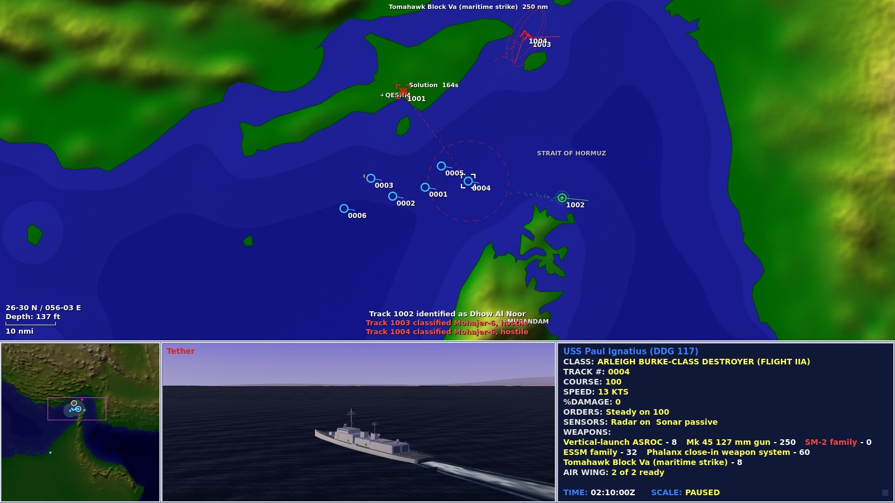

# Naval Fleet Command

**M26 Final QC:** every screen reviewed, the frame budget measured and the chart's frame cost roughly halved in the largest operations, track numbers placed clear of one another, the surviving screen defects fixed, and the console, tests, code and docs cleared of noise. The Jane's-style CDS interface is unchanged. See the [QC notes](docs/2026-09-28-final-qc.md) and [validation](docs/validation-m26.json); M25's [fleet operations](docs/2026-09-27-fleet-operations.md) are the last content change.

A naval command game in Godot 4.7.2, in the tradition of the late-1990s fleet-command games. Build an uncertain contact picture, protect the convoy, operate a carrier air wing, and decide when the salvo is worth the missiles. Twenty-two operations across the North Atlantic, the Western Pacific, the Gulf and the Mediterranean, in 2027 and in 1990. Original art and code; no Jane's assets or affiliation.

## Play

**[Play in your browser → jjnell95.github.io/naval-fleet-command](https://jjnell95.github.io/naval-fleet-command/)**. Nothing to install: it runs in Chrome, Edge, Firefox or Safari on a desktop or laptop with a keyboard. The first visit downloads the game once and the browser caches it.

Locally, open **Launch Preview.command** for the included browser build, or open `project.godot` in Godot. Choose an operation from one of the shelves on the operations desk, read the briefing, then take command.

The operations desk puts the task, first orders, theatre, difficulty and estimated play time beside the chart. The briefing separates **Orders & Objectives**, **Situation**, and **Command Reference**. All of the conflicts are fiction on real charts.



## The operations

| Shelf | Operations |
|---|---|
| **Cold War 1990** | Northern Convoy · The Iceland–Faroe Barrier · Norwegian Sea: Carrier Watch · Baltic: The Narrow Water · Sea of Japan: The Vladivostok Sortie |
| **North Atlantic 2027** | Norwegian Sea: Shadow Line · Gotland Basin · Iceland–Faroe Gap · Faroe–Shetland Channel · Vestfjorden Approaches · Norwegian Sea: Replenishment Group · North Cape: Ballistic Missile Defence · Barents Sea: Arctic Shield · Norwegian Sea: Joint Task Force · Vestfjorden Exercise Area · Carrier Qualification |
| **Western Pacific 2027** | Bashi Channel: Silent Passage · Taiwan Strait: The Picket Line · Spratly Watch: Fiery Cross · Sea of Japan: Northern Guard |
| **Gulf & Mediterranean 2027** | Strait of Hormuz: Tanker Transit · Eastern Mediterranean: The Tartus Line |

Every operation carries a commander's intent, three first orders, a difficulty and a play estimate. The Pacific and Gulf operations add coastal missile batteries, long-range SAM sites, ballistic anti-ship missiles, drone salvos, fast-attack-craft swarms, a ski-jump carrier and a Japanese task group under your command. Several give you Tomahawks and a battery ashore to think about: striking it first is a decision with rules of engagement attached, not a reflex.

## The forces

**139 platforms, 141 weapons and 164 sensors** across four catalogues, each with recognition art and an inspectable model:

- **Modern NATO and Russia**: Burke IIA and III, Ticonderoga, Constellation, Nimitz and Ford, Queen Elizabeth, Type 45 and Type 26, FREMM, Horizon, Charles de Gaulle, Mistral, Juan Carlos I, Nansen, Iver Huitfeldt, Sachsen, Braunschweig, Visby, Virginia, Astute, Suffren, Gotland; Gorshkov, Grigorovich, Slava, Udaloy, Steregushchiy, Buyan-M, Yasen-M, Kilo; carrier and land-based aviation on both sides.
- **PLAN**: Type 055, Type 052D, Type 054A, Type 056A, Type 022, the carrier Shandong with J-15s, Type 093B and Type 039A submarines, H-6J, J-16, KJ-500, Y-8Q, four helicopter types, a replenishment ship, YJ-12B and DF-21D batteries and an HQ-9B site.
- **Japan**: Maya, Akizuki, Mogami, the Izumo after her F-35B conversion, Taigei, P-1, SH-60K, F-35B and F-2, and a Type 12 coastal battery.
- **Iran**: Moudge and Alvand frigates, an export Kilo, Ghadir midget submarines, Peykaap III and Houdong craft, Mohajer-6, Qader and Khalij Fars batteries, a drone launch site and a Bavar-373 site.
- **1990**: Perry, Spruance, Ticonderoga, Nimitz, Los Angeles, Victor III, Sovremennyy, Udaloy, Slava, Nanuchka, F-14A+, E-2C, P-3C, S-3A and period helicopters, with their own weapons and sensors so nothing modern leaks in.

Public identities and broad fits are documented in the [2027 theatres ledger](docs/THEATRES_2027.md), the [1990 ledger](docs/COLD_WAR_1990.md) and [DATA_SOURCES.md](DATA_SOURCES.md). Performance values, signatures, magazines, detachments and hit probabilities are game estimates.

## Command the force

The command screen is laid out the way the late-1990s fleet-command games laid theirs out: the relief-shaded tactical chart across the top two-thirds of the window, and along the bottom the regional map, the 3D view of the hooked platform and the data display.

- **Hook and move:** left-click a symbol to hook it (Shift adds). **Right-click water** to send the hooked platform there at once; Shift+right-click adds a waypoint. **W** arms a multi-leg route. Right-drag, middle-drag or the arrow keys pan; the wheel zooms. **Home** fits the force, **C** centres the hook and its target, **F** follows it, **.** hooks the next own platform.
- **Give orders:** **right-click your own platform** for its Orders menu (speed, course, altitude or depth, sensors, EMCON, weapons state, flight deck, formation, route). **R** radar, **P** active sonar, **E** emission control.
- **Engage:** hook a shooter, then **right-click a contact** for **Engage with**: the weapons that suit it, each with its rounds and a salvo size. Unknown and neutral contacts are not free targets. Land-attack rounds can be fired at a battery or an airfield once it is classified.
- **Build the picture:** contacts begin uncertain and classify through observation. A passive bearing is not a measured range. **N / Shift-N** cycles priority contacts. **Tab** switches NTDS and graphic symbols; **Shift-V / K / I** toggle velocity leaders, track numbers and tags.
- **Read the data display:** the hooked platform's class, track number, course, speed, damage, orders, sensors and weapons (with the hull's reach for each job), or a contact as held, or the mission's tasking with nothing hooked. Its footer carries the watch time and the time scale (click them to pause or step the scale) and a lamp that flashes for new warnings.
- **See it:** the 3D view follows the hook. **T** cycles the cameras: **F9** tether, **F11** fly-by, **F12** action, **F8** detached. **G** swaps the chart and the 3D view; **F10** gives the 3D view the whole window.
- **Fly:** **F3** opens Air Operations. Select a host, aircraft type and quantity, then launch. Choose an airborne airframe and a compatible **Land At** destination, then **Return & Land**. Recovery, refuelling and rearming precede relaunch.
- **Status boards:** **A** opens the orders board, the task group (roster, readiness, event log), the track file (with the air-defence board) and the comms history over the chart. The game keeps running.
- **Manage the watch:** **Space** pauses; **1–6** selects 1×–60× time. Combat interrupts acceleration. Radio traffic reads along the bottom of the chart, and whoever is talking is ringed in white.
- **Find a command:** **H** lists every key command. **Command-K / Control-K** opens Actions from anywhere. Right-click the chart with nothing hooked for the display and screens menu. **F1** orders and help, **F2** symbol key, **F4** sensors, **F5** trails, **F6** relief shading, **F7** reference, **M** missions, **Ctrl-E** editor, **Ctrl-F10** restart (press twice to confirm), **Ctrl-M** sound.

The interface targets a desktop/laptop with keyboard and mouse/trackpad and is laid out for 1600 × 900 or larger. Browser play requires WebGL 2. Touch-only phone play is not supported, and the browser build says so before it downloads.

## What realism means here

The game models radar horizons, ESM, passive/active sonar, thermal layers, sonobuoys, uncertain and stale tracks, target-motion estimates, layered defence, channel limits, decoys, damage control, terrain masking, ship turning, aircraft fuel and deck cycles. The AI uses its held tracks and detected threats. Installations ashore stand on their ground: a battery on a headland sees the sea it faces, fires out over its own coast, and is hidden from the other side.

Four chart regions are built from Natural Earth 1:10m land and bathymetry: the North Atlantic with the Norwegian, Barents and Baltic seas; the Western Pacific from the Sea of Japan to the South China Sea; the Arabian Sea with the Gulf and the Red Sea; and the Mediterranean. Each has a continuous sea floor for the water column and the chart. The reclaimed Spratly outposts are added as approximate footprints because the dataset predates them. Natural Earth is generalized cartography, not navigation data.

Datalink latency and topology, continuous illumination, mechanical launcher conflicts and some weapon trajectories remain simplified. Ballistic anti-ship missiles fly a single abstract profile. Drone swarms are a generic one-way attack drone fired in salvos. Logistics, replenishment, mine warfare and save games remain future work.

## Develop and verify

```sh
godot --headless --path . --editor --import --quit
godot --headless --path . --script tests/run_tests.gd      # regression tests
godot --path . -- --cold-war-smoke                          # 46 command-screen checks
godot --path . -- --aviation-smoke                          # 19 air-operations checks
godot --path . -- --scenario=res://data/scenarios/northern_vigil.json --fastforward=2400 --run --perf=8   # frame budget
godot --path .
```

GitHub Actions runs the same tests and both interface suites on every pull request (`.github/workflows/tests.yml`).

Regenerate the scenarios with `python3 tools/scenarios/build_scenarios.py`, `build_cold_war.py` and `build_theatres.py`; each validates every start position, patrol leg and objective against the shipped coastline before writing. The regional coastline extractions and sea-floor rasters come from `tools/scenarios/import_coastlines.py` and `import_bathymetry.py` over the Natural Earth downloads named in `tools/scenarios/regions.py`. Generated files are committed, so playing needs neither Python packages nor network access. `tools/art/` builds the models and renders the recognition art without Blender; `tools/blender/` holds the earlier pipeline.

The repository includes the matching Godot 4.7.2 browser runtime. After changing the game, run `tools/web/build_web.sh` to rebuild `docs/play/index.pck` and record its size in the loader page (set `GODOT=/path/to/Godot` if `godot` is not on your PATH). GitHub Pages serves `main:/docs`, so merging to `main` publishes the browser build.

See [the release notes](docs/2026-09-27-world-theatres.md), [architecture](ARCHITECTURE.md) and the source ledgers. Godot licensing is in `docs/play/GODOT-LICENSE.txt`. No new source-license grant is inferred.
