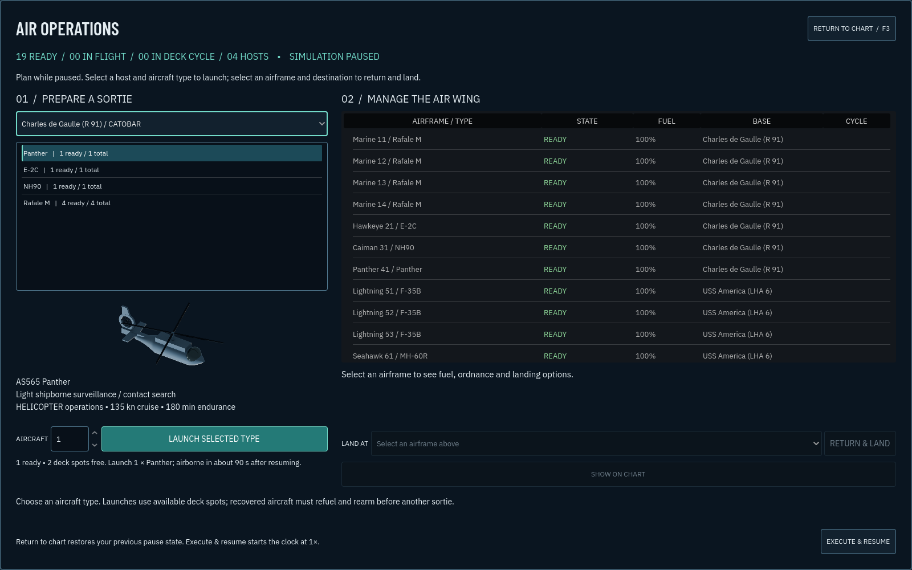

# M20: Air operations and fleet expansion

Aircraft selection and recovery are now an explicit command workflow. Open **AIR / F3** from the tactical display, choose a carrier or airfield, select an aircraft type and sortie size, and launch. The Air Operations board lists every friendly airframe with readiness, fuel, assigned or recovery base, and deck-cycle state. It only offers aircraft actually present at the selected host.

For landing, select an airborne airframe in the board, choose a friendly **LAND AT** destination, then press **RETURN & LAND**. **EXECUTE & RESUME** returns to the chart and runs time at 1×. **RETURN TO CHART** preserves the previous pause state. Once on the chart, keys 1–6 still set time acceleration. Planning pauses the mission so selecting an aircraft cannot silently cost several minutes at 60×.

## Fly a complete sortie

The new **CARRIER QUALIFICATION / AIR OPERATIONS** exercise provides Charles de Gaulle, USS America, an Italian Horizon escort and a friendly training field near Bodø. There is no opposing force. Launch a Rafale from Charles de Gaulle and a runway aircraft from the field, then return them to compatible destinations. The exercise completes only after an actual shipboard recovery and an actual airfield landing. Merely starting with aircraft in a hangar does not count.

You can also divert the Rafale to shore and relaunch it there after turnaround. The base marker is schematic, about two nautical miles inland of Bodø airport, because the generalized Natural Earth coast excludes the real coastal apron. It is a fictional training installation, not a surveyed runway.

## What changed in the simulation

- A requested aircraft type or callsign must exist and be ready. A missing selection no longer launches an unrelated airframe.
- Landing orders check faction, aircraft/deck compatibility and available capacity, and reserve a space for the incoming aircraft. The aircraft's home changes only after touchdown.
- Explicit return orders cancel tanker joins and formation orders. Automatic fuel return considers transit, approach and a landing reserve, with the existing minimum bingo threshold.
- Aircraft remain visible, detectable and targetable during a fuel-consuming approach. They follow a moving deck, maintain approach clearance, descend, land, refuel and rearm. Their state is shown as LANDING on the board and LAND on the fleet roster.
- A lost destination triggers a diversion. Aircraft aboard a destroyed host cannot finish a launch. Recovery reservations and reciprocal ownership links are cleared when a scenario resets.
- Successful landings are recorded by facility type for training objectives. Later diversion or loss does not rewrite that history.

## More platforms and weapons

Added **18 platforms**: eight surface ships, two submarines and eight aircraft. Added **12 weapon families** and **16 sensor definitions**. The totals are **74 platforms, 70 weapons, 81 sensors and 144 inspectable models** across eleven missions.

Examples include Charles de Gaulle, America, Juan Carlos I, Mistral, Horizon, Sachsen, Visby, Admiral Grigorovich, Suffren and Gotland; Harrier, Typhoon, Gripen C, F-16C, Atlantique 2, Su-34, Panther and E-2C. New ordnance includes Meteor, ASRAAM, IRIS-T, Maverick, air-launched RBS15, Kh-31A, Otomat, naval Mistral, Shtil-1, F21, Torpedo 62 and Torpedo 47. Every new weapon is fitted to a playable platform, and every addition has original recognition art and a 3D inspection model.

See the [roster and primary-source ledger](AVIATION_ROSTER_M20.md) for exact IDs, compatible wings, legacy fits and modeled omissions. New resources are available in the scenario editor and fleet gallery as well as the exercise.

## Validation and limits

**291 regression tests, 19 native aviation workflow checks and 24 native UI checks pass.** All eleven missions pass two 1,200-second AI runs without errors, warnings or grounded hulls; Northern Vigil also passes a 6,000-second stability run. The browser exercise completes actual carrier and shore landings with a clean console. The machine-readable results are in [validation-m20.json](validation-m20.json). The complete launch, diversion, touchdown, turnaround and relaunch sequence is exercised through the actual Main scene and UI command route, alongside regression, native UI, scenario and browser checks.

This remains a fleet-command game. The recovery path is a simplified controlled approach, not a six-degree-of-freedom aircraft model. Runway length, carrier wind-over-deck, weather landing minima, crew qualification, maintenance failures and finite base ordnance stocks are not simulated. Basing compatibility is deliberately broad; a compatible facility does not certify every real-world aircraft/deck pairing. Flight performance, sensors and combat effectiveness remain explicitly labeled gameplay estimates.
