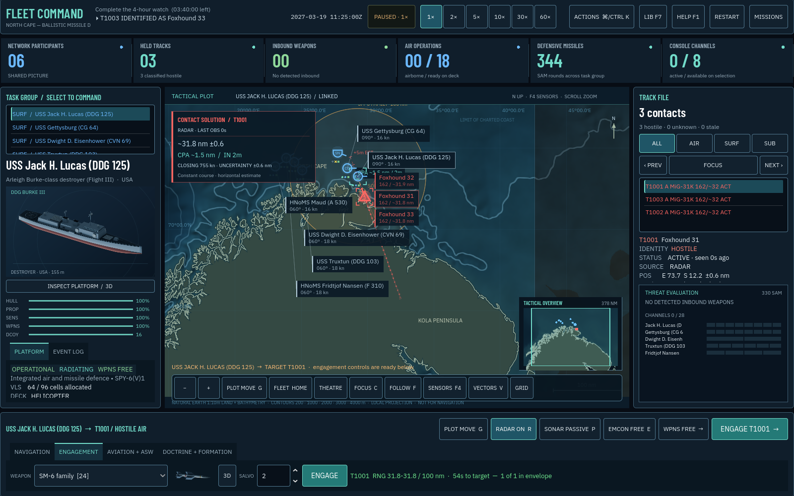

# M19: Contact fidelity and runtime stability

This change makes the tactical picture more consistent with what sensors have actually reported, fixes time-control and rendering defects, and releases the fleet when a scenario ends. It builds on M18 at `347e9ea6b6fac1c05f9fb7f901d693447ae58206`.

## Simulation changes

- A pause or speed change discards the current frame's old time backlog. Previously a combat event could set the clock to 1x while the remaining 60x backlog still ran. A reproduced one-second frame advanced 60 simulated seconds after a pause; it now stops at the triggering 0.25-second tick. The explicit developer `advance()` method still advances a requested interval regardless of pause, so scenario sweeps remain usable.
- An unobserved destroyed unit's track now coasts and expires by the same observation timeout as a surviving unit's. The track manager no longer consults hidden `alive` state to remove contacts early.
- Firm range fixes outrank bearing-only guesses. Within a sensor cycle, the most precise usable plot supplies position and the course/speed observation. Reversing a firm/bearing report order no longer shifts the track by roughly ten nautical miles in the regression example. Classification uses the strongest observation contribution once per cycle instead of whichever sensor happened to run first.
- A reacquired stale track takes the new fix and rebuilds its course/speed estimate. Unresolved bearing guesses do not enter the least-squares velocity fit.
- Reported class category is stored in the track, so the regular map symbol no longer looks through `Track.truth` for its glyph.
- `UnitManager` breaks carrier/aircraft, formation, and tanker references on reset and destruction, and removes retired jammer references. This fixes the recurring fleet ownership leak; a standalone aviation test fixture now also releases its own reciprocal links.

## Graphics and command information

Selecting a contact opens a chart-side **Contact Solution** panel. It shows source, last-observation age, estimated range and position uncertainty. A valid course/speed solution adds closing speed, estimated horizontal closest point of approach (CPA), time to CPA, and projected positions on the chart. The estimate uses only the selected unit and its visible track. Stale, unresolved, unavailable, opening, parallel, and beyond-horizon cases have explicit states instead of fabricated values.

Motion vectors have time ticks: five minutes for aircraft, thirty minutes for hulls. A bounded, thirty-second observation history provides fading track trails; gaps in coverage are not connected. Bearing-only contacts show **RANGE UNRESOLVED** in the solution and details, and `?` in the list and map labels.

The overview now triangulates coastlines in world coordinates and draws cached meshes, as the main map already did. Previously, projecting dense coastlines into a small overview caused repeated triangulation errors on every redraw. The selected overview marker no longer emits a filled-rectangle warning. The seabed shader uses an explicit depth sampler, removing the headless sampler compiler diagnostics while preserving the chart's appearance.

## Validation

- Godot 4.7.2 on Apple M5 Pro, Compatibility/OpenGL rendering.
- 264 regression tests pass, including fifteen new clock, track, relative-motion and lifecycle tests. Seven new tests failed on the original implementation and passed after the fixes. The suite exits without resource-leak warnings. Its two intentional invalid-input fixtures still log an unknown objective type and a degenerate landmass warning.
- All ten shipped missions run for 1,200 simulated seconds with both sides under AI control, seeds 2 and 13: 20/20 pass, no errors or warnings, no grounded hulls. This verifies the opening twenty minutes, not completion of every four-to-eight-hour mission.
- The actual native application passes 24 gallery, palette, focus and pause-restoration checks. A fought Aegis Bastion mission restarts with simulation time zero and no weapons in flight.
- Native captures at 1,600 × 1,000 and 1,152 × 720 verify the contact panel and plot layout. A Northern Vigil capture reproduces the formerly failing overview and now exits cleanly.
- The rebuilt Web package loads in the Codex browser and passes mission selection, briefing, Take Command, acceleration, pause and contact selection, with an empty warning/error console. The repository's WebAssembly runtime exactly matches the installed 4.7.2 export template used previously; the pack is rebuilt and its HTML size metadata refreshed.

See `validation-m19.json` for the final machine-readable record and sustained-run result.

## Limits and next priority

CPA assumes constant course and speed for at most thirty minutes, in the horizontal plane. It is advisory, not a collision-avoidance order or a weapon intercept solution. Displayed uncertainty is the game's existing positional envelope, not a calibrated statistical confidence interval; future manoeuvre and velocity uncertainty are not propagated into it.

This remains a game simulation. Passive target-motion analysis still uses a tuned quality/range approximation, classification accumulates over observation time, and damage, sonar propagation and engagement probabilities remain gameplay estimates. A defensible next realism milestone is a bearing-history estimator whose range observability depends on sensor/target geometry, followed by scenario balance testing. More platform names alone would not close that gap.

## Implementation references

The renderer uses the documented [Geometry2D triangulation API](https://docs.godotengine.org/en/stable/classes/class_geometry2d.html#class-geometry2d-method-triangulate-polygon) and [Godot shader uniforms](https://docs.godotengine.org/en/stable/tutorials/shaders/shader_reference/shading_language.html#uniforms). These references support implementation mechanics, not claims about real naval sensor performance.
