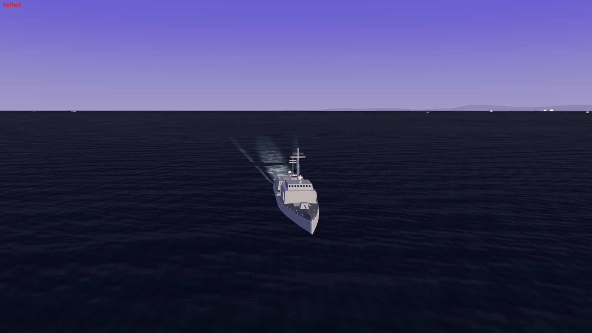
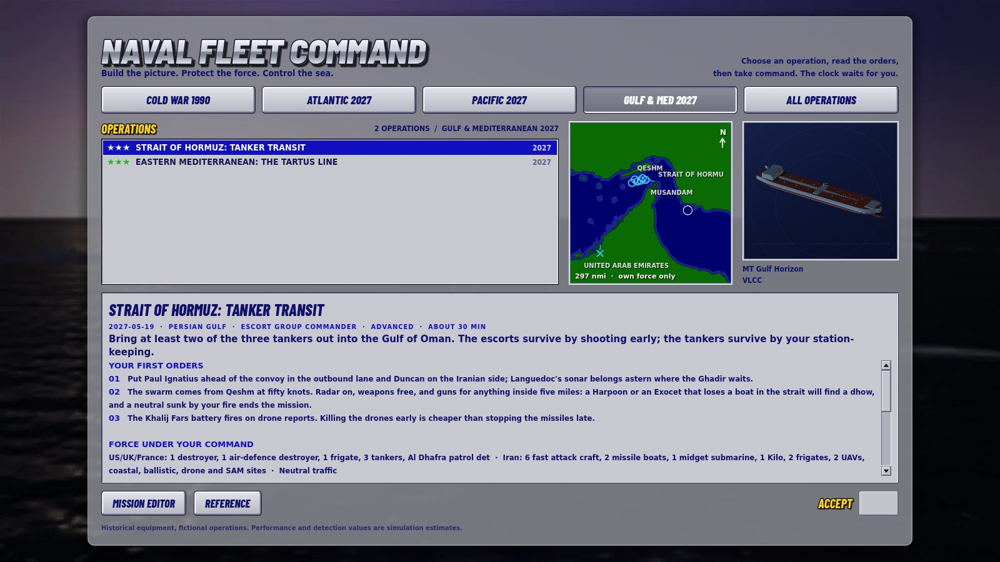
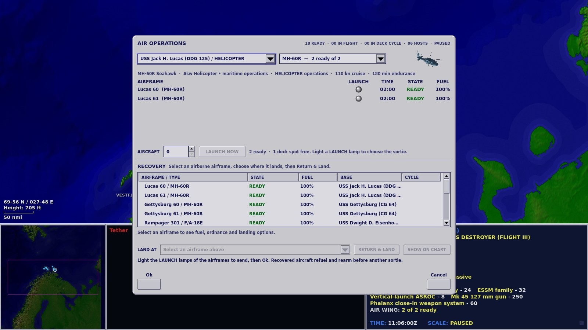

# M24: The CDS screen

28 September 2026. Built on M23 (`ff4dac5`).

The command deck is gone. In its place is the screen the late-1990s fleet-command games put in front of a task-force commander, the Combat Direction System screen, rebuilt from their manual and screenshots and rendered at modern quality. A relief-shaded tactical chart runs edge to edge across the top two-thirds of the window. Below it sit a square regional map, an always-on 3D view of whatever is hooked, and a navy data display. Orders go through right-click menus, hotkeys and grey pop-up dialogs. The old panels are still one key away, on the status boards.

Everything is original code and art. Nothing is copied from any other game, and nothing in the game is named after one. What carries over is a layout, a palette, a symbology and a way of working.

## The chart

- **Relief.** Land is a hypsometric tint, saturated green on the coastal plain through olive to khaki and tan on high ground, lit from the north-west. The sea steps down through ten bands of saturated blue, lightest at the coast and navy in the abyss, with the sea floor's own relief worked in. The chart runs to the window's edges. The header, footer, floating buttons, theatre inset, north arrow and neatline are gone.
- **Heights.** A new presentation raster per region carries land heights: GMTED2010 from the U.S. Geological Survey (public domain), read through the AWS Open Data terrain tiles and resampled onto the same grid as the sea floor by `tools/scenarios/import_relief.py`. It adds 5 MB. The simulation never reads it: grounding, radar horizons and masking still use the scenario coastlines. Inside a scenario's charted box the coastline polygons own the coast, so land sits exactly where hulls ground; beyond it, the raster's own coast continues without a seam.
- **Symbols.** NTDS frames in the identity colours: ownside light blue, hostile red, unknown yellow, neutral green, allied orange (the model has no allied identity yet). Air is an arc or chevron, surface a circle, diamond or square, subsurface the lower half, installations ashore an X. Every symbol carries a speed-scaled velocity leader and a white four-digit track number. The hooked platform gets white corner brackets and its target red or yellow ones. **Tab** swaps NTDS for small, medium or large graphic symbols drawn from the recognition art. **Shift+V / K / I** toggle leaders, track numbers and tags.
- **Readouts.** Bottom left: the cursor's position in degrees and minutes, the depth or height under it in feet, and a scale bar in nautical miles. Bottom centre: the radio line, where each unit's traffic reads "callsign: message" and the unit talking is ringed in white. Another side's units are named only by the track the plot holds on them.

## The bottom strip

- **Regional map.** The whole battle space, darker and less saturated, with own units and held contacts as dots, the chart's view as a magenta box you can drag, and a translucent disc for each radar on the air. It always holds the chart's whole view as well as the theatre.
- **3D view.** Always running, tethered to the hooked platform (or the hooked contact as the plot holds it). **F9** Tether, **F11** Fly-by, **F12** Action (cuts to launches, hits and deck events you can see), **F8** Detached, **T** cycles them. **G** swaps the chart and the 3D view; **F10** gives the 3D view the whole window. The look is new: a violet dusk sky, a dark glinting sea with foam wakes, coastal hills from the new heights, long white missile trails, billowing launch smoke, explosions, and fires under black smoke on damaged ships.
- **Data display.** The hooked platform's name in blue, then class, track number, course, speed, altitude or depth, damage, fuel, orders, sensors and weapons as white labels and yellow values. A contact shows what the plot holds: identity, estimated course and speed, source, position error and age, range and bearing, and the closest point of approach. With nothing hooked it shows the mission's tasking. The footer carries the watch time and the time scale; click them to pause or step the scale. A lamp flashes for unread warnings and opens the comms board.

## Orders

- **Right-click water** with a platform hooked and it goes there; Shift adds a waypoint. **Right-click your own platform** for its Orders menu: speed, course, altitude or depth, sensors, EMCON, weapons state, engage, flight deck, formation, route, follow, reference. **Right-click a contact** for Engage With: the weapons that suit it, each with its rounds and salvo sizes, greyed with the reason when out of envelope. With nothing hooked, right-click opens the display and screens menu.
- **Status boards (A)** hold the orders board, the task group with its roster and event log, the track file with the air-defence board, and the comms history. The game keeps running while they are up.
- **H** lists every key command on one board.

The key map follows the old CDS where that defines the screen, so some keys moved:

| Command | Was | Now |
|---|---|---|
| Plot a route | G | W (or right-click water) |
| Swap chart and 3D view | – | G |
| 3D cameras | T cycled hidden / inset / full | T cycles cameras; F8, F9, F11, F12 pick one |
| 3D full screen | – | F10 |
| Operations desk | F9 | M |
| Scenario editor | F8 | Ctrl+E |
| Restart | F10 twice | Ctrl+F10 twice |
| Sound | M | Ctrl+M |
| Wide chart | B | gone: the chart is always full width |
| Range circle | – | B |
| Status boards | – | A |
| Key commands | – | H |
| Vectors / leaders | V | Shift+V |
| Pan | arrows or WASD | arrows (A, W and S are hotkeys now) |

## Dialogs and the front end

In-mission dialogs are 1999 grey panels with bevelled buttons, navy bold text and glossy LED lamps. Air Operations became a launch dialog: light the LAUNCH lamps of the airframes you want and press Ok. The operations desk, briefing, reference and editor sit over an original dusk image rendered from the game's own 3D scene, on translucent grey-metal panels with navy italic buttons and yellow captions. Type is DejaVu Sans Bold for data and Barlow for headings, both under open licences recorded in `assets/fonts/`.

## Validation

- **445 regression tests pass**, 94 more than M23. They pin the layout, the data display's rows, the radio net, the status boards, the right-click menus, the key map, the chart's relief and symbols, the regional map and the 3D view's cameras and witnesses.
- The 42 command-screen checks pass in the real application at 1600 × 900: boards, data display, the G swap, F10, right-click menus on water, own units and contacts, the radio net, air operations, the key board, Space with a button focused, the layout filling the window and the chart holding 68% of it. The 19 air-operations checks pass at 1600 × 1000.
- All 22 missions run 6,000 simulated seconds at seeds 2 and 13 with the AI commanding both sides, now through the new screen: 44 of 44 exit cleanly with no script errors and no grounded hulls. The outcomes (35 still running, 4 won, 5 lost) are the same as M23's, so the new screen changed nothing underneath.
- An adversarial review of the integrated screen confirmed 20 defects, each reproduced before it was fixed and each fix pinned by a test. Among them: the 3D view drew the kill of a submarine nobody held and cut the Action camera to it; graphic symbols loaded all 139 plan images at once (184 MB and a 0.75 s stall, now 0.2 MB); the regional map made 689 draw calls a frame for Norway's coast (now one); a new hook was ignored for up to 90 seconds while the old ship sank; the sea lost its chop across most of the chart and ignored the weather.
- The rebuilt browser build boots in headless Chromium and runs the desk, the briefing, the command screen, the status boards, the swap and the full-screen 3D view with no console errors.

The machine-readable record is [validation-m24.json](validation-m24.json).

## Known limits

- The heights are GMTED2010 at roughly 2 km cells. Hills are smooth up close, and the scenario coastlines still show Natural Earth's 1:10 million facets at a 10 nm scale.
- The always-on 3D view is the largest new per-frame cost. It stops behind full-screen screens and while the tab is hidden. It has been measured under software rendering, not yet on a range of real GPUs in the browser.
- Track numbers are not decluttered where contacts overlap, as in the original.
- There is no allied identity in the model yet, so orange never appears.
- In the browser, the frame on which the 3D view changes size (G, F10 or resizing the window) logs a burst of WebGL buffer warnings. Nothing on screen goes wrong and the console is quiet afterwards. It is not the 3D view's anti-aliasing or mesh detail levels; the cause is still open.
