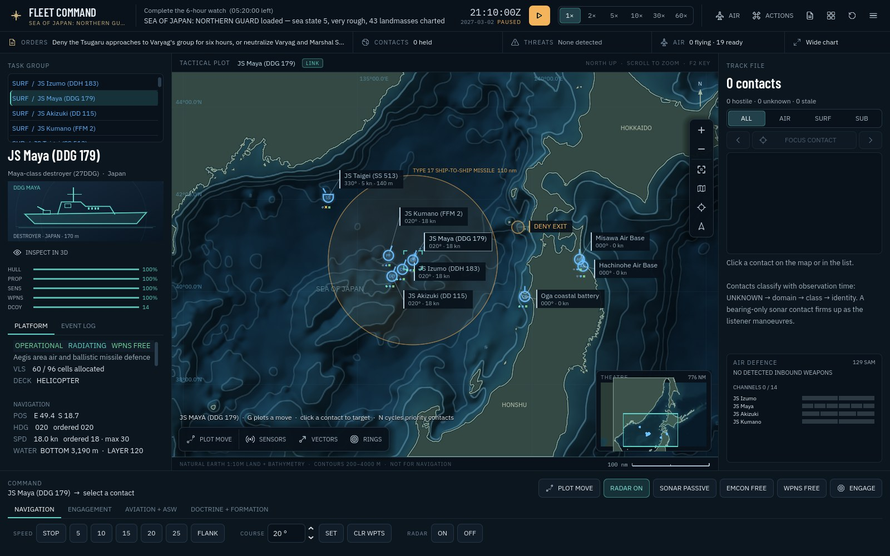
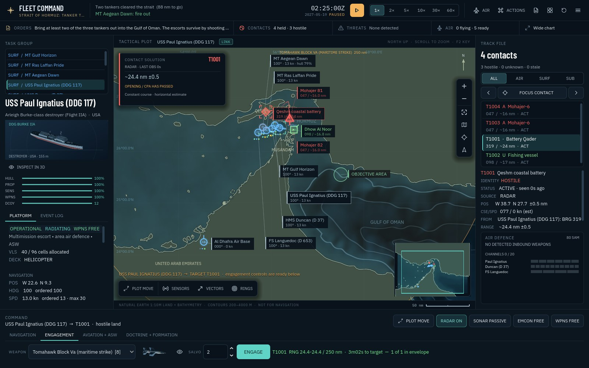
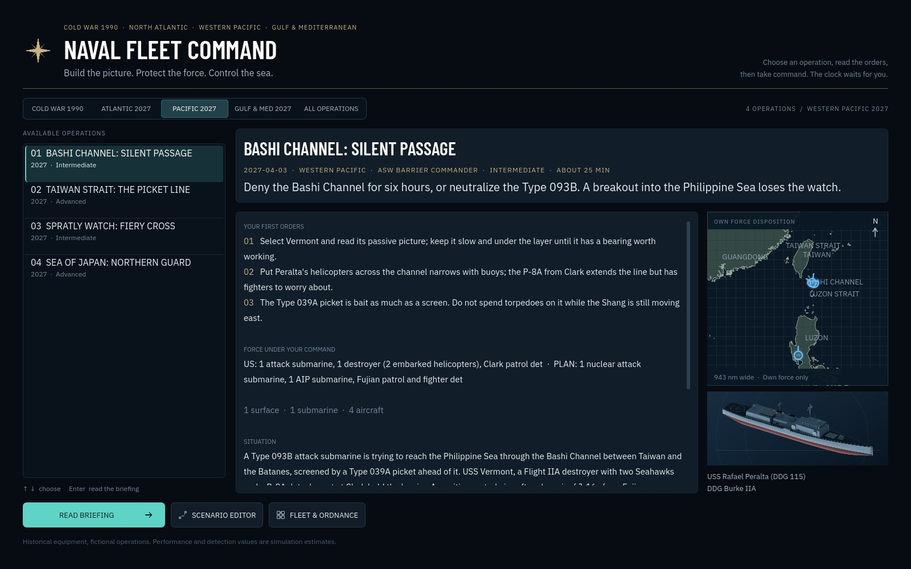
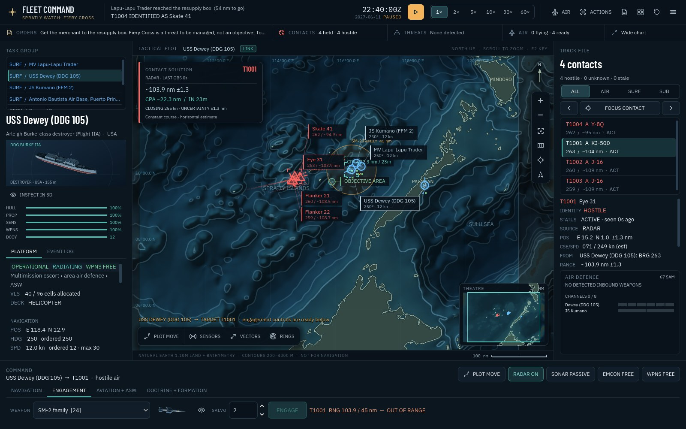
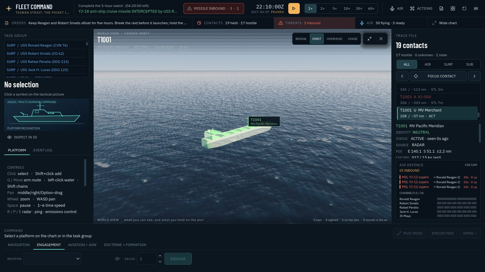

# M23: World theatres, installations ashore and the world view

27 September 2026. Built from main commit `8a1caa1`.

The game went from one sea to four, from fifteen operations to twenty-two, and from a chart-only presentation to a chart with a 3D world view beside it. The simulation learned that a coast can shoot back.

## Four chart regions

The Natural Earth 1:10m land and bathymetry that built the North Atlantic chart were extracted for three more regions: the Western Pacific from the Sea of Japan to the South China Sea, the Arabian Sea with the Persian Gulf, the Gulf of Oman and the Red Sea, and the Mediterranean. Each region has its own coastline extraction for the scenario builders and its own sea-floor rasters for the water column and the chart, built by the same interpolation between Natural Earth's depth contours. The runtime picks the region from the scenario's anchor, so a mission anchored off Taiwan reads the Pacific floor without any other change. The regional rasters add about 3 MB to the game.

The reclaimed Spratly outposts (Fiery Cross, Subi and Mischief) are added to the coastline as approximate rectangular footprints, because the 1:10m dataset predates them and one of the operations is fought around one.

## The 2027 catalogue

A generator (`tools/scenarios/theatres_2027.py`) writes 45 platforms, 43 weapons and 58 sensors with nation prefixes and an explicit manifest, following the 1990 pack's discipline: public identity and broad fit are recorded in [the ledger](THEATRES_2027.md); every number is a gameplay estimate on the existing catalogue's scale.

- **PLAN**: Type 055, Type 052D, Type 054A, Type 056A, Type 022, the carrier Shandong with a J-15 group, Type 093B and Type 039A submarines, H-6J, J-16, KJ-500, Y-8Q, Z-9C, Z-20F, Z-18F and Z-18J, a Type 903A replenishment ship, a YJ-12B coastal battery, an HQ-9B site and a DF-21D battery.
- **Japan**: Maya, Akizuki, Mogami, the Izumo after her F-35B conversion, Taigei, P-1, SH-60K, the Air Self-Defense Force's F-35B and F-2, and a Type 12 coastal battery.
- **Iran**: Moudge and Alvand frigates, a Project 877EKM Kilo, a Ghadir midget submarine, Peykaap III and Houdong craft, Mohajer-6, Qader/Noor and Khalij Fars batteries, a one-way attack drone site and a Bavar-373 site.
- **Russia**: a Bastion-P battery and an S-400 site for the Mediterranean and the Pacific.
- **Civil**: a very large crude carrier.

Models and recognition art for all of them were built without Blender: a Python geometry builder exports normalised GLBs and a Godot script renders the beauty, plan, profile and thumbnail images under the same lighting the game's inspection stage uses.

## Installations ashore fight

- A land platform with weapons is a battery or a site. The AI fires it on the faction picture with the same reluctance about stale and unclassified contacts as a ship, and never tries to move it. It radiates only while it holds a contact.
- A round fired from ashore climbs out over its own coast before the rule that a low flyer ends at the first ground it meets applies to it. A round aimed at a target ashore crosses the beach instead of dying on it.
- Installations stand on their ground: radar horizon, ESM horizon and terrain masking use plateau height plus mast, so a battery a mile behind a headland sees the sea it faces and is hidden from the other side.
- Tomahawk Block V, NSM, JSM and CJ-10 join JASSM-ER in carrying the `land` target type. A classified airfield, battery or site can be struck; Harpoon, LRASM, Kalibr and YJ-18 remain anti-ship rounds.
- SAM sites defend a coast exactly as a ship's air defence does, within their channels and magazines.
- Ballistic anti-ship missiles (DF-21D, YJ-21, Khalij Fars) fly the game's ballistic profile. The DF-21D is exo-atmospheric and SM-3's alone; the YJ-21 and Khalij Fars fly the terminal window that SM-6, the Type 45's Aster 30 and the S-400's 48N6 can reach.
- Ski-jump carriers (STOBAR) launch two at a time and recover one; they fly their own ski-jump aircraft and jump jets; a catapult deck can recover a ski-jump aircraft; a STOVL deck cannot.

Nine regression tests cover the shore rules, including a battery's round that turns back over its island and dies there.

## Seven operations

| Operation | Shelf | Command problem |
|---|---|---|
| Bashi Channel: Silent Passage | Western Pacific 2027 | A Virginia, a destroyer and a P-8 detachment deny a strait to a Type 093B under a patrol aircraft and fighters |
| Taiwan Strait: The Picket Line | Western Pacific 2027 | Reagan, two Aegis destroyers, Maya and Akizuki hold five hours east of Taiwan against a Type 055 group, an H-6J raid, a coastal battery and a DF-21D battery |
| Spratly Watch: Fiery Cross | Western Pacific 2027 | Dewey and Kumano escort a merchant past a reclaimed island base with a battery and a SAM site; eight Tomahawks and a decision |
| Sea of Japan: Northern Guard | Western Pacific 2027 | Command the Izumo group with F-35Bs, Maya, Taigei, P-1s, F-2s and a Type 12 battery against a Russian sortie toward Tsugaru |
| Strait of Hormuz: Tanker Transit | Gulf & Mediterranean 2027 | Three tankers out through the strait against a swarm, a midget submarine, drones, a Qader battery and a Khalij Fars battery |
| Eastern Mediterranean: The Tartus Line | Gulf & Mediterranean 2027 | Deliver Mistral to a box south of Cyprus with the Charles de Gaulle group, under an S-400 umbrella and a Bastion battery |
| Sea of Japan: The Vladivostok Sortie | Cold War 1990 | Carl Vinson's group against a Soviet cruiser group and a Backfire regiment |

Every one of the twenty-two operations now carries a commander's intent, three first orders, a difficulty, a play estimate, a role and what it teaches; the eleven earlier modern missions were written up to the same standard. The operations desk shelves them: Cold War 1990, Atlantic 2027, Pacific 2027, Gulf & Med 2027, and everything together.

The builders validate before writing: a hull ashore, an installation afloat, a patrol leg across an island or an objective on land fails the build with the offending unit named. The same rule runs as a test against the shipped files.

## Doctrine and balance from the AI-versus-AI runs

Every new operation was run with the AI commanding both sides, at least two hours of simulated time and the full watch for the shorter ones. Three findings changed the game rather than the scenario:

- **A breaking-out submarine keeps its missiles.** The Type 093B in the Bashi Channel fired its whole YJ-18 salvo at the first destroyer it heard, in the opening minute, and sank it. A boat whose task is to get through does not announce its position with a missile launch; it now holds its torpedoes for whatever is inside eight miles of its track and otherwise keeps going. The rule applies to any submarine in breakout posture, and a test holds it.
- **No ballistic round may fly where nobody can meet it.** The DF-21D flew at 60 km, above SM-6 and Aster 30's terminal ceiling (50 km) and below SM-3's exo-atmospheric floor (100 km), so a Ticonderoga with SM-3 aboard watched four rounds arrive without firing. The DF-21D now flies at 150 km and belongs to SM-3; the YJ-21 and Khalij Fars stay at 40 km, inside the terminal window, and the Type 45's Aster 30 reaches that window (it had been capped at 25 km, which left Duncan defenceless against the Khalij Fars battery in the Hormuz run). A catalogue test now requires every ballistic anti-ship round to have at least one interceptor whose window covers it.
- **A ballistic round is seen at a radar's full air range.** The YJ-21 carried a small-missile signature and was detected at 64 nm, which at 5,000 knots is 46 seconds: across every run no SM-6 met one, whatever the escorts fired, because an interceptor launched from a ship thirty miles off the carrier cannot arrive in time. The three theatre ballistic rounds now show at full range, so a picket twenty or thirty miles out has a shot and a picket a hundred miles out still does not.
- **The carrier killer is tuned to be a fight, not a verdict.** Six YJ-21 at 100 damage sank the carrier in every AI run of the Taiwan Strait, four hits out of six against a terminal defence that stops roughly a third of what it shoots at. The Type 055 now carries four, each doing 80, at the DF-21D's defensive difficulty; a picket that engages every round with two SM-6 should expect one hit, and a picket that does not will still lose the ship.
- **A neutral sunk by your own fire is named as such.** Hormuz protects the strait's neutral traffic by its rules of engagement; a French Exocet that lost its fast-attack-craft target found a dhow, and the failure read "protected vessel lost". Neutrals are now their own loss condition, "neutral vessel sunk by own fire", and the first orders say so: guns for the boats inside the strait, because a missile that loses one will find a dhow.
- **The opening minute belongs to the player.** The Taiwan Strait raid started inside its own launch range and the picket line had fired nothing before the first salvo was in the air; the H-6Js now start over the interior, an hour from their launch point, and the Type 055 group starts in the East China Sea beyond YJ-18 reach, so the ballistic salvo, the raid and the surface group arrive as three separate problems instead of one. The Bashi Channel picket submarine starts a watch's steaming west of the barrier so its missiles arrive as a mid-mission event.

The runs also confirmed what the operations are meant to feel like. A Type 055's HQ-9B reaches a hundred miles, and helicopters or an E-2D that wander into it die; the AI escorts spend their SM-6 and SM-2 magazines on a coordinated raid and the difference between a carrier lost and a carrier kept is whether the raid was broken before launch. The Sea of Japan in 2027 remains the hardest operation on the shelf.

## The world view

`T` opens a 3D view of the sea around the selected unit, as an inset in the chart's corner or filling the chart. It is presentation only and it obeys the information model: own units appear as their models at their true positions; other units appear at truth only inside visual range of one of your ships; otherwise a contact is drawn where your plot estimates it, with its class geometry only once the class is known and a generic marker before that; weapons appear only when your force has detected them. The sun is where the scenario's date, time and latitude put it; the sea state comes from the environment; the coast comes from the same polygons as the chart. Effects (launches, hits, intercepts, decoys, sinkings) arrive through the same calls the chart already receives.

Four cameras: **bridge** (from the selected ship's bridge, looking where she is heading), **orbit** (around the focus, with drag to turn and wheel to close), **overhead** and **chase** (behind an aircraft in flight). The plot's WORLD button and the Actions palette open it as well as `T`; a second press fills the chart, a third closes it. The footer counts what the view is allowed to draw: own units, sighted units, plotted contacts and detected rounds. Nineteen tests hold the rules, from the solar model (midnight sun at 78° N in June) to the guarantee that a hostile forty miles away with no track is absent.

Limits worth knowing. Land is a stylised shelf with three terraces at a quarter of the charted elevation, so a coast reads as low stepped hills and a shore station sits among them; nothing is real relief. Rounds at cruise altitude are usually above the frame of a ship-orbiting camera and show as plumes. Wakes and plumes are seeded back along the heading when the view first sees a unit, and effects that happen while the view is closed are not replayed. The sea animates in real time, so at 60× the ships outrun the swell.

## Validation

Recorded in [validation-m23.json](validation-m23.json).

- **Regression suite**: 351 tests, 0 failed (`godot --headless --path . --script tests/run_tests.gd` after `--import`), up from 319: nine shore rules, nineteen world-view rules, the regional sea-floor probes, the breakout-submarine doctrine, the ballistic-window invariant and the rest.
- **Interface suites under Xvfb**: the command-deck suite at 1600 × 900, 29 checks, 0 failed; the air-operations suite at 1600 × 1000, 19 checks, 0 failed.
- **Scenario sweep**: SWEEP_SENTENCE
- **Full-watch AI-versus-AI runs** of the new operations, the AI commanding both sides: the Bashi Channel to its six-hour end (victory, the Type 093B killed by ASROC and Mk 54s after it held its missiles); the Taiwan Strait for two hours on two seeds with the carrier afloat at the end of both, and once for the full five-hour watch (FULL_WATCH_SENTENCE); Hormuz, Spratly, the Sea of Japan in 2027 and 1990 and the Tartus line for two hours each without a script error or a grounded hull.
- **Browser build**: the rebuilt pack (52.9 MB, with the 37.7 MB runtime; a 91 MB first visit) boots in headless Chromium over WebGL 2 with the engine banner, the scenario loaded and no script errors; the only console messages are the software renderer's ReadPixels notices.
- **Art**: every one of the 139 platforms has profile, plan, beauty and thumbnail renders and an importable model; 280 models in all; the largest is Shandong at 11,152 triangles.
