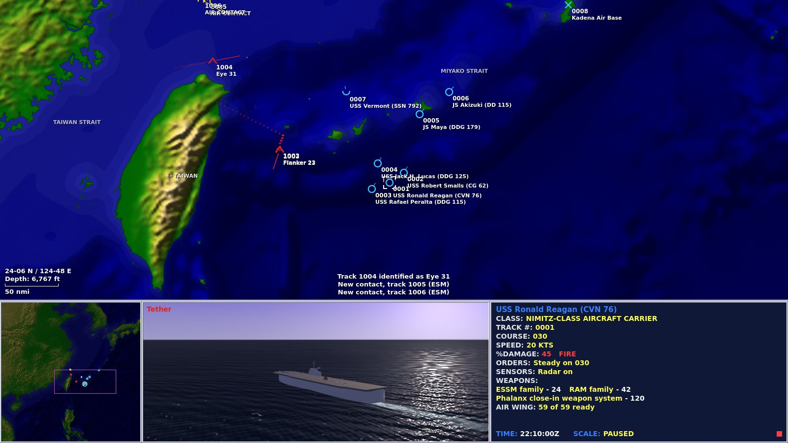
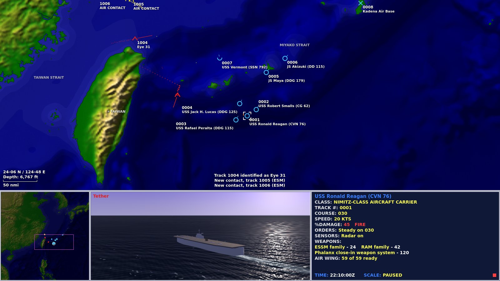

# M26: Final QC and optimisation

28 September 2026. Built on M25 (`4cf58fa`).

A pass over the whole game as it stands: every screen looked at, the frame budget measured rather than guessed, the defects that survived M24 and M25 fixed, and the noise cleared out of the code, the console and the docs. Nothing in the model changed except the order of two checks in the sonar pass, which gives the same answers. The CDS screen looks as it did, only cleaner.

## What changed on screen

- **Track numbers no longer smear.** The original printed every number at the symbol's lower right and let a formation write over itself; so did M24, as a known limit. `ChartLabels` now places each number and tag at the classic place unless that would print over another label or another symbol, then tries the upper right, the lower left and the upper left, and leaves it off where none of those is clear. The hooked platform's number is placed first and never left off. The assignment is remade four times a second on a coarse grid, so a busy plot costs a fraction of a millisecond, and labels are printed after every symbol so a symbol never covers a number. A formation tighter than its own numbers shows only the hook's: zoom in for the rest.
- **A shared objective area is named once.** The expanded operations put a box to reach and a box to hold on the same circle, and "OBJECTIVE AREA" and "LATER HOLD AREA" printed over each other in the Strait of Hormuz, the Mediterranean and the Spratlys. One circle, one name, the one that matters now: deny, hold, objective, later.
- **The track file board fits its panel.** At 1600 × 900 the page was 70 px taller than the boards and Godot centred the overflow, which cut the header and the CLOSE button off the top. The contact detail and the air-defence board now sit side by side, which is what the board's width was for.
- **Nothing peeks out from under the boards.** The chart's position readout, scale bar and radio line were drawn under the boards' margins; the chart skips them while a board covers it.
- **The operations desk's area chart** no longer prints "NORWEGIAN SEA" over "LOFOTEN" or "FAROE-SHETLAND CHANNEL" over "SHETLAND": sea names are centred as the chart centres them, and a name that would print over one already placed is left off.

## The frame budget

`--perf=S` is a new dev-harness flag: after a second to settle it times every frame for S seconds and prints the script time by path (the chart and its parts, the regional map, the data display, the 3D view, the simulation ticks and the shell), the renderer's draw calls and memory. The frame times themselves are the software renderer's and say nothing about a real GPU; the script times and draw calls carry over. Three busy operations at 1600 × 900, seed 2, 40 minutes in, the clock running at 1×, script milliseconds per frame:

| Path | Hormuz (33 units) | Taiwan Strait (106) | Northern Vigil (115) |
|---|---|---|---|
| Chart, before | 2.53 | 9.17 | 9.84 |
| Chart, after | 2.52 | 4.08 | 5.26 |
| 3D view, before | 2.65 | 2.67 | 2.70 |
| 3D view, after | 2.77 | 2.19 | 2.29 |
| Data display, before | 0.23 | 0.78 | 0.83 |
| Data display, after | 0.17 | 0.24 | 0.23 |
| Simulation ticks, unchanged | 2.2 | 5.3 | 6.1 |

What did it:

- **The coast is projected once per view.** The chart re-projected every vertex of every coastline in view every frame (13,500 for Norway); now it keeps the projected runs until the view moves. Skerries smaller than three pixels on screen keep their fill and lose their stroke, which was most of the vertices and none of the picture.
- **Trail and history dots are 2 px squares** instead of antialiased circles. A busy plot draws a thousand of them.
- **Label widths are measured once** per string, not once per frame per label.
- **The 3D view rebuilds its entries on simulation ticks**, not every frame: what may be drawn and where only changes when the simulation moves or the hook changes, and the scene already carries things on along their courses between ticks.
- **The data display redraws when its lamp or threat line visibly changes**, at most twelve times a second, instead of every frame while the lamp was lit.
- **The sonar pass checks reach before it walks the terrain.** The land walk is the dear part of the sensor cycle and was run for every pair of units before the cheap range test. Same detections, same order, same random draws.

The simulation's ticks are the remaining cost in the large operations: the sensor cycle over 115 units costs about 40 ms once a second, which is nothing at 1× and the reason 60× compression runs below 60× on a slow machine there. That is the model's cost and is left alone.

## Noise

- **The console is quiet for players.** The simulation's running commentary ("[Combat] ... launches ...", "[Defence] ...", "[Scenario] ...") goes through `Debug.event()`, which prints in debug builds and scripted runs and not in the browser release. The test runner turns it off, so its output is the PASS and FAIL lines.
- **The test suite exits clean.** The "16 ObjectDB instances leaked, 12 resources still in use" that every validation record since M18 recorded as baseline came from one test fixture that built a ship and its helicopter without a UnitManager to break the cycle. It does now.
- **Compatibility shims with no callers are gone**: the chart's `world_view_requested`, `FOOTER_H`, `COL_LABEL_BG`, `show_vectors` and `set_overview_suppressed`, the 3D view's hidden/inset/full mode cycle and the old camera presets, `MapSymbols.draw_selection`. The tests that pinned them now pin the API the game uses.
- **The docs match the game.** `HANDOFF.md` described the M10 layout and said the folder was not a git repository; it is now a current handoff. The build string read M24, the local preview launcher said Cold War 1990, and the README counted 29 command-deck checks against 46.

## Validation

- **466 regression tests pass**, five more than M25 (label placement, the objective marks), with no leaked instances and no resources in use at exit.
- **46 command-screen checks** pass in the real application at 1600 × 900 and **19 air-operations checks** at 1600 × 1000.
- **The scenario sweep**: all 22 operations at seeds 2 and 13, 6,000 simulated seconds each with the AI commanding both sides, 44 of 44 exit cleanly with no script errors and 0 grounded hulls (35 still running at the end, 5 won, 4 lost).
- **The browser build** was rebuilt (`docs/play/index.pck`, 58.8 MB) and booted in headless Chromium with SwiftShader WebGL 2: the desk, the briefing, taking command, pause, next contact, the status boards, the swap and the full-screen 3D view, with no console errors and no warnings on any of them but the swap.

The machine-readable record is [validation-m26.json](validation-m26.json).

## Known limits

- A formation tighter on the chart than its own numbers shows only the hook's number. The original smeared them; this leaves them off. Zoom in.
- The frame budget was measured under llvmpipe. On a real GPU the renderer's share is smaller and the script share is what is reported here.
- Norway's coast still costs about 3.15 ms a frame to stroke at the operation's opening scale; the fill is one draw call, the stroke is many antialiased polylines. Caching it as a mesh per view would take it to nothing but is a bigger change than this pass wanted.
- The burst of WebGL warnings M24 recorded on the swap frame is still there, and is now narrower: it is one "bindBuffer: element array buffers can not be bound to a different target / bufferSubData: no buffer" pair per landmass on the chart (67 in Northern Convoy), it comes only when the chart changes parent (G), never when only the 3D view does (F10), and it does not come from the coastline strokes (a frame drawn without them produces the same burst). Nothing on screen goes wrong. It is the engine's GLES3 canvas polygon buffers under WebGL, and the fix is upstream or in not reparenting the chart at all.
