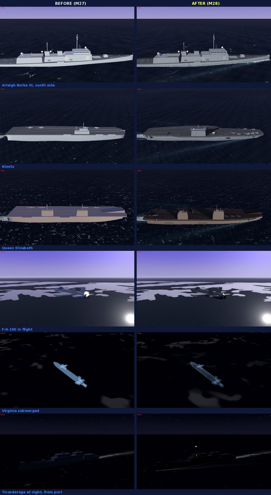
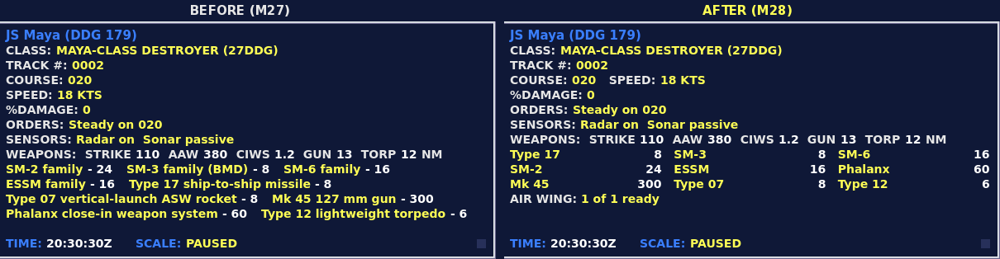

# M28: The live view, deep strike and torpedo defence

28 September 2026. Built on M27 (`f5b25ea`).

M27 left four things open and the report added a fifth: the browser build had not been rebuilt because
the environment had no export templates; torpedo defence had been dropped because torpedoes barely
appear in the AI runs; the French MdCN cruise missile was missing; the largest ships' weapon lists ran
off the bottom of the data display; and the ships, aircraft and submarines in the 3D view needed better
graphics. All five are done.

## The live view

### What was wrong

The baseline screenshots made the problem specific. Every hull rendered the same pale lavender-white: the
models' paint is a light grey, and the environment's flat lavender ambient lit every face nearly equally, so
a ship had almost no shading and read as painted plastic. The carriers were a box of hull under a box of
deck, and the Nimitz and the Ford were the same model. A carrier's wake came out in separate patches. A
submerged boat was a flat blue cut-out. After dark, ships disappeared.

### Finishes

The models are not touched. The 3D view's model pool now hands each instance to `WorldMaterials.dress`,
which swaps every named surface (`naval_paint`, `deck_non_skid`, `antifouling`, `rubber`, `airframe` and
twenty others) for a shared material on a new shader, `world_hull.gdshader`, that knows what the surface is:

- **Paint by navy.** A U.S. haze grey, the lighter greys of the Royal Navy and the European fleets, the
  blue-grey of Russian hulls, the PLA Navy's pale grey, a merchant's white. Weathering goes with the navy:
  streaks of grime and rust running down from scuppers are heavier on a Russian or Iranian hull than a
  Japanese one.
- **Plating and wear.** Strakes and butts of the shell plating on the vertical faces, mottled non-skid on
  the decks, wear down the middle of a flight deck, panel lines and a lighter underside on airframes, the
  tile grid of a submarine's rubber. Everything is sized in metres of the model and fades before it can
  alias, so a frigate filling the view and a carrier on the horizon both stay clean.
- **Light.** The environment's flat ambient is off for these surfaces. A hemisphere replaces it (the sky's
  light from above, the sea's dark bounce from below, a vertical face half of each), glossy surfaces mirror
  the sky at a grazing angle, and the finishes take 78 % of the sun's diffuse so a haze-grey roof in full
  sun no longer burns out to white. Sun shadows come on when the 3D view is big enough to show them (the
  swap or full screen), reaching just past the subject so the shadow map is spent on what the camera sees.

### In the water

A hull meets the sea where the ocean's own swell says it does: the hull shader evaluates the same two
swell trains as the ocean shader, from shader globals that the scene sets with the weather and every camera
move. Below that line the hull is wet and dark; along it foam laps, and at speed the bow throws spray.
A moving surface ship pushes a bow wave, two arms opening from the stem at about twenty degrees with foam
along both sides, on a patch of sea that rides the swell.

The broken carrier wake had a simple cause. A wake is a strip laid through samples taken every third of a
hull length, and each vertex was lifted onto the swell in script. A carrier's samples fall about 116 m
apart, which in sea state 3 is almost exactly one swell wavelength, so the displaced sea rose over the flat
strip between them. The strip is now laid flat, subdivided to 12 m near the eye, and lifted in the wake
shader's vertex stage. That removes the script's per-vertex swell sums as well.

### Flat-tops

Every flat-top from the Blender pipeline (Charles de Gaulle, America, the 1990 Nimitz, Mistral, Queen
Elizabeth, and the Nimitz and Ford that shared one model) was the same slab. The seven that sail in the
operations are rebuilt in the Blender-free pipeline by `tools/art/build_flattops.py`: a flared hull that
reaches an overhanging deck on a thick gallery edge, catwalks along the sides, lifts let into the deck edge
over dark hangar openings, weapons sponsons, the landing area's edge lines and dashed centreline, catapult
tracks, helicopter spots, and islands in tiers with glazed bridges, masts and radars. The classes differ
where a lookout would see it: the Nimitz's island amidships under a tripod mast, the Ford's smaller island
further aft with flat arrays, Queen Elizabeth's two islands and ski ramp, Charles de Gaulle's compact island
forward, America's long island and spot circles, Mistral's tall slab sides. Their deck parks are new too:
Super Hornets on the Nimitz and Ford, Tomcats with their wings swept back on the 1990 Nimitz, Rafales on
Charles de Gaulle, Hawkeyes, helicopters and Lightnings. A deck outline with an angled deck is concave,
which the kit's `plate` could not triangulate (it fans from the first corner), so the builder ear-clips.
Each model is under 15,000 triangles. The gallery renders and the chart's plan views were regenerated.

### Aircraft, helicopters, submarines, lights

- Airframes wear the tactical ghost greys, darker on top. A jet pipe is a faint warm glow by day instead
  of a white ball, and a bright one at night.
- A helicopter's main rotor turns as a faint streaked disc. The disc sits at the blade plane, measured
  from each model's mesh (the height band high on the airframe whose vertices cover the widest area),
  because the top of the bounding box was the rotor head, and the first version floated above the blades.
- Anything under the water is drawn through it with its form kept: lit from above, brighter at its
  silhouette, dimmer with depth, with a faint sonar sweep, where it was a flat translucent fill. Plotted
  contacts keep their identity colour on the same body.
- After dark, ships show a masthead light, red to port, green to starboard and a stern light, screened to
  the arcs the rules of the road give them: 225 degrees ahead for the masthead light, dead ahead to 22.5
  degrees abaft the beam for each sidelight, 135 degrees astern for the stern light. The lights alone say
  which way a ship is heading. Aircraft show wingtip lights and a flashing red beacon.
- The whitecaps are broken into wind-drawn streaks. Seen from above a submerged boat they were round
  twenty-metre blotches.

### What it costs

Measured as M26 did (`--perf=8`, 1600 × 900, seed 2, 40 minutes in, 1×, under llvmpipe, so frame times
are the software renderer's and only the script time and draw calls carry over):

| | Hormuz, before | after | Taiwan Strait, before | after | Northern Vigil, before | after |
|---|---|---|---|---|---|---|
| 3D view script, ms/frame | 1.92 | 2.22 | 1.76 | 1.89 | 1.70 | 2.07 |
| Draw calls, whole screen | 178 | 179 | 286 | 290 | 355 | 359 |

In the full-screen 3D view on the Ford in Northern Vigil, where shadows come on, the draw calls go from
30 to 47 and the primitives rise about 10 %; the 3D view's script time is 1.78 ms before and 1.99 ms after.
The always-on pane under the chart has no shadows and costs what it did within a few tenths of a
millisecond.

## MdCN

MdCN is in service on the Aquitaine-class FREMMs, in Sylver A70 cells, and on Suffren, from her torpedo
tubes in a capsule; Suffren fired one on 20 October 2020. It is a land-attack missile only, so in the game it
lists `land` as its one target type and cannot be sent at a ship. Range is 540 nm, the "up to 1,000 km"
of the most recent report (the sources conflict; the ledger has them). The FREMM carries eight in half her
A70 cells, because production stopped in 2021 and only restarted this year; Suffren carries four, with
twelve F21 and four SM39 in her twenty racks.

The open question from M27 was how the Tartus operation should use it. It needs no rebalancing. The Bastion
battery above Tartus reaches 130 nm when something gives it a track, and it radiates only while it holds
one, so it is found only when it shows itself. MdCN turns that moment into a choice: strike the battery
from well outside its reach, through the S-400 site's cover, or keep the missiles. Tartus's first orders
say so in one line. In Hormuz, Languedoc's MdCN joins the destroyer's Tomahawks as a way to reach the
coastal battery, and the operation's description names both. In Northern Vigil, Aquitaine carries them
too; the one target ashore there is the airfield at Olenya on the Kola peninsula, and only once the plot
holds it. The Khmeimim airfield in the Tartus operation is the same kind of target.

## Torpedo defence

Before this, a torpedo homing on a ship was fought with the ship's chaff: the same decoy roll as a missile,
about a coin toss per torpedo, because every torpedo's counter-countermeasure value is low. Chaff does
nothing to an acoustic seeker. Now:

- **Soft kill.** Acoustic decoys, from new platform data: a towed decoy that is streamed for the whole
  watch and never runs out (AN/SLQ-25 Nixie on the U.S. surface ships, 1990 hulls included; Sonar 2170 on
  the Type 45 and Type 26), and expendable decoys that do (Sonar 2170's sixteen, CANTO on the FREMM and
  Suffren, and every submarine's countermeasure canisters). Once a torpedo homing on the ship is within
  2 nm and the ship can hear it (itself or over the link), the towed decoy gets one try if the ship has way
  on, then one expendable. The odds are the decoy's effectiveness over the torpedo's resistance, as for a
  missile. A torpedo pulled off searches on along its heading and may find another ship, whose own
  countermeasures then get their try.
- **Hard kill.** Paket-NK on the Gorshkov and the Steregushchiy, one magazine of eight for both of its
  jobs: an ASW torpedo, which those ships had no equivalent of before, and an anti-torpedo round fired at
  a torpedo homing on the ship within 1.6 nm, at most two per torpedo, and never across land. It runs out
  through the water to the torpedo on the same interceptor path as a SAM, and the intercept is rolled.
  The AI keeps two rounds back from its own attacks, so a ship that has been hunting a submarine still
  has an answer when the submarine shoots back.
- **Chaff** now works only against missiles, which is what it is for.

Submarines' old "decoys" were only ever used against torpedoes, so they were their countermeasure
canisters already. They move to the new fields with the same count and effectiveness, and a submarine's
survival against a torpedo is unchanged. The hulls with no public source for a torpedo countermeasure
(the Chinese, Japanese, Norwegian, Danish, German, Italian and Iranian ships, most Russian ones, Queen
Elizabeth, Charles de Gaulle, Mistral and the Constellation) get none; the ledger lists them. The unit
panel names each ship's torpedo defence and the readiness bars count its expendables. On the defence board, a torpedo's
row says what the ship it is running at has against it (ATT, DECOY or EVADE) where it used to count SAMs,
which for a torpedo was always "0 up". The after-action's decoy count is now the expendables spent,
chaff and acoustic, whether they worked or not; it used to count only the ones that worked, and would
have counted a towed decoy that spends nothing.

## The weapons grid

The data display listed each system on its own row by its full name ("HHQ-9B / HQ-9B long-range
surface-to-air missile" is 48 characters) and stopped drawing at the bottom of the pane without saying so.
At 1600 × 900 a Maya's nine systems pushed the air-wing line off the board.

Every weapon now has a short name in its data, what an operator would call it on a crowded board: SM-2,
Harpoon, H/PJ-11, MdCN. Eleven letters at most, and the full name stays on the unit panel. The weapons are a
grid of cells, one per system, its short name and its rounds flush right, in the order the reach line names
the jobs (strike, air-to-air, air defence, close-in, gun, anti-submarine), farthest-reaching first. The pane
takes as many columns as fit, three at 1600 × 900. Course and speed share a line. The grid keeps its lines
for the rows after it, and if it still cannot fit it gives its last cell to "+N MORE" rather than drop a
system silently. The largest loadout in the catalogue, nine systems, fits in three lines with two to spare,
and a screen check draws it on the real pane to hold that.

The short names live in the data, and the two generators that write the 1990 and 2027 catalogues carry
them, so rebuilding the catalogues reproduces them. The Gulf and Spratly builders also no longer pass the
Burke's Tomahawk fit by hand, the stale item M27 noted.

## The browser build

The environment has network access to GitHub, so the official 4.7.2 export templates were downloaded (1.3
GB, resumed once after a dropped connection) and the web templates installed. `docs/play/index.pck` is
rebuilt: 57.1 MB, from 56.1 MB. The engine runtime is unchanged.

Headless Chromium with SwiftShader WebGL 2, served from `docs/` at 1600 × 900, ran the desk, the
briefing, taking command, pause, next contact, the status boards, the swap and the full-screen 3D view
running, with no console errors. The swap raises WebGL `INVALID_OPERATION` warnings, 254 of them over the
swap and its return. The M27 build raises exactly the same warnings in the same places, so they predate
this change.

## What the review changed

A review of the finished diff found eight things. All are fixed and have tests where a test can hold them.

- **The instance-uniform budget.** The first version passed a hull's way through the water, a lamp's arc
  and a bow wave's beam as instance uniforms. Godot keeps those in one buffer capped at the WebGL
  uniform-block size, 4096 slots at 16 per instance, so about 255 instances: a probe here ran clean to
  250 and printed "Too many instances using shader instance variables" before 300. A carrier took 18 of them (thirteen dressed meshes, four lamps
  and a bow wave), pooled models keep theirs while hidden, and a carrier group with its air wing and a
  missile exchange would have run out, on the desktop as well as in the browser. None of the world view's
  shaders uses them now: a hull wears one of five shared variants of each finish by speed (stopped, and
  about 5, 10, 16 and 23 knots), each kind of lamp is its own shared material, and each bow wave has its
  own. That also fixed a surfacing submarine losing its waterline once the underwater look was lifted,
  because the renderer dropped the instance values while the tint was on.
- **Enemy interceptors raised our alarms.** A Paket-NK round, fired at our submarine's torpedo, is a
  torpedo, and our sonar heard it: "TORPEDO IN THE WATER", the clock dropped to real time, a hostile round
  counted and, for an AI side, a submarine datum set on a surface ship. Enemy SAMs fired at our missiles
  already raised "INCOMING" the same way before this change. Interceptors are now skipped by the alarm,
  the hostile-round count and the AI's datum. The sweep's hostile-round totals below are lower partly for
  this reason.
- **Paket-NK across land.** It could be cued over the link at a torpedo on the far side of a headland; it
  now needs a clear path through the water.
- **Paket-NK spent on attacks.** See the reserve above.
- **Torpedo effects.** Intercepts and decoys of a torpedo were drawn ten metres up, where its data leaves
  the altitude at the default; they are drawn on the sea.
- **Decoy count.** As above.
- **The data display.** If the rows before the weapons filled the pane, the hidden count kept a stale
  value; and if the rows after the grid took every free line, the grid drew nothing, not even "+N MORE".
  The grid now always gets a line when there is one, and the screen check draws the largest board as it
  is in play, with its sensors and air-wing lines.
- **Undefined `smoothstep`.** The rotor disc's edges called `smoothstep` with its edges reversed, which GLSL
  ES leaves undefined (and Safari's WebGL runs on Metal). So did one line of the land shader, from before
  this change; both are rewritten to the same values with the edges in order.

## Validation

- **511 regression tests pass** (483 before): 16 torpedo-defence tests, 4 data-display tests, 2 MdCN tests
  and 6 world-view tests (every material in the 284 models has a finish; dressing by navy and lifting a
  tint; a hull's way as shared variants; no instance uniforms; the rotor disc at the blades; the light
  arcs). Three existing tests were extended: the Suffren
  stowage count includes MdCN, the new-weapons check covers it, and the own-unit data display test reads
  the short names.
- **47 command-screen checks** (one new: the largest loadout fits the data display) and **19 aviation
  checks** pass under Xvfb.
- **Scenario sweep, before and after.** SWEEP_PLACEHOLDER
- The frame budget above, and the browser run.
- Not done: `tools/art/render_backdrop.gd` hangs under Xvfb here, on the M27 tree as well, so the front
  end's backdrop is still M24's render.

## Known limits and next steps

- **Torpedo countermeasures for the other navies.** The PLAN and Japanese hulls are the ones that matter
  in the operations, and no source was found that fits them hull by hull.
- **The Burke's model is now the weakest thing in the view.** It is the older Blender geometry; the
  finishes help it, but the next geometry pass should start with it and the other most-seen escorts.
- The sea from directly above a submerged boat is still dark and close to featureless: the camera stays
  above the water, and an underwater view would be its own piece of work.
