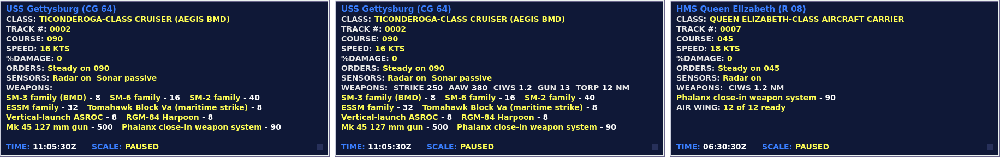

# M27: Ship fits and the reach line

28 September 2026. Built on M26 (`c6b1f0f`).

The report was that some ships carry one system with no range, and that defences and weapon
complements should be more accurate. Every ship and submarine loadout was audited against its class's
public fit, and the answer turned out to be two different problems. Some hulls were thin because the
data left out weapons the real ship carries. Others are thin because the real ship is, and the fix
there was to say so on screen, not to invent hardware. The command screen also never stated how far a
ship's weapons reach, which made both kinds read alike.

## What was wrong in the data

The audit tabulated each hull's weapons by type and reach and checked the result against public
references ([the source ledger](../DATA_SOURCES.md#ship-fit-review-28-september-2026) has the basis for
each line). Seven hulls were corrected:

| Hull | Before | After |
|---|---|---|
| Arleigh Burke IIA and III | Nothing past a 13 nm gun on 14 of the 16 Burkes in the 13 operations that sail one; the other two (one each in Gulf and Spratly) had Tomahawk patched in by hand | Tomahawk x8 |
| Virginia | Torpedoes, 25 nm | + Tomahawk x12 in her twelve payload-tube cells |
| Astute | Torpedoes, 25 nm | + Tomahawk x12 |
| Improved Kilo (636.3) | Torpedoes, 22 nm | + Kalibr x4; the Project 877 boats stay torpedo-only |
| Suffren | F21 x20, 27 nm | F21 x16 + SM39 Exocet x4 (new weapon) |
| Iver Huitfeldt | No close-in layer, no torpedo, 8 Harpoon | Millennium 35 mm CIWS (new weapon), MU90 x12, 16 Harpoon |
| Visby | Gun and torpedoes; nothing past 11 nm | + RBS15 x8 |

Two weapons are new, `millennium_35mm` and `sm39_exocet`, each with a generated model, beauty render and
thumbnail from the Blender-free art pipeline. They follow the existing conventions: `GAMEPLAY_ESTIMATE`
throughout, a `ciws` counted in bursts, an `asm` with the AM39's reach.

## What was left alone, and why

The most tempting "fix" would have been to give the thinnest hulls a missile. Public sources say the
data is right, so it stays:

- **Queen Elizabeth** carries Phalanx and nothing else. She has no missile defence of her own; the 30 mm
  DS30M is listed "for but not with", and Navy Lookout's guide, which covers events into 2026, still describes a
  Sea Ceptor fit as a case to be made, not a programme. Her escorts are her air defence, which is the tactical point of
  stationing a Type 45 near her.
- **Juan Carlos I** carries four 20 mm guns, and the game has no mount for one. She appears in no operation.
- **Type 26** has no anti-ship missile: the weapon planned for it arrives in the early 2030s.
- **Nansen, Udaloy, Mistral, Braunschweig, Mogami and Type 056A** are what their class fits are.

`tests/test_fits.gd` pins each of these, with the reason, so reversing one has to be a decision.

## The reach line

The data display listed each system and its count and never said how far any of them reached. The
unit panel did, but rounded a Phalanx's 1.2 nm to "1 nm". The head of the WEAPONS block now reads, for
a Burke III, `WEAPONS:  STRIKE 250  AAW 100  CIWS 1.2  GUN 13  TORP 12 NM`: the farthest reach for each job, on
the row that was already there. A hull that cannot do a job leaves it out, so the Queen Elizabeth reads
`WEAPONS:  CIWS 1.2 NM`.

The first version put a range on every weapon row, and the screenshot showed why that fails: the
Ticonderoga's Mk 45 and Phalanx were pushed off the bottom of the display. The display holds about
five weapon lines, and the largest hulls already run past that: a width estimate puts the Type 055's nine
systems at about eight lines and the 052D's seven at six, so their lists are cut today. The header line costs no line, and it survives
the cut. The unit panel and the header both print ranges with `Geo.format_nm`, which keeps a tenth where
the reach is not a whole number of miles.

## Validation

- **483 regression tests pass** (466 before): 14 new fit tests, 3 new display tests, and one
  corrected. The submarine data test used to assert that every weapon a boat carries is a torpedo; it now
  asserts at least one torpedo and that anything else is a strike missile. Reverting three of the fits
  makes six of the new tests fail, so they do check the data.
- 46 command-screen checks and 19 aviation checks pass under Xvfb.
- The scenario sweep (all 22 operations, two seeds, AI on both sides, 6,000 s each) is running against the
  old and the new data side by side; its results are added to this note when it finishes.
- Not done: the browser build (`docs/play`) was not rebuilt, because it needs export templates this
  environment does not have. It carries the old fits until someone with templates rebuilds it.

## Known limits and next steps

- **Torpedo defence.** A ship's only answer to a torpedo is the shared decoy pool and its own speed. A
  separate anti-torpedo system (a towed decoy, the Russian Udav rocket) would be more accurate, but
  torpedoes barely feature in the AI sweeps, so it was not built.
- **MdCN.** Suffren can carry it (MBDA reports it fired in her trials). Adding it needs a land-attack weapon and a
  decision on how the Tartus operation, which has shore targets, should use it.
- **The weapon list still overflows on the largest hulls.** The reach line is a stopgap; a real fix is a
  compact two-column layout, or the list paging with the board.
- The Gulf and Spratly scenario builders (`tools/scenarios/build_theatres.py`) still pass the Burke's Tomahawk
  fit explicitly. It matches the hull default now, so it does no harm, but it would hide a later change to
  the default.
