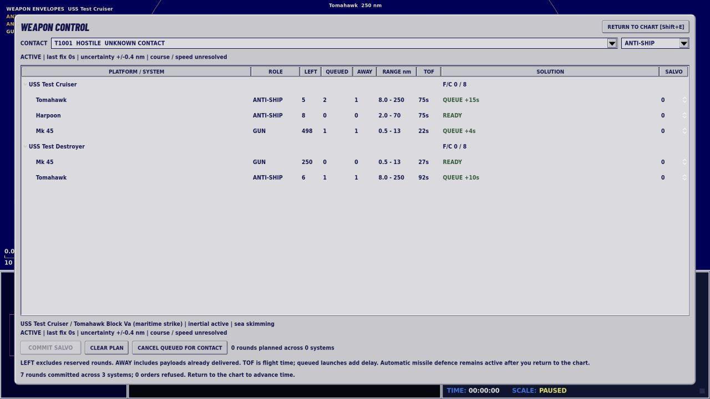
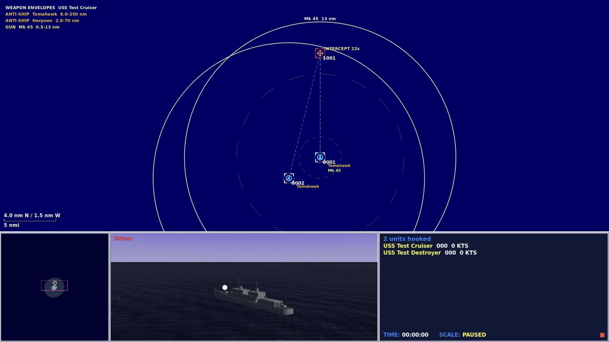

# Weapon control and catalogue audit

The M30 update keeps the Fleet Command-style CDS: the tactical chart, NTDS contact symbols, right-click orders and the three lower panes. A grey Weapon Control dialog adds a complete firing board without replacing the quick engagement menu.

## Issue a mixed salvo

1. Hook one or more friendly ships or airborne aircraft, then a contact. Press **Shift+E**, choose **Weapon control** from the right-click menu, or open **ALL SYSTEMS** on the Engagement tab.
2. Each fitted weapon has its own row beneath its platform. Set quantities in the **SALVO** column. Different weapons and different ships can be included in one commitment. The plan total includes systems hidden by the current role filter and states how many are hidden. Choose another held contact from the dropdown to build its plan; changing the contact clears the uncommitted quantities.
3. **COMMIT SALVO** sends individual orders through the normal simulation validation. The receipt reports accepted systems and refused orders. **LEFT** is available stock after reservations; **QUEUED** is still aboard; **AWAY** includes an ASW payload already delivered into the water.
4. Return to the chart to advance time. **CANCEL QUEUED FOR CONTACT** returns only unfired rounds. A weapons-hold order also cancels queued fire. Weapons already in flight continue their engagement.

Launchers enforce spacing across repeated orders. VLS weapons on the same unit share an abstract launch service; other weapon families have independent mounts or racks. Automatic defence shares that service and can delay an offensive queue. These intervals and the single-service VLS approximation are gameplay tuning, not throughput claims for real launchers or their separate modules. Queue estimates can lengthen when defensive fire intervenes.

Pending shots are rechecked for track ownership, identity, range, terrain, launcher damage, emissions and weapons hold. Losing the shot cancels the reservation instead of launching blindly later. Existing airborne rounds still follow the simulation's guidance and acquisition rules. The after-action count increments when a round actually leaves, rather than when its entire salvo is reserved.

## Read the plot

**Shift+R** toggles role-coloured weapon envelopes for the reference platform. The filter on Weapon Control selects all systems, air defence, anti-ship, ASW, land strike or guns/CIWS. Dual-role weapons appear in each applicable filter. The reference library uses the same filters, including aircraft missiles and guided bombs.

| Colour | Role | Chart convention |
|---|---|---|
| Blue | SAM / AAM | Solid maximum range |
| Amber | Anti-ship | Solid maximum range |
| Teal | Torpedo / ASW rocket | Dashed maximum range |
| Violet | Land strike / guided bomb | Bomb range is dashed |
| Pale yellow | Gun / CIWS | Solid maximum range |

Inner dashed circles mark minimum range. The legend names each available system and its range band; it stays clear of the lower chart readout. The selected weapon adds a line to the predicted intercept and a dashed seeker basket. These are game envelopes, not detection ranges or guarantees of a hit. Friendly and hostile NTDS frame colours remain unchanged.

The firing solution solves for the contact's estimated motion and checks the distance to the intercept point. A receding contact inside the nominal range can still be beyond reach. A bearing-only contact has no missile solution; torpedoes may still search the estimated bearing. Last-fix age, positional uncertainty and unresolved motion appear on the board. Stale tracks and uncertainty wider than the seeker basket produce warnings. No targeting UI reads hidden enemy positions, identities, damage or destruction.

Rounds have distinct chart shapes: torpedoes use a ring and heading stroke, guns use tracers, bombs use diamonds, air-defence missiles have a crossbar, and ASW rockets have a surrounding ring. Labels on selected platforms are limited and separated to reduce overlap during massed fire.

## Catalogue corrections

The structural audit covers all **139 platform records and 148 weapon records**: every fitted weapon and delivery payload resolves, magazines are positive, VLS fits stay within capacity, and range/speed/launch-interval fields remain usable. This is not a claim that every real configuration or performance number has been independently verified. The targeted source review changed these material mismatches:

| Record or fit | Previous behavior | M30 behavior |
|---|---|---|
| AIM-9X aircraft record | Classified as a ship SAM | AAM; the alternate family record also uses an imaging-IR seeker label |
| AGM-158B JASSM-ER | Could attack ships | Fixed/relocatable land-target role; maritime strike remains a separate weapon family |
| RUM-139 VL-ASROC | Fast underwater torpedo, including surface attack | ASW rocket flies to its launch solution, then releases a Mk 54 with its own speed, search and run budget |
| Type 07 VLA | Same single-speed underwater abstraction | Rocket delivery followed by a representative Type 97-family payload; exact payload variant is a scenario assumption |
| Mk 54 | Surface and subsurface target domains | Anti-submarine role |
| British F-35B | AMRAAM and assumed JSM strike fit | Two AMRAAM, two external ASRAAM and two Paveway IV in a representative mixed strike fit |
| Japanese F-35B | Assumed the JSM procurement also applied to the STOVL variant | Counter-air fit; JSM is removed from the default B-model fit |
| Astute | Maritime-strike Tomahawk seeker | Separate tube-launched land-attack Block V record alongside Spearfish |
| Il-38N and Tu-142 | Submarine-launched heavyweight UGST | Representative airborne APR-3-family ASW fit; the source explicitly lists Il-38, while the Tu-142 variant/quantity remains an inference |
| Orion | Two Kh-38-family missiles | Three generic 50 kg guided bombs, matching a manufacturer's example weight class without claiming a particular named-weapon certification |

The aircraft catalogue is still a set of scenario fits, not a complete station-by-station loading simulator. Planned or fictional 2027 configurations elsewhere in the catalogue retain their existing labels. This pass does not certify every national integration or every future delivery date.

The new Paveway IV and generic light bomb use a simple altitude-dependent glide envelope against land targets. Laser designation, detailed ballistics and release aerodynamics are not simulated. Bomb height descends along the flight path. AAM detection and the 3D view now use the launch aircraft's altitude instead of placing all AAMs at their resource's fixed default height; subsequent air-to-air vertical maneuver remains abstracted.

ASW rockets use an air-to-water transition. They do not acquire a submarine during the air leg or teleport to its true location. After water entry, the payload searches locally without automatic track steering; SAMs cannot pursue it underwater. The board's ASW **TOF** is the delivery flight time, with underwater search and prosecution occurring afterward.

## Sources and uncertainty

Checked 29 September 2026. The changes use public role and integration information; probabilities, signatures, ranges, salvo intervals and most magazine choices remain marked gameplay estimates.

- [Lockheed Martin JASSM product page](https://www.lockheedmartin.com/en-us/products/jassm.html) describes air-to-ground employment against fixed and relocatable targets. It supports separating the baseline AGM-158B record from maritime strike.
- [U.S. Navy Mk 54 fact file](https://www.navy.mil/Resources/Fact-Files/Display-FactFiles/Article/2167937/mk-54-lightweight-torpedo/) identifies the surface/air-launched ASW role and the Mk 54 VLA integration. [DOT&E FY2023 Mk 54 report](https://www.dote.osd.mil/Portals/97/pub/reports/FY2023/navy/2023mk54.pdf) describes placing the torpedo near a submarine through aircraft release or VLA delivery. Neither supplies the gameplay trajectory used here.
- [JMSDF procurement listing](https://www.mod.go.jp/msdf/bukei/t2/nyuusatsu/K-07-6100-0115.pdf) identifies Type 07 as a vertically launched torpedo-delivery rocket and lists Type 97 separately. The exact Type 97 payload modeled here is an explicit representative assumption, not a payload certification inferred from that list.
- [Edwards AFB F-35B UK weapons tests](https://www.edwards.af.mil/News/Display/Article/1121590/461st-flts-tests-uk-weapons-for-f-35b/) documents ASRAAM and Paveway IV testing. [UK MoD answer 31754](https://questions-statements.parliament.uk/written-questions/detail/2022-07-06/31754/) identifies AMRAAM, ASRAAM and Paveway IV as certified stores. The [Commons F-35 briefing of 7 April 2025](https://researchbriefings.files.parliament.uk/documents/CBP-10239/CBP-10239.pdf) distinguishes these from delayed future integrations. The game does not treat the RAF website's broader weapons list as proof that every listed integration is already available.
- [Kongsberg's JSM fit-check announcement](https://news.cision.com/kongsberg-gruppen-asa/r/kongsberg-successfully-completes-fit-check-of-joint-strike-missile--jsm--in-the-internal-carriage-ba%2Cc9425712) specifies internal carriage engineering for F-35A/C. [Kongsberg's Japanese follow-on order announcement](https://kommunikasjon.ntb.no/pressemelding/18758660/japan-anskaffer-flere-jsm-missiler-fra-kongsberg?lang=no&publisherId=17849152) specifies F-35A. Removing JSM from the default B fit avoids assuming that procurement for one variant certifies another.
- [Royal Navy Astute equipment page](https://www.royalnavy.mod.uk/equipment/submarine/astute-class) identifies TLAM's land-target role. Its [31 May 2022 Block V upgrade announcement](https://www.royalnavy.mod.uk/news/2022/may/31/20220531-submarine-services-tomahawk-missiles-receive-265m-revamp) concerns land attack, supporting a separate UK TLAM record.
- [Rosoboronexport Aerospace Systems catalogue, 2005, p.129, mirrored manufacturer PDF](https://server.3rd-wing.net/public/tiengo/Doc/r%C3%A9aliste%20avionics%20russes.pdf) describes APR-3E as air-delivered ASW and explicitly lists Il-38. It does not certify the exact modern Tu-142 fit used here. The modeled family and quantities are labeled accordingly.
- [Kronshtadt Orion-E brochure](https://kronshtadt.ru/assets/files/productfiles/%D0%9E%D1%80%D0%B8%D0%BE%D0%BD_new/%D0%9E%D1%80%D0%B8%D0%BE%D0%BD-%D0%AD%20%28eng%29.pdf) lists a 250 kg payload and three 50 kg guided bombs as an example. An older [manufacturer ISR brochure](https://kronshtadt.ru/assets/files/productfiles/Orion_eng.pdf) lists 200 kg and a different cruising speed. The newer strike-capable configuration is the basis for this representative fit; the two brochures are not treated as identical aircraft specifications.

## Validation and local release

The regression suite includes launcher spacing, shared VLS service, cancellation/refund rules, observer ownership, intercept geometry, ASW delivery, aircraft altitude and corrected fits. The real-scene interface check exercises mixed salvos on two ships, cancellation, role filtering, target clearing, modal pause restoration and launch statistics.

Validation completed with 564 regression checks, 47 existing command-screen checks, 19 aviation checks, 32 workshop checks at each desktop size and 24 weapon-control checks at each desktop size. All 52 actual-scene battles reached 6,000 simulated seconds without script errors, with zero units aground in the final state. Of the 52 outcomes, two changed relative to the recorded M29 sweep: coastal stress seed 2 changed from a loss to still running; Taiwan Strait seed 13 changed from still running to a loss, with the protected carrier destroyed instead of surviving at 48/400 HP. These are observed outcome changes, not proof of any one causal parameter.

The final 274-actor rendering sample reached 21.7 fps at a 1600 × 900 logical viewport, with a 74.0 ms p95 and a 147.5 ms worst frame over eight seconds. Earlier M30 symbols measured 16.1 fps; batching the SAM/AAM symbol geometry removed excess draw work. The samples are short and the initial comparisons overlapped background stress tests, so no controlled percentage speedup is claimed. Large battles still have visible frame stalls.

The final run counts, battle outcomes, exported-package checks and hashes are recorded in [validation-m30.json](validation-m30.json). The full catalogue snapshot is [catalogue-audit-m30.json](catalogue-audit-m30.json). The editable Godot source and browser package are included. Open `Launch Preview.command` for the local build; publishing this update to GitHub and Pages is a separate step.
