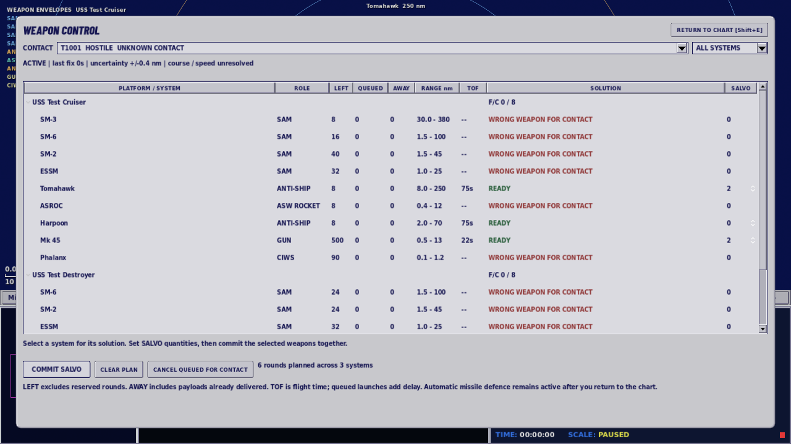

# Combat controls and missile tracking

Attack and Defence now sit together on the command strip. The own-platform context menu also offers countermeasure readiness, evasion, resuming the standing plan, interceptor policy and automatic or manual countermeasures.

Attacks recheck the firing solution at the gesture. The firing board and radio report actual committed rounds, including mixed magazines across a group. Unfired cancellations report the rounds refunded and any remaining queue. Spent systems stay visible so their reserved and airborne rounds remain inspectable. Filtered plans are validated before being summarized or committed. Defensive selections report mixed settings accurately.

Hover a plotted missile or torpedo to inspect it. Own weapons show the launcher, held target, estimated time and remaining range. Opposing weapons require a detection available to the current observer and expose no hidden launcher or target. Expired rounds disappear from detection records and from the chart and 3D view, including changes while paused or disconnected from the shared picture.

Weapon movement uses swept acquisition and impact geometry within the remaining flight range. This prevents skipped targets, speed-dependent hits far abeam and impacts before seeker activation. Interceptors lead the detected inbound instead of chasing its current position. Ships ignore unlocked air-to-air rounds that cannot attack them. Automatic acoustic expendables share the same finite pulse and reload as manual deployments; one salvo no longer empties the acoustic magazine immediately.

Repeated work is reduced by indexing observer-held track lookup, sorting salvo queues only after changes, grouping locked threats by target, recording missile trails on simulation changes and caching model availability and unchanged solar calculations.

## Performance evidence

These isolated probes compare the affected operations on the same Godot 4.7.2 runtime. They measure script work, not total frame rate.

| Probe | Before | After |
|---|---:|---:|
| Countermeasure target traversal: 120 hulls, 800 torpedoes | 50.586 ms/cycle | 4.082 ms/cycle |
| Observer lookup: 200 tracks, 30,000 lookups | 966.285 ms | 45.397 ms |
| Launcher readiness: 500 queued rounds, 300 queries | 523.980 ms | 267.565 ms |
| Model availability: 48 entries, 1,000 frames | 913.746 ms | 25.330 ms |

A five-second graphical sample of the 115-unit Joint Task Force at 1× remained about 9 FPS on this environment's Mesa llvmpipe software renderer. The sample contained no weapons in flight and does not establish an overall combat FPS improvement or a hardware GPU budget.

## Validation

The machine-readable results are recorded in [validation-combat-cleanup.json](validation-combat-cleanup.json). Validation uses the exact Godot 4.7.2 runtime shipped with the browser build.

- 638 regression tests, including 39 additions, passed; the runner's runtime-error self-check passed.
- 338 graphical checks passed across weapon control, Northern Passage, Command Watch, Cold War, aviation and fleet workshop flows. Weapon control was exercised at 1280 × 720 and 1600 × 900.
- Seven Northern Passage policy/replay runs passed 115 checks, with identical seed-31 replay results.
- All 46 scenario runs (23 scenarios, seeds 2 and 13) reached 6,000 simulated seconds without engine errors or unintended groundings. The model/data hash stayed unchanged across the full sweep.
- The local browser package was rebuilt and checked through real browser input, with no page, request or game-script errors. Its loader size matches the 60,801,056-byte package.

The rebuilt browser package loads and the Attack and Defence boards render at 1280 × 720. Expanding the 3D pane still produces the inherited Godot/WebGL buffer warnings observed in earlier builds with Chromium SwiftShader; the inspected view renders correctly. This cleanup does not claim to resolve that renderer limitation.

