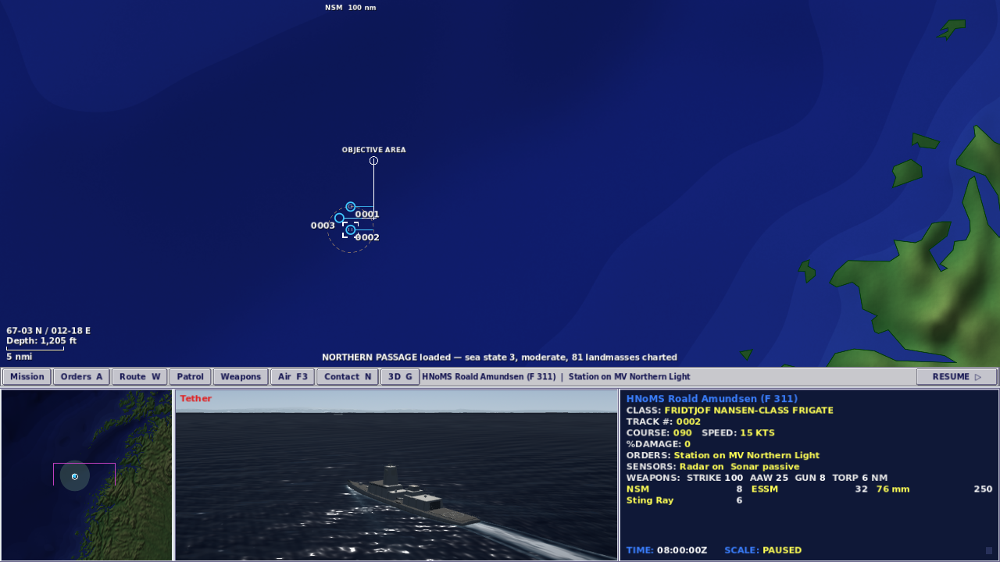
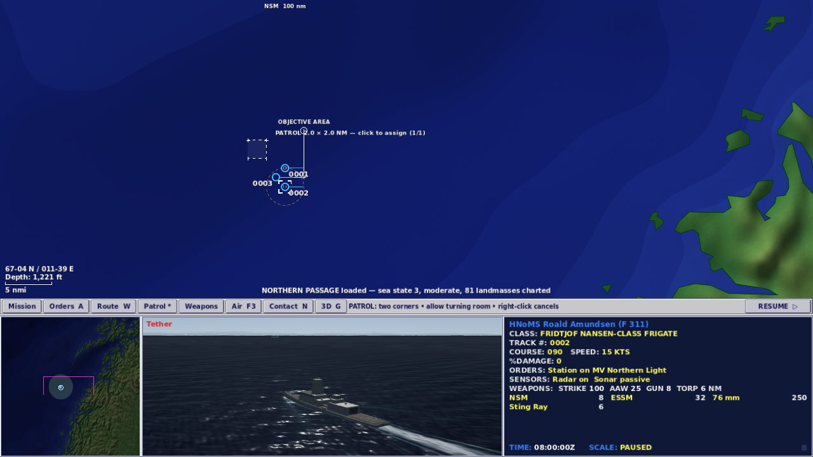
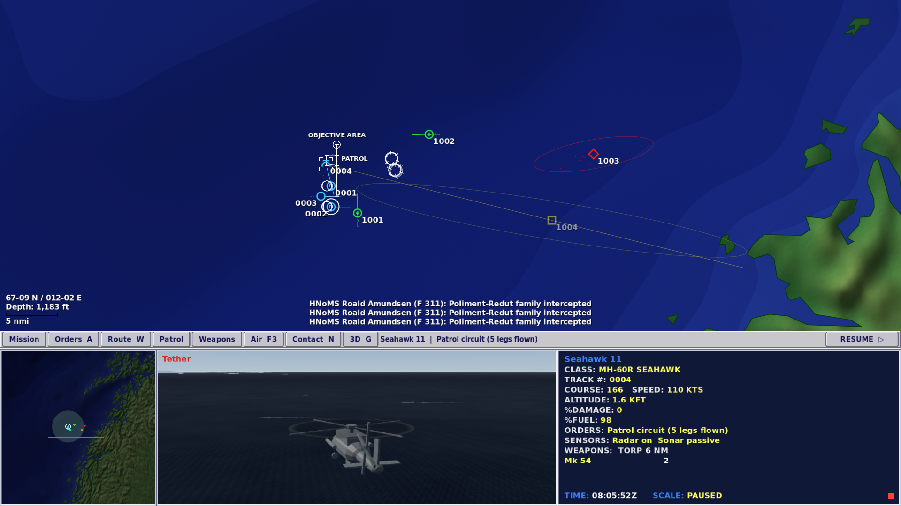
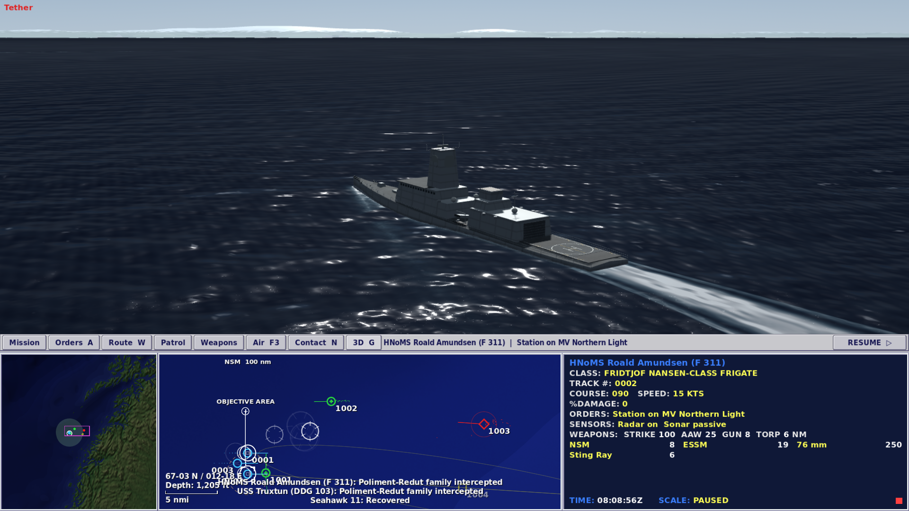

# M32: Command Watch

30 September 2026 · local development build · Godot 4.7.2

This pass brings the graphics, controls and tasking closer to the supplied Fleet Command reference notes. The four-pane command display remains the centre of play: an uncertain tactical picture above a regional chart, a live 3D camera and compact platform data.

## What changed

The chart uses deeper naval blues, quieter green relief and larger four-digit track numbers. Northern Passage now opens on the convoy approaches at a 32 NM vertical extent; its regional pane still carries the whole theatre. Coastlines, depth rasters and detection rules retain their geographic meaning.

A slim, square, bevelled command strip exposes Mission, Orders, Route, Patrol, Weapons, Air, Contact, 3D and Pause. These keys invoke the same command paths as the keyboard and contextual menus. The strip shows the selected platform's current task and explains how to finish a route or patrol. It remains usable while paused and is isolated behind modal screens.

The live view has blue-grey maritime daylight and a slightly higher tether camera that keeps the horizon visible. Three escorts have new, original recognition models: Nansen's single broad radar tower and long flight deck, Gorshkov's tapered mast and foredeck launch cells, and Steregushchiy's compact deckhouse, spherical mast cap and inclined launchers. Bridge glazing, hangar doors, boats, davits, railings, deck markings and fittings replace the earlier generic blocks. Each model uses 12 merged material surfaces and 6,164–7,040 triangles. The GLBs and all recognition images were regenerated from the maintained Python authoring pipeline.

## Use patrol tasking

1. Hook an airborne aircraft or another deployed, mobile platform.
2. Choose **Patrol** on the strip, use **Shift+W**, or choose **Assign patrol area** in the platform's right-click menu.
3. Click the entry corner, then the opposite corner. The preview shows the circuit and whether each selected platform can accept it. Right-click or Escape cancels drawing.
4. The platform repeats the four legs. Its data display reports the completed legs, and the chart closes the circuit with a dashed return leg and a PATROL label.

A patrol must allow at least one nautical mile per leg. Fast platforms require more: validation calculates their turning diameter and arrival tolerance. Hulls cannot receive a circuit or approach that crosses land. Invalid orders leave the previous plan intact. A speed increase that would make the circuit unsteerable is also refused with an explanation.

Patrols leave formation. A new transit/course, Stop, Clear Route or formation order cancels repetition. Radar, sonar, emissions, weapons state and compatible speed changes retain the circuit. Evasion temporarily suspends it and then resumes the plan. Aircraft consume normal fuel; return orders, bingo fuel and tanker diversion supersede the patrol. Launch and recovery still require the actual deck cycles. Patrol assignment does not improve a sensor or reveal enemy truth.

The opening briefing introduces the new tool and advises recovering reconnaissance early as the opposing ships close. A long exposed patrol can lose the aircraft; there is no protected patrol state.

## Captures from the running game

The command screen at 1280 × 720:



Two-corner patrol preview, before any order is issued:



The helicopter has completed a circuit, consumed fuel and contributed reconnaissance to the shared picture:



The rebuilt frigate, after recovering the patrol helicopter; G exchanges the chart and the live camera:



The same chart treatment was inspected in [Hormuz](2026-09-30-command-watch-hormuz.png), [Tartus](2026-09-30-command-watch-tartus.png) and [the Spratlys](2026-09-30-command-watch-spratly.png). These are native viewport captures, not mockups.

## Verification

The exact results and limits are recorded in [validation-m32.json](validation-m32.json).

- 599 regression tests pass, including 12 new patrol tests. The runner self-check confirms runtime exceptions fail the suite.
- 42 native mouse and keyboard checks pass at each size and exercise the real scene at 1280 × 720 and 1920 × 1080: paused assignment, cancellation, control bounds, actual launch, a repeating reconnaissance circuit, endurance consumption, return/recovery, command panels and the live view swap.
- Existing command-screen, aviation, workshop and weapon-control suites pass. Northern Passage's seven ordinary-order trials retain their outcomes and exact seed-31 replay across commands, observations, positions, health, fuel and magazines.
- All 46 full scenario runs pass: 23 shipped scenarios, seeds 2 and 13, and 6,000 simulated seconds per case, with no script errors or hulls grounded at the end. Results are recorded individually in the validation file.
- The local browser package was rebuilt and opened in Chromium 151 with SwiftShader; the normal command view, patrol controls, flight deck and weapon screen were inspected.

The inspected browser patrol is [captured here](2026-09-30-command-watch-browser-patrol.png).

The inherited WebGL buffer warnings when G resizes the 3D view remain. M31 reproduced the same warnings in the unchanged M30 package; this pass does not claim to repair that engine/browser path. Native live-view checks pass. The virtual display also reports unsupported V-Sync; it uses Mesa llvmpipe software rendering.

## Reproduce

```sh
godot --headless --path . --import --quit
godot --headless --path . --script tests/run_tests.gd
python3 tools/test_runner_self_check.py "$GODOT"
python3 tools/verify_northern_passage.py "$GODOT" work/m32/policies
xvfb-run -a -s "-screen 0 1280x720x24" godot --audio-driver Dummy --path . \
  --resolution 1280x720 --script tools/command_watch_playtest.gd -- --seed=31 --capture
xvfb-run -a -s "-screen 0 1920x1080x24" godot --audio-driver Dummy --path . \
  --resolution 1920x1080 --script tools/command_watch_playtest.gd -- --seed=31 --capture
python3 tools/smoke_scenarios.py "$GODOT" work/m32/sweep
tools/web/build_web.sh
```

This validation was completed locally before commit, push or publication; remote CI and deployment status are recorded separately by GitHub Actions. Full mid-engagement save/load remains a separate future milestone.
