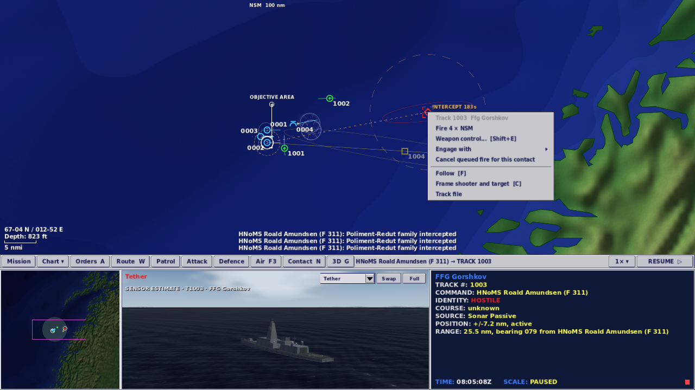
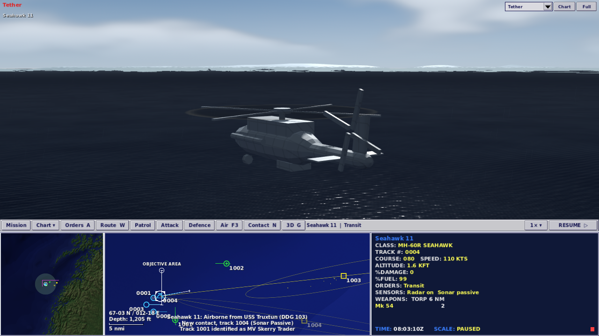
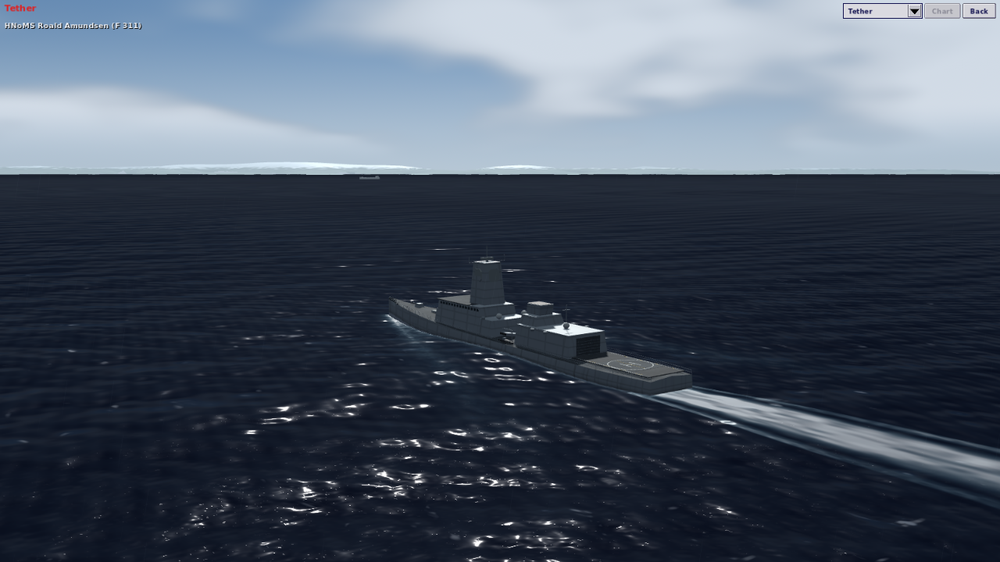

# M33: Command intent and consequences

30 September 2026 · local development build · Godot 4.7.2

The previous build reproduced Fleet Command's four-pane display, but several interactions still felt like operating a simulation interface. This pass connects a simple order to an understandable task, a crew acknowledgement and the right live view.

## What the research showed

The [original reference manual](https://archive.org/details/Janes_Fleet_Command), including its [searchable OCR](https://archive.org/stream/Janes_Fleet_Command/Janes_Fleet_Command_djvu.txt), describes a direct command loop: select a platform, right-click an unknown to identify it, or engage a hostile using a suitable weapon. Its Intercept Track section describes movement into weapon range. The camera chapter describes a named subject and action cuts that return to the hooked platform.

The contemporary [COMBATSIM review](https://www.combatsim.com/htm/may99/fleet-rev1.htm) praises accessibility and short tutorials; its [visuals and sound discussion](https://www.combatsim.com/htm/may99/fleet-rev3.htm) emphasizes the connection between the command display and the battle. [SUBSIM's review](https://www.subsim.com/ssr/fleet1.html) describes the appeal of missile trails, ship damage, aircraft activity and the tethered view. These sources support improving interaction and feedback before expanding the already substantial catalogue.

The supplied screenshots are visual reference material. They are not instructions to copy the original game's assets. All game art and code remain original.

Three specific gaps in M32 motivated the changes:

- Selecting a contact retained the shooter, but both the data and camera preferred that shooter. The contact therefore did not become the inspected subject.
- Routine firing required nested weapon/salvo menus. “Close to identify” only ordered a transit to the contact's old position; it did not follow the developing track.
- The wide 3D pane squeezed out the sky. Camera choices needed remembered keys, action cuts lacked subject captions, and scenario weather had no visible cloud or rain layer.

## What changed

**Inspect without losing command.** Click a contact and the data display and 3D camera follow the held contact. The selected shooter stays available, and the display names it beside the contact. Clicking your own platform restores its data and view. Unknown contacts retain generic depictions and reported positions. Class-known contacts use recognizable models with an uncertainty ring and **SENSOR ESTIMATE** caption; hidden damage and wakes remain hidden. Hover text explains a chart mark in plain language using only the information held.

**Give a persistent investigation order.** Select a deployed ship or aircraft, right-click an unresolved contact and choose **Investigate contact**. The unit follows updates to that held track until its class is established, the contact becomes unavailable, or a sea approach is blocked. It reports the result over the radio. Surface ships and helicopters stop using normal deceleration; fixed-wing aircraft continue forward flight. New navigation, formation and accepted recovery orders replace investigation. Evasion temporarily takes priority, and bingo fuel still sends aircraft home. Bearing-only contacts cannot supply a destination. There is no automatic weapons release.

**Fire a stated salvo directly.** A contact menu now exposes **Fire N × weapon** when a selected platform has a valid firing solution. It uses fitted suitable weapons, actual free ammunition, rules of engagement, range and guidance/channel checks. With several shooters, the menu states the total rounds and the number that can fire. An unavailable shot shows its blocking reason. The detailed firing board and weapon/salvo submenu remain available. This is an in-range fire command; the original game's automatic movement into attack range is still a separate gap.

**Find controls with the mouse.** **Chart** exposes graphic ship/aircraft silhouettes, labels, the symbol key, sensor/weapon ranges, zoom and fleet/theatre framing. A separate time menu exposes 1×–60× without resuming a paused watch. The 3D pane has a camera selector, Swap and Full/Back buttons. Accepted commands receive short platform-attributed acknowledgements; grouped salvos report the ammunition actually committed, including when a menu's requested quantity has become stale.

**Read the live scene.** Tether framing adapts to the pane's aspect ratio to retain a useful horizon and more sky. The subject and action captions explain what is being shown. Hull fill lighting improves readability under cloud. Scenario `cloud_cover`, `rain_intensity` and optional `cloud_base_m` drive lightweight cloud banks and near-camera rain; their animation stops while paused. Wind-only changes now refresh the environment. Northern Passage explicitly authors broken clouds and light drizzle, described in its briefing. The existing sea state and visibility still govern sensor conditions; cloud/rain add no new sensor rules.

At takeoff, the camera stays outside the aircraft's own launch ship while keeping the aircraft selected. Close aircraft framing returns as normal flight climbs and clears the host. This changes presentation only; it does not relocate aircraft or alter flight rules.

## In-game captures

These are captures of the running native game, not mockups.








## Validation

The combined build preserves the current combat cleanup's Attack/Defence controls, queued-fire cancellation, missile tracking and authoritative firing checks. It passes **660 regression tests** and **231 native checks**, covering both 1280 × 720 and 1920 × 1080, actual ammunition receipts, weapon control and Command Watch. A new regression also covers paused cloud changes invalidating the solar-lighting cache. The current package hash, fresh scenario results and verification of the combined source are recorded in [validation-m33-merge.json](validation-m33-merge.json). The screenshots above show this combined build.

The integrated source also passed a fresh **46-run scenario sweep**: every operation at seeds 2 and 13 reached 6,000 simulated seconds without unexpected errors or grounded hulls. Content hashes verify that the simulation scripts and data stayed unchanged across the sweep. GitHub's regression and interface workflow passed for the game commit; its run is linked in the combined validation record.

Before integration, local validation passed **620 regression tests**, **150 native interaction and targeted checks**, and **283 existing interface and Northern Passage assertions**. All 23 scenarios completed two 6,000-second AI runs (46 total) without script errors or grounded hulls. The rebuilt browser package loaded in Chromium without page or script errors, and its mouse controls and expanded view were visually checked. Its existing 257 WebGL resize warnings also reproduce in the baseline.

The earlier local snapshot remains in [validation-m33.json](validation-m33.json); its package hash describes that earlier build. Run the new real-scene interaction checks with:

```sh
godot --headless --path . --editor --import --quit
godot --headless --path . --script tests/run_tests.gd
godot --path . --resolution 1280x720 --script tools/fleet_command_playtest.gd -- --seed=31 --capture
godot --path . --resolution 1920x1080 --script tools/fleet_command_playtest.gd -- --seed=31 --capture
godot --path . --resolution 1280x720 --script tools/fleet_command_playtest.gd -- --seed=31 --capture --aircraft-capture-only --receipt-check
tools/web/build_web.sh
```

Pass `--output-dir=res://work/validation-name` after `--` to preserve evidence from a previous run.

This remains a bounded improvement to the existing game. A developed campaign, mid-engagement save/load, recorded crew voices, detailed aircraft texture work and automatic intercept-to-engage are not delivered by this pass. Performance values remain game estimates. The pre-existing Chromium/SwiftShader buffer warnings on resizing the 3D viewport are tracked separately from native correctness.
