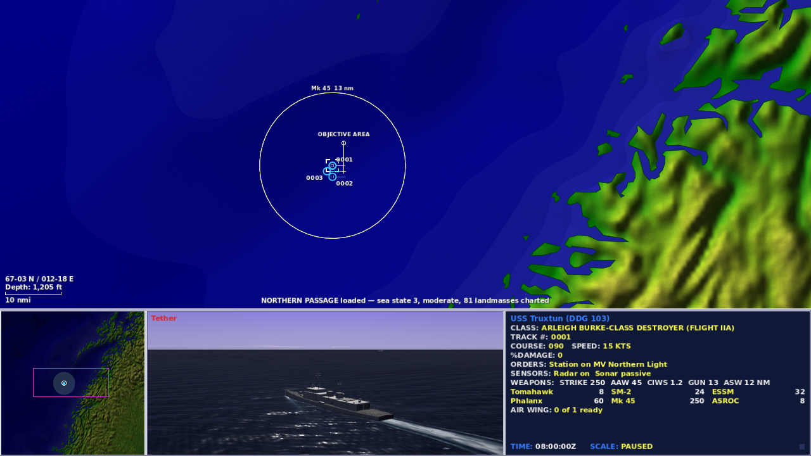
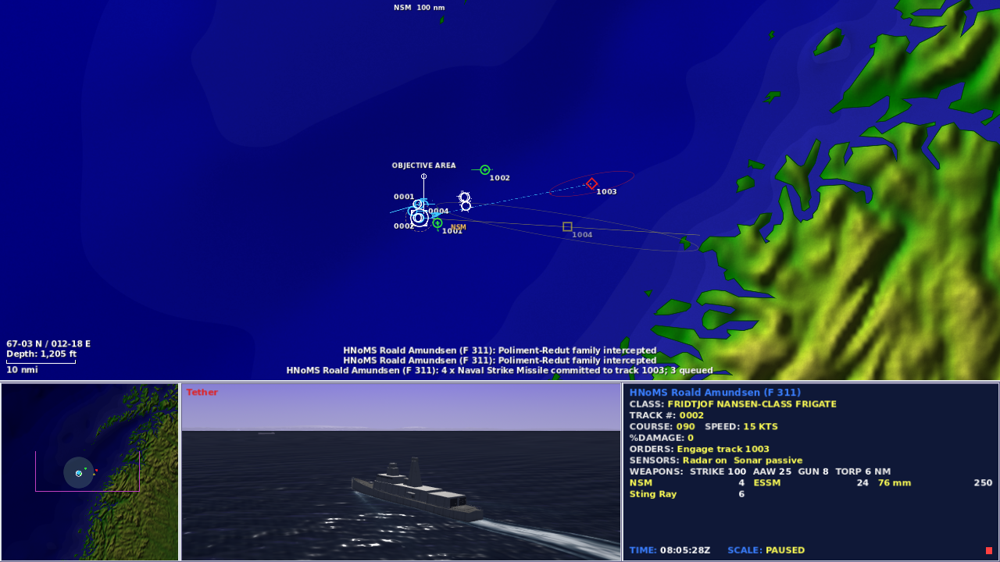

# M31: Northern Passage

## Implementation plan

The starting checkout is `7c89570`. A fresh Godot 4.7.2 run passes 577 regression tests and the runtime-error runner self-check. It already implements the CDS four-pane screen, observer-limited tracks and 3D view, finite weapons and defensive capacity, helicopters and carrier cycles, real geography, and custom scenario authoring.

This milestone completes an approachable first operation on that foundation:

1. Add **Start Northern Passage** to the existing operations desk, keeping the custom library and optional templates available.
2. Generate an original Norwegian Sea escort with a Burke IIA, Nansen, one embarked MH-60R, an escorted freighter, two opposing combatants, and two neutral merchants. Validate the actual eight-mile route, timing, coastline clearance, and initial investigation interval.
3. Add attributed-loss objectives so player-caused civilian sinkings can fail the mission without blaming the player for every neutral loss. Show civilian incidents, defensive and offensive ammunition expenditure, and the player-observed event timeline in the debrief.
4. Test normal-order victory and defeat, deterministic replay, paused commands, reconnaissance and contact boundaries; run regressions and real-scene UI checks at 1280×720 and 1920×1080, and inspect native screenshots of command and engagement screens.
5. Update the existing current-state/validation records and rebuild the existing browser export without committing, pushing, or publishing.

## Scope boundaries

Full mid-engagement save/load remains the next major playability milestone. The existing time-compression choices, simulation units, platform catalogue, art, and geography stay in use. This delivery does not claim completion of the whole supplied build brief or introduce a campaign, multiplayer, or a new engine.

## Play this milestone

Open `project.godot` with Godot **4.7.2**, or run `godot --path .`. Choose **Start Northern Passage**, read the paused briefing, then **Take Command**. The freighter already has its two-leg route and the escorts are following it. Space pauses without advancing movement, sensors, fuel or deck timers; orders remain available.

Use **F3** to open Air Operations, choose Truxtun, light Seahawk 11's launch lamp, then **Launch Now** or **Ok**. Resume to complete the two-minute launch. Keep reconnaissance close enough to the escorts to defend it; an early return is safer than flying directly at the opposing group. **Shift+E** opens Weapon Control. It explains rejected shots, launch queues and finite ammunition. Identify unknown surface contacts before committing NSM. **H** lists controls; **A** opens the status boards and observed comms; **G** swaps chart and 3D; **Ctrl+F10** twice restarts.

The debrief shows achieved/avoided conditions, player-caused civilian sinkings, defensive and offensive ammunition, own losses and the observed message timeline. Scroll the report for its full contents. Selecting weapons free issues a warning; a round fired at an unknown merchant can still cause a mission-ending civilian incident.

## Implementation

The new scenario generator uses the existing coastline and catalogue pipeline. `follow_route: true` converts the authored `patrol_nm` legs to initial player MOVE orders; legacy AI patrols retain their existing behavior. An optional `caused_by` field on named `unit_lost` objectives uses the existing last-attacker faction, including later fire/flooding deaths. The scenario workshop validates both fields.

Main keeps civilian incidents separate from enemy kills. Both use the held contact label. The debrief consumes the same observed radio traffic the player received, including legitimate visual identification; it does not pull enemy names or events out of debug truth. The journal keeps the latest 512 messages and reports truncation, while the existing 60-line comms board stays compact. Both reset on restart.

The frigate closes along an authored patrol using the existing breakout posture, active search radar and its own AI picture. No scripted damage, free contacts, extra ammunition or forced mission outcome is used in the end-to-end policies.

## Route and measured outcomes

The cargo route is **3 + 5 = 8 nautical miles**. The generic freighter retains its existing **15-knot** cap, giving a nominal 32-minute transit. Fixed-tick play reaches the 0.35-mile exit circle after **1,850 seconds (30:50)**, with turn execution, waypoint acceptance and the arrival radius included. The limit is 2,700 seconds, leaving 14:10 margin on that undelayed passage. Both route legs and all starting hull positions pass the shipped coastline checks.

| Ordinary-order policy | Seed | Observed result |
|---|---|---|
| Keep the screen, launch/return reconnaissance, use NSM on held hostile tracks | 31, repeated | Victory at 30:50; exact replay match |
| Same escort policy | 13 | Victory at 30:50 |
| Break formation, silence sensors, hold weapons and send both escorts away | 31 and 13 | Freighter lost at 17:46; defeat |
| Stop the freighter with the escorts present | 31 | Deadline defeat at 45:00; freighter still alive |
| Weapons free, commit NSM at unknown surface tracks | 31 | Player-caused merchant sinking at 00:44; defeat, no enemy-kill credit |

The escort's first opposing launch occurs at 03:41.75 and its first player launch at 05:08. Both escort seeds expend eight offensive rounds, use 56/63 defensive rounds, and return the helicopter alive. The freighter arrives undamaged while both opposing combatants remain afloat. Coastal Star is sunk by RED collateral damage in these runs; the attributed loss condition correctly does not blame BLUE for it. This distinguishes victory from an empty sea and also shows why the civilian tally says “sunk by your force.”

These are automated policies driving the real Main scene through normal orders and fixed simulation ticks. They demonstrate reachable outcomes and repeatability, not broad human playtesting or difficulty tuning across every possible tactic.

## Validation

All commands below used the pinned engine after sourcing the cloud activation file:

```sh
source /workspace/.cloud-onboarding/naval-fleet-command/activate.sh
godot --headless --path . --import --quit
python tools/scenarios/build_northern_passage.py
python tools/test_runner_self_check.py "$GODOT"
godot --headless --path . --script tests/run_tests.gd
python tools/verify_northern_passage.py "$GODOT" work/m31/policies
```

- **587 regression tests, zero failures**, versus a freshly verified 577-test starting point. The runner self-check confirms a runtime exception produces failure.
- Seven actual-scene mission policies pass **115 assertions**. Seed 31 repeats exactly, including commands, observations, unit positions, health, fuel, magazines and outcome.
- Generation is byte-for-byte repeatable; the scenario contains seven surface hulls, one embarked helicopter and 81 coastline polygons.
- Existing native suites pass: **47** command-screen checks, **19** aviation checks, **34** workshop checks at each of 1600×900 and 1280×720, and **24** weapon-control checks at each of those sizes.
- Northern Passage passes **29 graphical checks at each of 1280×720 and 1920×1080**. These are actual output pixels; Godot uses its existing 1600×900 logical canvas and scales it to the window. Desk, briefing, four-pane command screen, engagement and scrollable debrief were inspected.
- The M31 checks are added to the existing CI workflow. This is local verification; no remote CI run or publication is claimed.

Graphical command template (replace both sizes for the second run):

```sh
xvfb-run -a -s '-screen 0 1280x720x24' godot --path . \
  --audio-driver Dummy --resolution 1280x720 --script tools/passage_playtest.gd -- \
  --policy=escort --seed=31 --capture --out=res://work/m31/graphical-1280.json
```

Existing interface flags were run with Xvfb at the sizes above: `--cold-war-smoke`, `--aviation-smoke`, `--fleet-workshop-smoke` and `--weapon-control-smoke`. Workshop and weapon checks used isolated `res://work/m31/` scenario libraries. Gulf/Hormuz, Mediterranean/Tartus and Pacific/Spratly were also rendered after 300 simulated seconds and visually inspected, alongside the new North Atlantic mission.

**All 46 shipped-scenario battles passed:** 23 scenarios, seeds 2 and 13, and 6,000 simulated seconds per battle, with no script/parse failures or grounded surviving hulls. This uses the existing `--autopilot --fastforward=6000 --dump` path; seed 13 and the final Pacific cases ran in parallel, and the remaining duplicate queue was stopped after all distinct cases passed. Reproduce the complete sweep serially with `python tools/smoke_scenarios.py "$GODOT" work/m31/sweep`. These are fixed-duration AI execution checks, not a claim that every operation reaches victory. Custom stress fixtures from earlier milestones are outside this run.

## Native captures





[The same engagement at 1920×1080](2026-09-30-passage-engagement-1920.png) and [the resulting debrief](2026-09-30-passage-debrief.png) are additional native captures. These images come from the running game; they are not mockups or generated artwork.

## Browser package

`tools/web/build_web.sh` rebuilds the existing Web export, with pack and runtime sizes checked against the HTML loader. The local package was served with `python -m http.server 8765 --bind 127.0.0.1 --directory docs` and opened in **Chromium 151.0.7922.173 / WebGL 2 / SwiftShader at 1280×720**. The new start button, paused briefing, Take Command, Space, F3 flight-deck controls, Shift+E weapon board and G pane swap were exercised and visually inspected. Boot, the normal command view, F3 and Shift+E recorded no warnings or JavaScript exceptions in the staged check. Expanding the 3D view with G emitted WebGL `INVALID_OPERATION` buffer warnings. The same 257-message warning sequence reproduces when G expands Northern Convoy in the unchanged starting export (`7c89570`), served locally with the same runtime and browser. This existing renderer limitation remains; an error-free browser session is not claimed. [The browser flight-deck capture](2026-09-30-passage-browser-air.png) shows the single ready MH-60R.

This validates browser boot and control routing, not a full browser battle or browser save persistence. See [validation-m31.json](validation-m31.json) for package hashes, exact native commands, policy states, assertions and diagnostic logs.

## Remaining limits

Full mid-engagement save/load is still unimplemented and is the next substantial milestone. It must preserve clock/PRNG state, orders, formations, aviation references, tracks, weapons/launch queues, cooldowns, objectives and the observed journal, with resumed-versus-uninterrupted replay tests. Custom scenario saves do not meet that requirement.

The existing 1×/2×/5×/10×/30×/60× choices remain, rather than introducing the brief's proposed 4× and 8× options. Attribution uses last-attacker responsibility, not proportional blame in mixed attacks. The journal has a disclosed 512-message cap. Catalogue performance, readiness, detachments, magazine fits and combat probabilities remain game estimates documented in the existing source ledgers.

The expanded browser 3D view retains the existing WebGL buffer-warning limitation described above. Native software rendering reports unsupported V-sync changes. Some test shutdowns also report 2–10 retained ObjectDB instances; no unexpected script/runtime errors were reported in the final mission checks. No lifecycle overhaul or new FPS benchmark is claimed. Changes and the rebuilt browser pack remain local: no commit, push, deployment or publication was performed.
