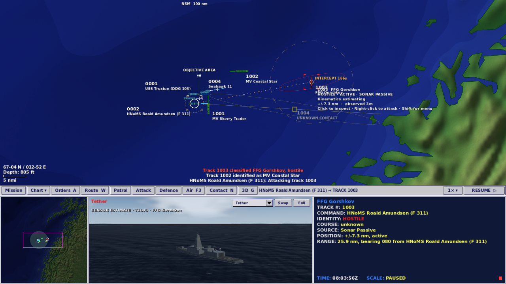
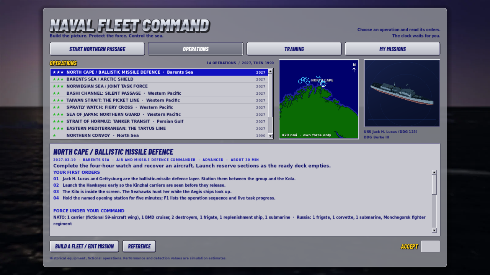
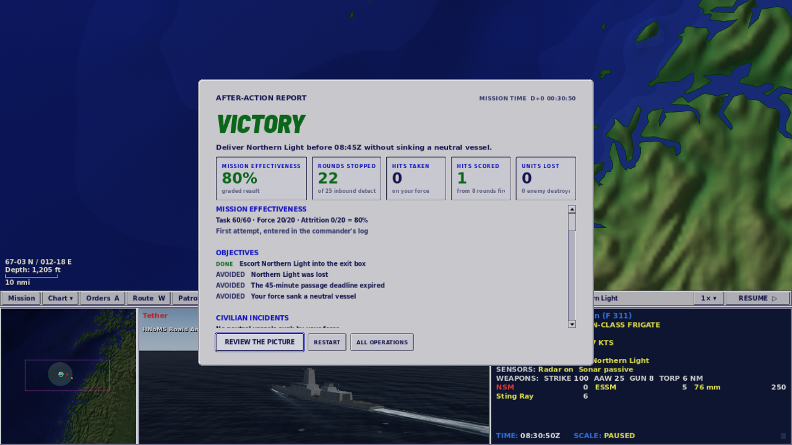

# M34: The command loop

1 October 2026 · local development build · Godot 4.7.2

## Why the game still did not feel like Fleet Command

The project had rebuilt Fleet Command's screen but not its command loop. In the 1999 game, a hooked platform plus one right-click produced a standing task that the crew carried out: close to range, choose the weapon, keep firing, and report what it was doing on the ORDERS line. Here, every order was either a state change or an in-range fire command that the player had to set up. The one subsystem that closed on a target and kept shooting on its own was the enemy AI, which is never attached to the player's side. The enemy had the autonomy the box copy promised the player.

Around that core, the 1999 game's framing was missing or inverted. Its star-rated single missions were the front door; here the 22 authored operations sat behind an empty mission builder under **Optional Templates**. Its debrief graded the mission as an effectiveness percentage and kept the best score in a commander's log; here a mission ended in a binary VICTORY or DEFEAT and nothing was remembered. Its crew spoke; here they type. Its automation sat on the offensive side, and in the shipped game even missile defence was left to the player by default. Here automation sits almost entirely on the defensive side.

The result was a more accurate simulation than the 1999 game, operated through a denser console. That is precisely what reviewers praised Fleet Command for not being. GameSpot's Chet Thomas put it this way: it "takes the Harpoon model of real-time naval combat, strips it to the bone, and wraps it in a simple and visually dynamic package without sacrificing the core sense of depth and realism" ([GameSpot, 1 June 1999](https://www.gamespot.com/reviews/fleet-command-review/1900-2536050/)).

This milestone fixes the core loop and the two framing devices that cost least to build. The rest is ranked below as future work.

## What the original did

All quotations are from the original manual's [OCR text on archive.org](https://archive.org/stream/Janes_Fleet_Command/Janes_Fleet_Command_djvu.txt) unless another source is linked. Each was checked against that text for this note, and the OCR's character errors are corrected.

**One right-click was the whole engagement.** "Right-click on Enemy or Neutral Object: The hooked platform moves to attack the chosen enemy object. The best weapon for the attack is automatically selected." And: "Right-click on Unknown: The hooked platform moves to identify the unknown object." The quick-start section says the same thing in one line: "For a quick attack, left-click on your chosen platform and right-click on the enemy target. Your platform automatically moves in for the attack using the most appropriate weapon."

**The attack was a standing task, not a shot.** "When you use the default right-click Engage command, your platform continues to fire its primary weapon until the hostile track is destroyed or your platform is destroyed, unable to fire due to damage, has depleted its supply of appropriate weapons for the target, or until you give it another order. If your asset depletes its supply of primary weapon before the threat is destroyed, your platform continues to engage the hostile track with the next best weapon appropriate for the contact."

**It closed to range on its own and said so.** "Regardless of which Engage command you use, if the target is out of range of the designated 'best' or selected weapon, the firing platform moves to intercept the target. You are notified of this situation by the INTERCEPT TRACK message in the ORDERS section of the Data Display. The weapon is fired as soon as the target is within the designated weapon's range."

**The cursor told you what the click would do.** "When your platform is hooked and the cursor is over a hostile track, the cross-hair cursor appears indicating that the default right-click command is Engage."

GameSpot's review describes the same loop from the player's side: "All commands are handled from this simple and elegant screen layout. Some orders are simple mouse-driven commands, such as move to a location, identify an unidentified target, and destroy an enemy target."

**Missions were the front door, and they were graded.** To begin a single mission: "Click the mission title of your choice. A description of that mission appears along with a map of the region where the mission takes place. Stars next to the mission name denote level of difficulty, from one star (easy) to four stars (most difficult)." The campaign advanced on a grade: "you must successfully complete all the goals of the specific mission and score a minimum mission effectiveness rating," from 50% for the first mission to 65% for the last. Scores were built from platform points: "If a Friendly platform is damaged or destroyed, its points are subtracted from your mission score. If a Hostile platform is damaged or destroyed, its points are added to your score… When a platform is damaged but not destroyed, the player still receives partial points." A log kept the record: the game "maintains a log for every commander you create. The log displays the best score for every mission attempted by your current commander," with "the date and time you completed your best score."

**The defensive side was the player's job by default.** "SHIPS AUTO-ENGAGE INCOMING MISSILES: When this option is ON, your ships automatically engage incoming missiles with the best weapon available as soon as they are within range. When this option is OFF, you are responsible for defending your ships from missile attack. (Defaults to OFF.)"

**The crew talked.** [SUBSIM's review](https://www.subsim.com/ssr/fleet1.html): "If a platform is out of weapons or doesn't have the proper weapon to engage the target you select, you will hear a regretful 'Cannot comply.' … A lot of 'Roger!', 'Out!', and 'He's toast!' ringing out against the background noise of the type of ship or plane you have selected." The same review confirms the default layout: "a 2D map view that comprises the top half of the screen, a regional map, Data Display, and 3D window." The owner's screenshot with the 3D view on top shows the swapped state, which this game already offers on **G**.

## Why this build missed it

These are the specific places the command loop broke, as the code stood at the start of this milestone.

- **No attack order existed.** `Order.Type` had 27 members and none closed to range. The engage order was accepted only when the shot was legal at that instant, so a contact out of range got a greyed "Cannot engage: out of range" in the menu and no movement.
- **The right-click did not do the job.** A bare right-click on a contact only hooked it and opened a menu. Only Ctrl or Cmd plus right-click fired, and only with a weapon already lined up on the orders board. The H board promised "Contact: engage," which the chart did not deliver.
- **The enemy had the loop the player lacked.** The enemy AI's engage-then-close behaviour already existed, but Simulation builds an AI controller only for factions the player does not command.
- **The authored operations were hidden.** The desk opened on **My Missions**, which is empty on a fresh install and greets the player with "Create your first mission". The 22 operations sat under **Optional Templates**, described in the README as "for editing, reference and regression coverage."
- **Nothing was graded or remembered.** The mission manager could only end in VICTORY or DEFEAT. The debrief showed four raw counts, and nothing was written anywhere when a mission ended.

## What changed

**A standing Attack order.** A new `Order.attack(track, weapon := "")` is a task the platform carries out until it ends. Each tick, the unit manager checks the held plot, picks the best weapon aboard with rounds left (longest reach first, guns last), or the weapon the player named. If the contact is out of range, the platform steers to a standoff at 80% of that weapon's reach and the ORDERS line reads **INTERCEPT TRACK**. It fires as soon as the envelope allows, which may be before the standoff. It waits for the rounds to arrive and reads the plot for 20 seconds, then fires again. When one magazine empties it moves on to the next suitable weapon, closing further if that weapon is shorter-ranged.

Inside a weapon's minimum range it opens out. Against a contact that is opening faster than the weapon can catch at that range, it keeps closing. When land blocks the round's path it moves to nearby water with an open line, or ends the attack if the coast leaves none. Bearing-only contacts are attacked only with torpedoes.

The task ends with a crew report when the target is destroyed, the contact is lost, the magazines are empty, weapons are put on hold, or the launchers are damaged. It also ends, with the reason, if it can neither fire nor move for three minutes. A move, course, stop, route, patrol, formation or investigate order replaces it silently, and so does Cancel fire on that contact. A speed order sets its closing speed. A second attack order on the same contact keeps the task and its pause. Evasion suspends it and hands back.

It never fires at a stale plot; it closes on it instead. It reads only the faction's held track. The one place it consults the ground truth is the unit manager ending every attack on a unit that has sunk, because the plot does not expire a track just because the ship under it went down.

**The right-click does the job.** With a platform hooked, a bare right-click on a hostile contact orders the attack. A bare right-click on an unclassified contact orders Investigate. The cursor shows a cross over a contact the hooked platforms would attack and a query mark over one they would investigate. **Shift+right-click** opens the contact menu. That menu now starts with **Attack track N** and an **Attack with** submenu, followed by the existing finite **Fire N × weapon**, the engage submenu and the firing board. Ctrl or Cmd plus right-click still fires the weapon lined up on the orders board.

**The operations are the front door again.** The desk opens on **OPERATIONS**: the 14 authored operations, with stars, theatre, and the 2027 headlines first and the 1990 pack after. **TRAINING** holds the eight exercises and Northern Passage. **MY MISSIONS** holds what the player builds, and **Build a Fleet / Edit Mission** stays where it was. Coming back from a mission, the desk opens on the shelf that holds it.

**Missions are graded and remembered.** The mission manager now grades every mission from 0 to 100. Task accomplishment is worth 60. It is credited only on a win, so before any civilian penalty a victory grades between 60 and 100% and a defeat between 0 and 40%. A mission won by any one of several routes counts the whole task as done. Keeping the force is worth 20, pro rata to the points of what was damaged or lost. Taking the enemy's points is worth 20, with partial credit for damage as in 1999. Each neutral vessel the player's weapons sink costs 25, and one they damage costs a pro-rata share of that, so harming civilians can pull even a victory below 60%. Platform points come from catalogue category: a carrier is worth 1,000, a destroyer 400, a frigate 250 and a fighter 60. A scenario may set its own `points` on any unit.

The debrief leads with **MISSION EFFECTIVENESS** and a one-line breakdown. A commander's log in the player's own storage keeps each operation's best result, its date and the attempt count. The desk shows the best percentage beside each operation and in its details.

These are captures of the running native game from the final validation runs, not mockups.

## Where this build deliberately differs from 1999

- **Neutrals are not attacked by a bare right-click.** The 1999 manual put "Enemy or Neutral Object" on the same default. Here a neutral, a friendly, or a classified contact of unknown allegiance gets the menu instead. That is because Northern Passage and the Gulf operations make civilian losses a defeat condition.
- **There is a pause between salvos.** The 1999 platform "continues to fire its primary weapon". With finite, modelled magazines, the task waits for a salvo to arrive and reads the plot for 20 seconds before spending more. That keeps a frigate from emptying its launchers into a contact the first salvo already sank.
- **There is no TURNING TO ENGAGE.** This build does not model launcher arcs, so there is nothing to unmask.
- **Self-defence stays automatic.** The 1999 default left missile defence to the player. The contemporary [COMBATSIM review](https://www.combatsim.com/htm/may99/fleet-rev2.htm) objected: "The game in its current configuration does not allow for friendly ships to protect themselves autonomously… Jane's should have included options to accommodate both gameplay styles." Making it an option is listed below.

## What is still missing, ranked

The research ranked fourteen gaps by how much they cost the feeling, then by how cheap they are to fix. This milestone closes the first four: the standing attack, the right-click defaults, the front door and the graded result. The rest remain:

1. **A crew you can hear.** Spoken acknowledgements, "Cannot comply", launch and splash calls, and an ambient sea and engine bed. As a first step, interface advice ("Select a shooter first") should move off the radio line so the radio carries only crew traffic.
2. **Global game options with a Classic preset.** Ships auto-engage incoming missiles (off in Classic), aircraft engage after a visual identification, a time ceiling (4× in Classic), and voice and ambient toggles. The orders menu should become a list of tasks rather than switches.
3. **Orders that arrive during the fight.** Tasking and intelligence messages with coordinates, objectives hidden until a tasking unlocks them, and seeded random start boxes so a replayed operation differs.
4. **Launch a mission, not an airframe.** CAP stations, visual identification sweeps, strikes and rally points chosen at launch, and Return to Station.
5. **A campaign.** Four linked operations with an effectiveness gate between them, and mid-mission save first. The commander's log built here is the gate's data. The sources disagree on what the 1999 campaign carried between missions. The manual says the fleet "will re-supply and rearm itself" between scenarios. COMBATSIM found each campaign "in effect one large mission" and wrote that "there really isn't any linkage between individual campaigns." Whether losses carry forward should therefore be a data switch, not a decision made in code.
6. **An Action camera that reaches the whole battle.** Today it only cuts to events within 40 nm of the hooked platform.
7. **A fuller contact readout.** "SOURCE: S-3 Viking Surf Search Radar" rather than "Radar", an estimated %DAMAGE line, hover-to-read, and F7 opening the hooked contact's reference entry.
8. **Stations the force returns to,** and group right-click attack and identify.
9. **Tutorials taught by doing,** and first orders written as orders rather than keystrokes.
10. **A debrief replay of the truth.**

## Validation

All of this ran on the final source in a cloud container, headless and under Xvfb with software rendering; the browser package was booted in headless Chromium. GitHub's own CI run on the commit also passed. [validation-m34.json](validation-m34.json) holds every count, the per-run sweep results and the package hash.

| Check | Result |
|---|---|
| Regression tests | 690 pass, 0 fail (660 before this milestone) |
| Command screen, aviation | 47 and 19 checks pass |
| Fleet workshop, weapon control | 38 and 30 checks pass at 1600 and at 1280 wide |
| Command Watch, contact intent and attack | 45 and 73 checks pass at 1280 and at 1920 wide, plus 20 aircraft and receipt checks |
| Northern Passage, graphical | 32 checks pass at 1280 and at 1920 wide |
| Northern Passage, seven ordinary-order policies | all pass; the seed-31 replay is identical |
| Scenario sweep, every operation at two seeds | 46 of 46 reach 6,000 s with nothing aground; every outcome matches M33's |
| Browser package | 58.1 MB; boots to the operations desk with no page or script errors |

Two things this does not show. No human has played the build since the change, and the sweep's autopilot drives the player's side through the enemy AI, so it exercises the shared simulation but never issues the new Attack order. The attack is covered by 18 dedicated tests and by the real-input playtest, which right-clicks a live hostile.

## Sources

- *Jane's Fleet Command* reference manual (Sonalysts / Jane's Combat Simulations, 1999), [archive.org OCR](https://archive.org/stream/Janes_Fleet_Command/Janes_Fleet_Command_djvu.txt). Quoted sections: Mouse Controls; Engaging Threats (Right-click Engage Command, Intercept Track, Turning to Engage); Single Missions; Campaigns; Admiral's Log in Detail; Game Options; Mission Editor (Points).
- Chet Thomas, ["Fleet Command Review"](https://www.gamespot.com/reviews/fleet-command-review/1900-2536050/), GameSpot, 1 June 1999.
- ["Fleet Command"](https://www.subsim.com/ssr/fleet1.html), SUBSIM Review, 1999.
- ["Fleet Command" review, part 2](https://www.combatsim.com/htm/may99/fleet-rev2.htm), COMBATSIM, May 1999.

No Jane's or Sonalysts art, text, names or assets are used in the game. The quotations above are research notes for this record only.
