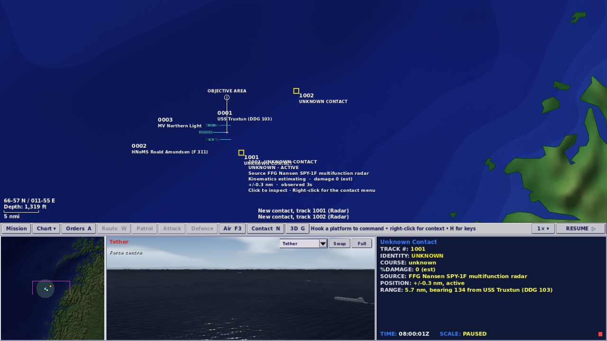
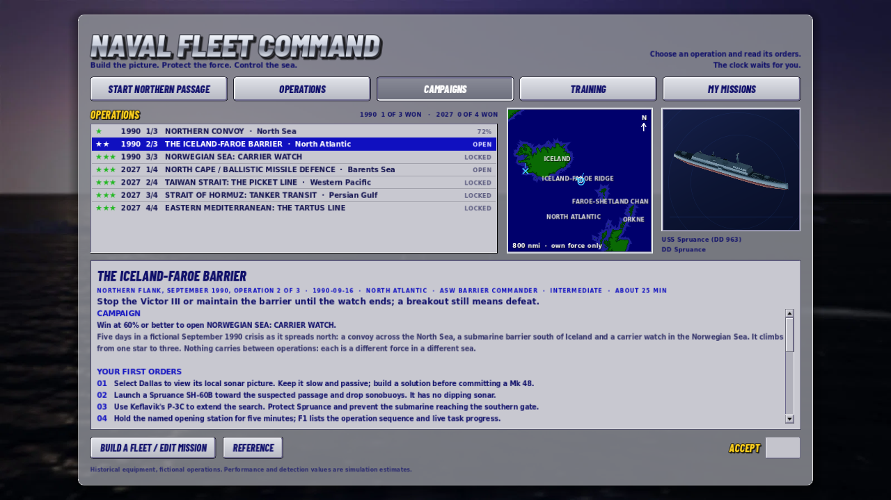
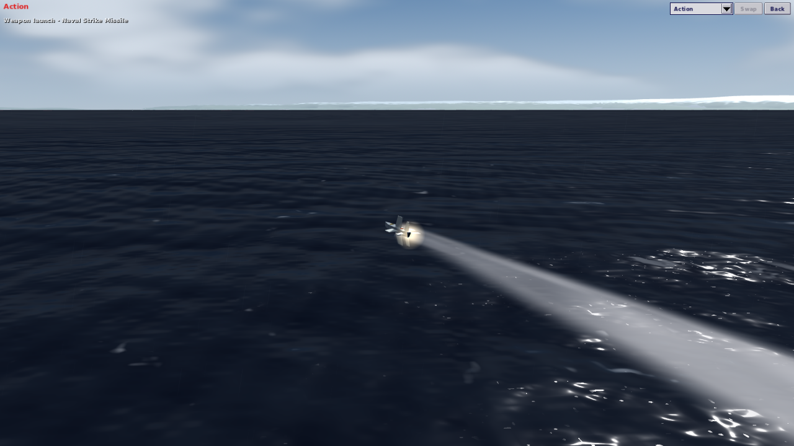

# M35: nine missions, a crew you can hear, and campaigns

M34 gave the game Fleet Command's command loop. M35 makes the game smaller and louder. Twenty-three missions became nine, each a different command problem, and those nine now also run as two campaigns. The crew speaks, the sea and machinery have a sound bed, and a contact reads out the way the 1999 data display read one. A spatial index cuts the heaviest mission's sensor cost. The crew, the campaigns, the camera and the readout come from the [M34 note's ranked gaps](2026-10-01-fleet-command-command-loop.md#what-is-still-missing-ranked): the first, fifth, sixth and seventh.

## Nine missions

The list had grown to 23 by accretion. Eight were set in the Norwegian Sea, four in the Western Pacific and two each in the Barents Sea and the Baltic. The Sea of Japan appeared in both 1990 and 2027, and several training missions taught the same thing. Each kept mission now answers a different question:

| Mission | Shelf | The command problem |
|---|---|---|
| Northern Passage | Training | Escort a freighter through traffic; the screen, the plot and one helicopter |
| Carrier Qualification | Training | The air-operations cycle with nothing shooting back |
| Northern Convoy, 1990 | Operations | A convoy screen with a shared single-arm launcher |
| The Iceland–Faroe Barrier, 1990 | Operations | Passive ASW: bearings, buoys and a breakout line |
| Norwegian Sea: Carrier Watch, 1990 | Operations | Fleet air defence against a Backfire raid |
| North Cape: Ballistic Missile Defence, 2027 | Operations | Two interceptor layers and a submarine inside the screen |
| Taiwan Strait: The Picket Line, 2027 | Operations | The largest air battle, under a coastal battery |
| Strait of Hormuz: Tanker Transit, 2027 | Operations | Small-craft swarms in dense traffic, and identifying before firing |
| Eastern Mediterranean: The Tartus Line, 2027 | Operations | A high-value unit under a long-range SAM umbrella |

That is one 2027 operation per chart region, three 1990 operations that climb from one star to three, and two to learn on. The cut missions are Shadow Line, Gotland Basin, Iceland–Faroe Gap, Faroe–Shetland Channel, Vestfjorden Approaches, Replenishment Group, Arctic Shield, Joint Task Force, the Vestfjorden sandbox, Bashi Channel, Spratly Watch, Sea of Japan 2027, and the 1990 Baltic and Sea of Japan missions. Their generators and files remain in git history at commit `38592fa`.

**The cut was made in the generators, and it exposed drift.** The documented regeneration sequence did not reproduce the shipped data. Pull requests 26 and 27 had hand-edited three catalogue files without updating their generators: the Perry's shared Mk 13 launcher, the Type 07's rocket delivery and the Japanese F-35B fit. A rebuild would have silently reverted all three, and the Perry is in a kept 1990 mission. They now live in the scripts. The sequence (`build_scenarios.py`, `build_northern_passage.py`, `build_cold_war.py`, `build_theatres.py`, `operation_design.py`) reproduces `data/` byte for byte. The nine kept files match their M34 versions byte for byte, except one deliberate fix and Northern Passage, whose regenerated file writes accented chart labels as characters rather than escapes (the parsed content is identical).

**That fix is Hormuz's neutral-loss condition.** It said "Neutral vessel sunk by own fire" but counted any loss, so an Iranian boat sinking the dhow failed the player's mission. It now counts only the player's fire, as Northern Passage already did, and a new test checks both directions.

Tests that loaded a cut mission were re-pointed to a kept one where they checked a rule (named-target victory, two-of-three tankers, a neutral loss outliving an enemy kill, a carrier group resolving every actor, one land mesh for hundreds of islands). Three were removed because a kept test already covered the same rule. The workshop's North Atlantic chart now borrows the 1990 carrier watch's coastline, whose open-water origin sits almost where the cut Norwegian Sea chart's did.

## Performance

| Measure | Before | After |
|---|---|---|
| Scenario data shipped | 7.31 MB, 23 files | 2.65 MB, 9 files |
| Desk refresh, first in a session | about 95 ms of parsing | about 32 ms |
| Desk refresh, every later one | about 30–55 ms | about 0.1 ms |
| Terrain clip per sight line, Taiwan Strait | 44 µs | 12 µs |
| Whole sight-line test, Taiwan Strait | 61 µs | 21 µs |
| Sensor cycle, Taiwan Strait at 30–40 simulated minutes | 42–45 s per 600 simulated s | 35–37 s |

Desk and terrain timings are native, on a shared cloud container under load, so treat them as ratios rather than absolutes. The browser package and boot comparison is in the validation record.

- **The desk index caches summaries.** Shipped missions are parsed once a session. A custom mission is read again when its modified time or length changes, or when the editor saves it.
- **The terrain index is exact.** Every radar, ESM, sonar and weapon sight line used to clip itself against every landmass on the chart, 406 of them in the Taiwan Strait. Charts with 64 or more landmasses now keep a bucket index, so a line looks only at the coast near it. A test compares indexed and exhaustive results on 15,000 random lines across five charts. Small charts keep the plain loop, which is faster for them.

**What the cut does not do: make a kept mission run faster.** Only the terrain index does that. The largest remaining cost is still sensor reporting, which grows with the number of radiating aircraft. In the Taiwan Strait a simulation tick costs about 8 ms at ten minutes and about 22 ms at forty, because ESM and radar report every listener–emitter pair each second. At 30× and 60× the clock cannot keep up late in that battle. The likely fix is to report a held, unchanged pair less often. That changes random-number consumption and therefore outcomes, so it belongs to the next milestone, with a new sweep baseline.

## Campaigns

The **Campaigns** shelf takes the seven operations in their in-game date order:

- **Northern Flank, September 1990:** convoy on the 14th, barrier on the 16th, carrier watch on the 18th.
- **Four Crises, 2027:** North Cape in March, the Taiwan Strait in April, Hormuz in May, Tartus in October.

An operation opens when the one before it has been won at 60% effectiveness or better. A defeat opens nothing, and neither does a victory spoiled by a sunk neutral. The commander's log is the only record, so a campaign needs no save file, and a win from the Operations shelf counts once the order reaches it. Locked operations say what opens them and cannot be accepted. The debrief says whether the result cleared the gate and what it opened.

Nothing carries between operations. The M34 note recorded that the sources disagree about the 1999 campaign: the manual says the fleet "will re-supply and rearm itself" between scenarios, and COMBATSIM found "there really isn't any linkage between individual campaigns." Here each operation is a different force in a different sea, so there is nothing to carry, and the desk says so.

## A crew you can hear

`CrewVoice` speaks short, original naval phrases for 19 command-screen events through the operating system's text-to-speech. The events are acknowledgements, refusals, weapons away, inbound missiles and torpedoes, kills, hits, losses, new and hostile contacts, bingo fuel, fire out, the mission result and, new in the merge, an attack broken off. Each own unit has a fixed pitch and rate. Alerts interrupt routine traffic; routine lines keep one pending, pace themselves and go quiet above 1×.

Interface advice ("Select a shooter before you engage", the reason an order was refused) moved off the crew's radio line into a dimmer advice line. It never reaches the comms board, the debrief journal or the voice. The platform says "unable to comply" and the console says why. An ambient bed of sea wash, machinery, rotor and jet follows the sea state and the hooked platform. Voice and ambient are toggled from Actions or the right-click Sound menu and remembered.

Voice is on by default in the browser, macOS and Windows. On Linux it needs speech-dispatcher and stays off until the player turns it on. No test or driven run ever reaches the operating system's speech.

## The contact readout

A contact's data display now reads like the 1999 one in the reference screenshot:

- **SOURCE** names the platform and set that made the last plot, for example "FFG Nansen SPY-1F multifunction radar".
- **%DAMAGE** is an estimate built only from your own hits against the reported class's catalogue health.
- **COURSE** and **SPEED** read plainly; the position row still states the uncertainty.
- With nothing hooked, the display reads whichever contact the cursor rests on.
- **F7** opens the reference on a classified contact's class, looked up from the track's reported class and never from the unit under it.

## An Action camera that reaches the whole battle

The M34 note listed the Action camera's 40 nm reach as a gap. Now:

- **It follows our strike rounds to the end.** An own launch that is not a torpedo, an interceptor or a gun round is followed until it disappears, then the camera holds for 4.5 seconds on the hit, kill, intercept or miss reported where it was last drawn. With nothing reported the caption reads "Round lost". Only a hit on, or the loss of, one of our own units takes the camera away mid-pursuit.
- **It goes wherever the plot witnessed something.** The 3D origin re-centres on the Action subject, so an event 120 nm off is drawn where it happened. `WorldPresentation.witness_point` still decides what may be shown: our own units at truth, anything else only as sighted or as the plot holds it. A detected enemy round becomes an "inbound" event, named only by a held track number.
- **The tether points without leaving.** When something worth watching happens out of frame, the tether's caption reads, for example, "Weapon impact · Track 1003 · F12 to watch" for three seconds, and switching to Action then shows that event.
- **The coast hides rather than lies during a jump.** On a re-centre of more than 12 nm the land is hidden for up to two frames, never drawn in the wrong place.

In the capture run behind that frame, the missile was fired at a hostile frigate and its seeker struck a neutral merchant in the traffic lane instead. That is existing seeker behaviour, not the camera's, and it is exactly the risk Northern Passage's orders warn about. In the browser, F12 may open the developer tools before the game sees it; T cycles to Action as well.

## Not verified

- **Speech and ambient sound were never heard.** This container has no speech-dispatcher, and every suite uses a recording sink and the dummy audio driver. Voices, pitch, interruption and the ambient levels are checked numerically only.
- **No human playtest** of the campaigns, the voice or the camera is recorded.
- Timings come from a shared container under load; the A/B comparisons were run back to back to keep them fair.

## Validation

Final runs on this tree, in a cloud container under Xvfb with software rendering. The full record is [validation-m35.json](validation-m35.json).

| Check | Result |
|---|---|
| Regression tests | 723 passed, 0 failed (690 at M34) |
| Runner self-check | pass |
| Command screen, aviation | 50 and 19 checks pass |
| Fleet workshop, 1600 and 1280 wide | 44 checks pass at each, campaign and shelf checks included |
| Weapon control, 1600 and 1280 wide | 30 checks pass at each |
| Command Watch, 1280 and 1920 wide | 45 checks pass at each |
| Contact intent, attack and readout, 1280 and 1920 wide | 79 checks pass at each, plus 20 for aircraft and receipts |
| Northern Passage graphical, 1280 and 1920 wide | 32 checks pass at each |
| Northern Passage policies | 7 of 7 pass; the seed 31 replay is identical |
| Scenario sweep, 9 missions at seeds 2 and 13 | 18 of 18 reach 6,000 s with no errors or grounded hulls; all 18 outcomes match M34 |
| Browser package | rebuilt, 60.9 MB to 56.4 MB; boots in headless Chromium with no page or script errors |

**Review.** Four read-only reviewers covered the cut and data, the desk and campaigns, the voice merge, and the readout and terrain index, each followed by an adversarial verifier. They raised 18 findings. The verifiers confirmed 15, 13 of them distinct, and all 13 are fixed. The most serious was that the workshop smoke, run as the README documented it, deleted the player's commander log. The verifiers rejected three: a voice-doc wording point (reworded anyway), the kill estimate on a stale track (it follows the existing radio rule), and the terrain test's two unindexed charts (the test now forces the index on them). A separate camera review raised three findings, all confirmed and fixed: a Detached view stranded where the Action shot was, a real hit at an uncertain plot captioned "Round lost", and a recovery shown twice. The first two have regression tests that fail without the fix.
