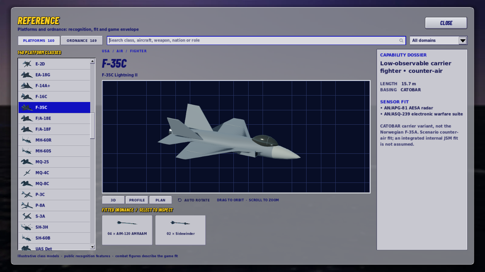
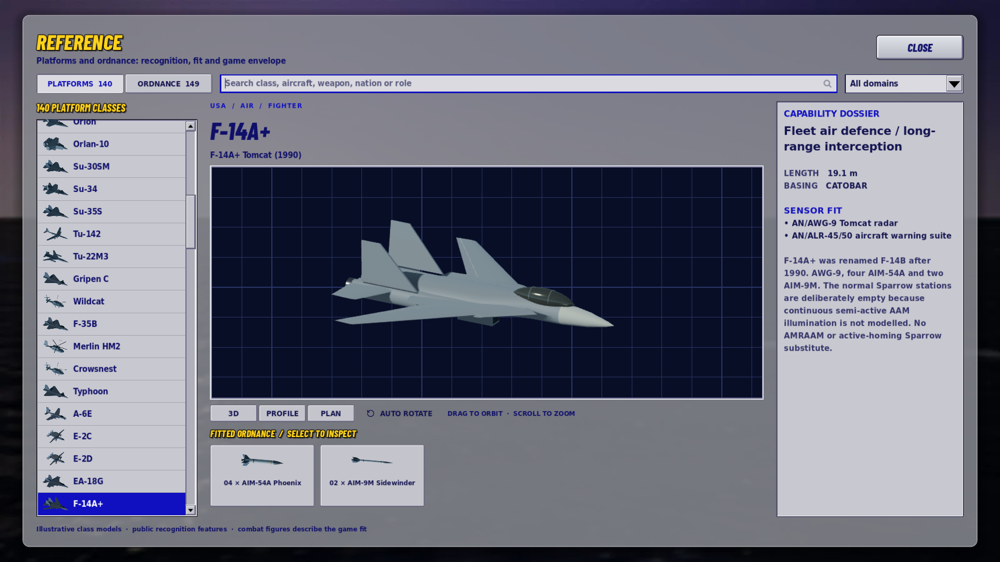
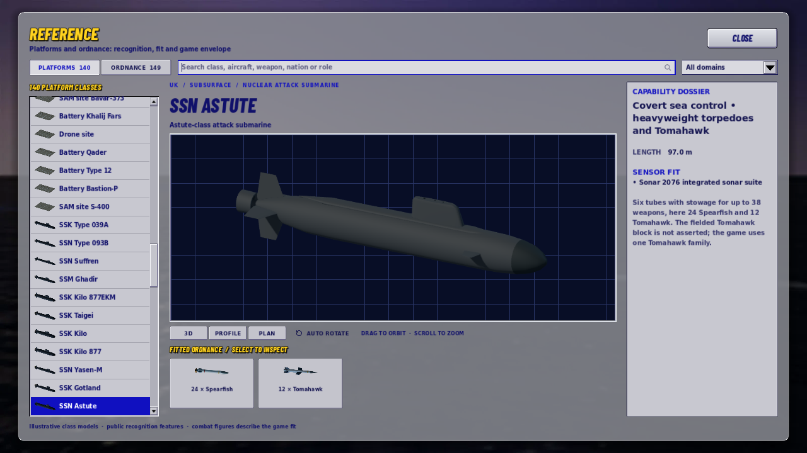

# Aircraft, submarines and the command-screen integration

2 October 2026 · Godot 4.7.2

This change combines the earlier [command-screen simplification](2026-10-02-command-screen-refinement.md),
[Classic/contact/guide work](2026-10-02-deep-command-review.md), and a new recognition-art pass.
It includes source, generated models and images, native validation evidence, and the rebuilt browser package.

## Model improvements

**22 aircraft entries and all 14 submarine entries** have revised original models. The 36 entries
include the Japanese F-35B and Iranian Project 877 donor copies. Every updated GLB has matching
beauty, thumbnail, profile and tactical-map plan renders. The definitive list is in
`validation-aircraft-submarines.json`.

Aircraft now use elliptical fuselage sections and tapered wing sections, with thin trailing edges,
framed glazing, recessed intakes and open exhaust lips. The F-35C has the wider carrier wing and fold
lines; F-35B has a closed lift-fan door. Hornet/Growler, Tomcat, Flanker, delta-canard and Falcon families
retain distinct planforms, engine arrangements and one/two-seat canopies. Patrol aircraft have curved
cockpit windows and engine openings; the S-3 has its T-tail, the P-3 its MAD boom, and the Hawkeyes their
four-fin tail, rotodome and variant-specific four/eight-blade propellers.

Submarines have rounded sonar bows, tapered afterbodies and faired sails. Beam, sail proportions,
bow/sail planes, cruciform/X stern controls and pump-jet/screw geometry vary by class. Virginia,
Astute and Kilo no longer inherit the generic sail planes. Pump-jet shrouds have open bores, and
exposed screws have pitched blades. Retracted mast heads avoid suggesting every boat is operating
with raised sensors. A dark matte coating preserves their silhouette under both studio and world lighting.

These remain approximate class-recognition models. Clean aircraft poses do not represent a current
weapons loadout; small fittings are illustrative. This art pass does not alter performance, detection,
weapons, scenario balance or which enemy information the player can see. The earlier held-report
rules remain authoritative for sensor-only models.

## Command changes included

- The persistent strip has nine controls; Orders leads with route and patrol tasks, and contact
  menus prioritize investigate/attack with detailed weapon selection nested below.
- Contact readouts distinguish live, stale and lost reports, show report age/source/uncertainty,
  and say “not assessed” when no damage has been assessed.
- Classic uses actual 1×/2×/4×/8× time, manual missile defence and attacks on orders. Saved legacy
  rules are preserved as Custom.
- The world view uses reported class and measured altitude, distinguishes sightings from sensor
  estimates, and respects terrain and submerged-observer limits.
- Northern Passage offers an optional, saved guide driven by real orders and reports. Bearing-only
  contacts get an explanation and an explicit skip, followed by safe recovery practice.

## Validation

The combined local build passed **889 regression tests**. Fresh native checks passed at both viewer
sizes: **154 at 1280 × 720**, **154 at 1920 × 1080**, plus **30 guided-command checks** at 720p.
The viewer checks instantiate all 36 entries through the actual Reference screen, verify live
geometry, contain all model bounds in each of the three camera presets, check control layout and
confirm the hidden viewport stops rendering. Screenshots were inspected for fighter, patrol and
submarine representatives. Earlier contact/attack, camera, mission and save checks are retained in
the linked command-review validation records.

The updated models range from **1,832 to 5,488 triangles**, with at most **six material surfaces**.
The complete catalogue import/material tests pass. Both donor GLBs and all eight donor images match
their refreshed sources byte for byte. The browser pack exports successfully and its loader byte
count matches; its SHA-256 and exact size are in `validation-aircraft-submarines.json`.

Browser execution and audio playback were not verified in this session. Native checks use OpenGL
Compatibility with Mesa/llvmpipe and dummy audio. Full logs are under `work/model-review/`.

## Rebuilding

`tools/art/build_air_subs.py` is the authoritative source for this set and is registered after the
older builders. `tools/art/rebuild_air_subs.sh` rebuilds meshes, imports, renders all four images,
copies donor derivatives last and imports again. Dependencies and import limits are documented in
`assets/README.md`. Rebuilding these entries with the old Blender generators would lose the changes.

The combined pull request also adds the guide and recognition-viewer suites to CI.
