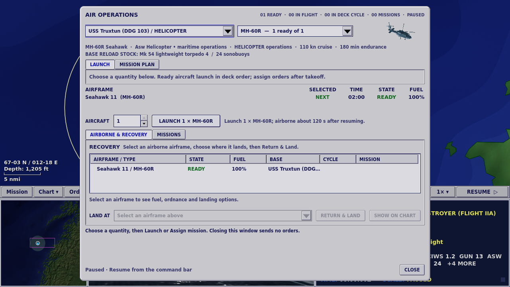
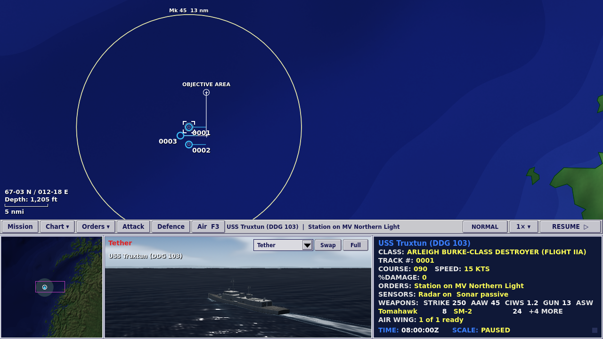
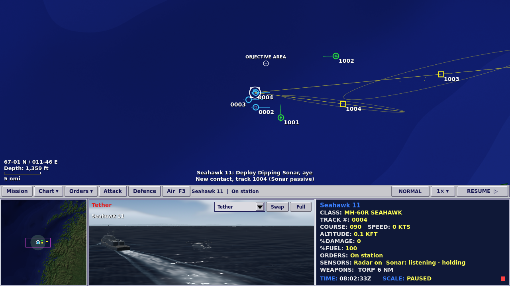

# Air Operations, interface size and deliberate sonar cycles

The three remaining priorities from the [deep command review](2026-10-02-deep-command-review.md) are implemented. The four-pane command screen, period styling, held-contact model and revised aircraft/submarine art remain the foundation.

## Air Operations

Choose a host, aircraft type and quantity. The table previews selected airframes in deck order. Quantity is the only selection control; the row lamps and launch-on-Ok action are removed. **Launch** and **Mission Plan** have separate tabs and share one primary action, labelled with its quantity and consequence. The planner initially selects a mission the chosen aircraft can perform.

Submitting clears the quantity to prevent duplicate orders. **Close** sends no order and restores the previous paused/running state and time multiplier. A footer explains what the clock will do. The dialog body scrolls when needed while Close remains accessible, including at 125% size.

## Readable interface sizing

**100%, 110% and 125%** are available in the operations desk’s Options menu, the command bar’s gameplay menu and the command palette. Scaling covers custom chart text, menus, controls and hit targets together. It is saved as a display preference independently of gameplay presets and engagement saves. Scripted runs use 100% unless `--ui-scale=125` is supplied and cannot overwrite player preferences.

## Helicopter sonar handling

A fitted airborne helicopter accepts **Orders → Sensors → Deploy dipping sonar**. The crew decelerates and descends, lowers the array for 30 simulation seconds, and then listens. Manual deployment holds until recovered. Automated ASW searches listen for their full configured interval after lowering, then raise for 20 seconds before continuing. Investigation crews also deploy when they reach a submarine datum. Handling times are explicit gameplay estimates.

Only the listening phase participates in dipping-sonar passive detection, active detection, ping interception and torpedo warning. Selecting active sonar sets posture without deploying it. The selected-unit readout shows positioning, lowering, listening/pinging, or raising with a countdown where applicable.

Navigation, evasion and recovery retract the array before movement resumes. The cycle preserves navigation intent instead of restoring a stale route over a newer command. Automatic fuel returns cannot begin final approach with an array deployed. Land, a lost hover and sensor damage prevent a working dipped array. Hull and towed sonar retain their existing model.

The phase and countdown are part of the saved Unit state. Lowering, listening and raising continuations match an uninterrupted simulation byte for byte after disk save/reload. Older saves without these fields load stowed.

## Validation

- Full regression run: **897 passed**, followed by **7 passed** in the focused sonar suite, including one additional land/hover case. GitHub subsequently passed the expanded **898-test** suite.
- New native viewport suite: **57 checks passed at 1280×720 and 57 at 1920×1080**. It exercises 100/110/125% scale selection, layout, the sole launch action, both modal clock states, sonar commands, the operations desk and briefing.
- Existing carrier mission workflow at **125% / 1280×720: 62 checks passed**, including chart station selection, assignment, recovery and saved-state interaction.
- Northern Passage: both escort seeds win, the repeated seed matches exactly, and abandonment, deadline and civilian-attack policies still lose as intended (7 runs, 139 checks).
- Existing aviation lifecycle smoke: **19 checks passed**, including recovery, rearming, diversion and clock restoration.
- The browser data pack is rebuilt with Godot 4.7.2. Browser execution was not available in this environment; runtime validation used native Godot under Xvfb/llvmpipe.

Detailed results: [validation JSON](2026-10-02-command-priorities-validation.json). The new viewport suite is included in GitHub Actions at both resolutions.

The scenario check exposed an unsafe assumption in its old escort policy: it automatically fired repeated salvos on a sonar-derived estimate with roughly 7 nm uncertainty, through held civilian traffic. Without incidental sonar during takeoff, the resulting missile acquisition killed a neutral. The driver now checks the held civilian corridor and report uncertainty before committing an anti-ship missile, and validates the actual defensive exchange instead. This changes test orders, not weapon behavior or civilian-loss rules; the separate deliberate civilian-attack case still fails the mission. Offensive destruction is optional in Northern Passage.
