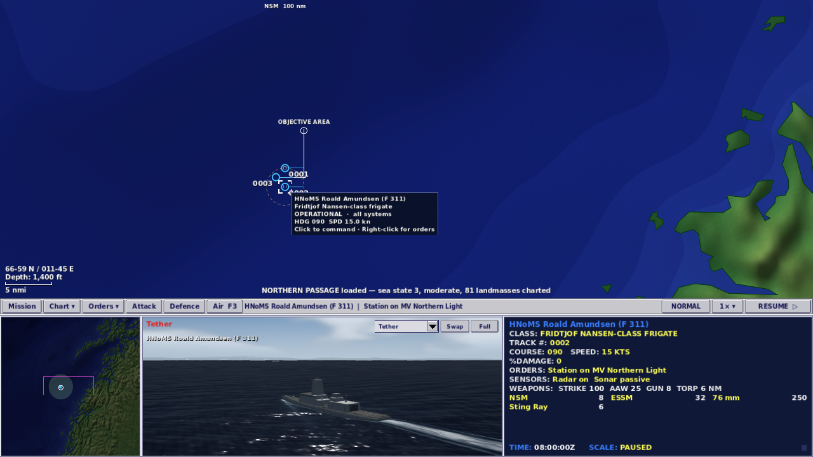
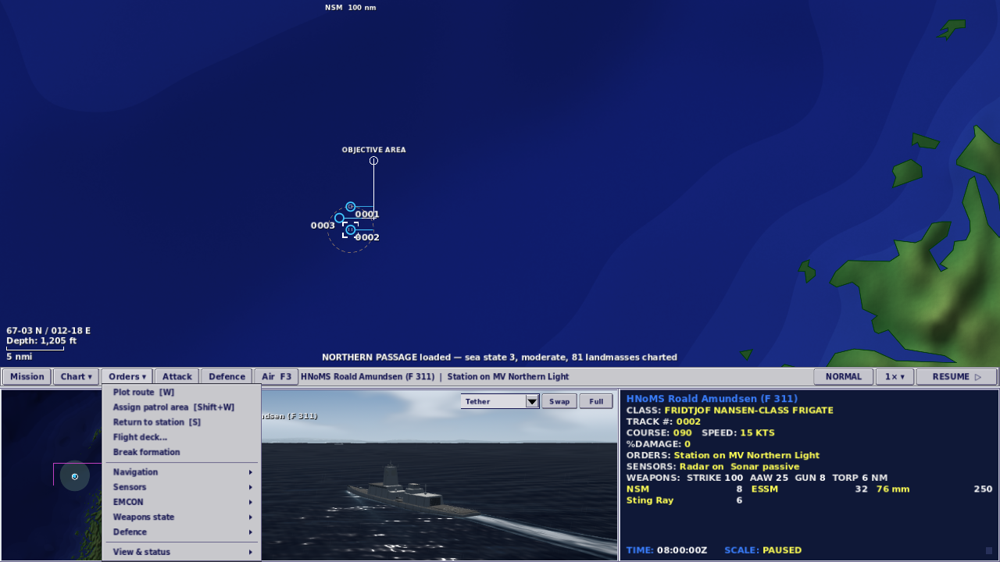
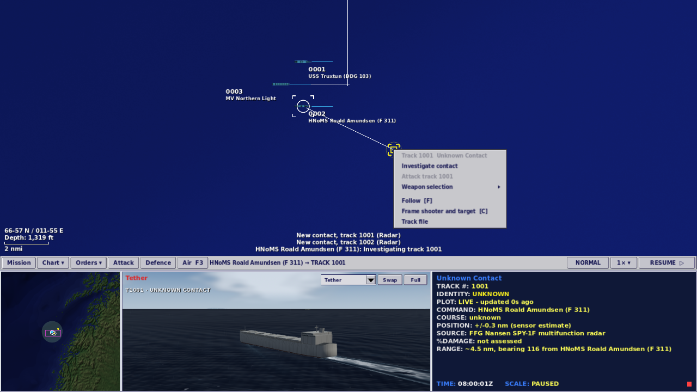
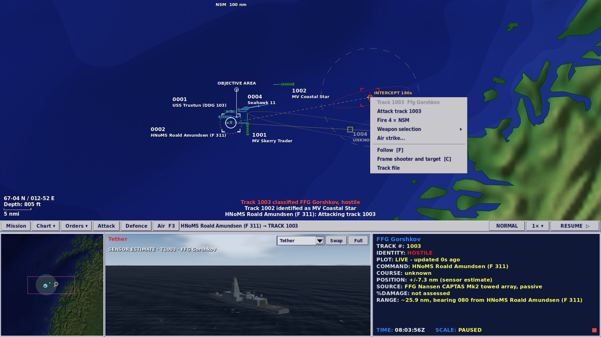

# Command-screen refinement

2 October 2026 · local development build · Godot 4.7.2

Follow-up: [the deeper review](2026-10-02-deep-command-review.md) corrects Classic, adds optional guided command and resolves the contact-view issues below. The checks in this note describe the earlier bounded pass.

The four-pane layout, direct right-click orders and standing tasks already carry much of the original Fleet Command's command loop. This pass reduces visible choices and makes the held contact picture more explicit. It changes presentation and command routing only; simulation rules, mission data, balance, save fields and gameplay presets are unchanged.

## Current-run review and changes

1. **Command a platform — improved.** The strip had 13 controls, including separate route, patrol, next-contact and swap-view buttons. It now has nine: Mission, Chart, Orders, Attack, Defence, Air, preset, time and pause. The selection and orders line gains space. Hover text has a dark backing, so chart labels and leaders no longer run through the text.
2. **Give an order — improved.** The Orders button opens the same menu as right-clicking an own platform. Route, patrol and return to station lead. Speed, course, altitude/depth, clear route and auto-return are under Navigation; follow, centre, reference and status boards are under View & status. An empty selection explains that a platform must be hooked and still provides access to boards. Route and patrol now require one extra click from the strip; W, Shift+W, S and A remain available. N or Chart cycles contacts; the live pane or G swaps the views.
3. **Inspect and identify — improved.** An unknown's menu leads with Investigate. A disabled Attack still explains its refusal. Data Display, hover and Track File distinguish live plots, stale/lost reports and contact reports, with report age. Old course data says LAST; range has an estimate marker; bearing-only contacts withhold range and speed. No assessed damage reads “not assessed,” rather than implying an undamaged hull. The selected shooter remains available while inspecting a contact.
4. **Engage a hostile — healthy.** Hostiles still lead with Attack, even before exact class identification. A valid finite Fire N × weapon stays directly accessible. Weapon-specific attack, finite salvo configuration, the firing board and queued-fire cancellation are grouped under Weapon selection. The Attack strip button still opens the detailed board directly.

Accepted screenshots are from this run, captured and inspected from the native game under Xvfb at 1280×720 and 1920×1080. Original captures and the full before/after walkthrough draft are retained in `work/ui-review/`. These are game captures, not mockups.

## Remaining priorities

1. **Reconcile Classic with the original manual.** The M36 research quotes four original time settings, whose actual rates were 1×, 2×, 4× and 8×. The current Classic preset stops at 4× actual time. It also enables engagement after hostile identification for ships and aircraft, whereas the quoted original option concerned aircraft after visual identification and defaulted off. An authentic preset should be separated from convenience options, preserving the rules stored in existing saves. This pass leaves these gameplay choices unchanged.
2. **Teach one complete loop in the introductory operation.** Select an escort, identify an unknown, return to station and defend against an inbound. Terms such as hook, EMCON and weapons tight still assume experience. This is a recommendation for a subsequent tutorial pass, not a completed onboarding audit.
3. **Make uncertain 3D contacts visibly provisional.** The captured unknown-contact view shows a solid hull. The subsequent code trace established that this is a sighted but unclassified merchant, not a fabricated sensor-only model. Sightings and estimates need explicit captions; genuinely sensor-only class representations should be subdued. Improve distant ship and aircraft silhouettes and lighting before fine model detail.
4. **Make small-screen text and keyboard focus configurable.** Typography and menu targets remain small at 720p; disabled rows have low contrast. The command strip still relies on shortcuts rather than normal Tab focus. Status words supplement color, but no screen-reader or full accessibility compliance check was performed.

Historical context is from the existing [M34](../docs/2026-10-01-fleet-command-command-loop.md) and [M36](../docs/2026-10-02-m36-missions-saves-and-an-enemy-with-a-plan.md) research, citing the [1999 reference manual](https://archive.org/stream/Janes_Fleet_Command/Janes_Fleet_Command_djvu.txt) and [COMBATSIM review](https://www.combatsim.com/htm/may99/fleet-rev2.htm). The original game was not run, and those external sources were not fetched again in this session.

## Validation

| Check | Result |
|---|---|
| Full regression suite | 884 passed, 0 failed |
| Command/contact/camera mouse suite, 1280×720 | 79 passed, 0 failed |
| Command/contact/camera mouse suite, 1920×1080 | 79 passed, 0 failed |
| Command/patrol mouse suite, 1280×720 | 42 passed, 0 failed |
| Weapon control, 1280×720 | 38 passed, 0 failed |
| Browser export | Rebuilt successfully, 57,335,660 bytes |
| Browser smoke test | Not run: browser-control tool unavailable in this session |
| Deployment | Not performed |

The interface total is 238 checks, including screenshot and layout assertions. Tests cover report freshness and uncertainty, no reading through a contact's truth association, retained selection, investigation, finite ammunition receipts, paused orders, and the existing patrol launch/recovery flow. No full scenario sweep was repeated because simulation/data were unchanged. Native verification used software rendering and does not establish browser correctness or human learnability. The existing missing speech-dispatcher and V-Sync warnings are environment limitations.

See `validation-command-screen-refinement.json` for counts, scope and the rebuilt pack hash. Original command/contact/camera reports are in `work/ui-review/after-1280/` and `after-1920/`; the current patrol report is `work/m32/command-watch-1280.json`.
