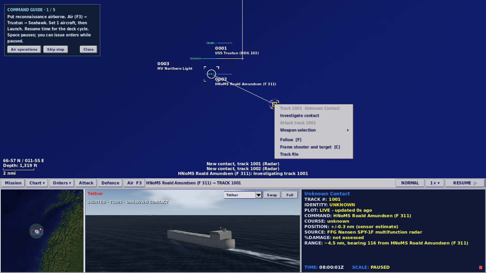
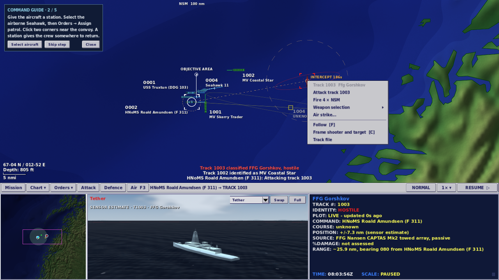
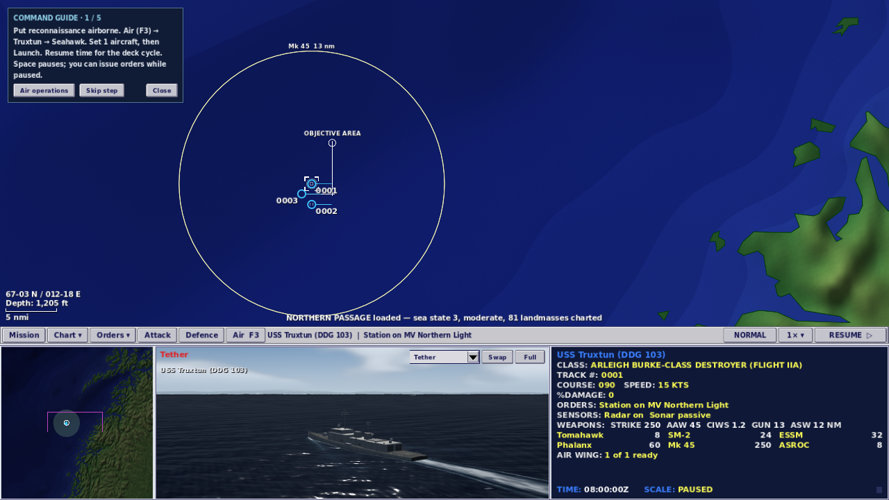
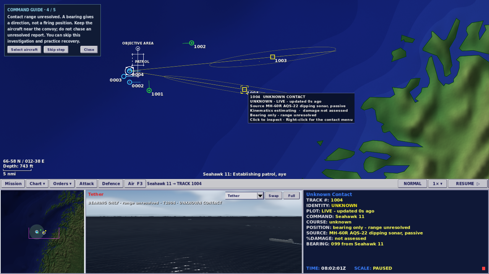

# Classic rules, uncertain contacts and guided command

2 October 2026 · local Godot 4.7.2 build

The strongest route toward the original Fleet Command is to keep the commander focused on three decisions: what the contact report supports, what task to give the crew, and when to authorize weapons. The earlier nine-control strip and task-first Orders menu support that. This pass fixes rules and information presentation that undermined it, then teaches those decisions in the actual introductory engagement.

## Original-game comparison

The reference is the original [Fleet Command manual](https://archive.org/stream/Janes_Fleet_Command/Janes_Fleet_Command_djvu.txt), using the quotations already checked and recorded in the project's [M34](2026-10-01-fleet-command-command-loop.md) and [M36](2026-10-02-m36-missions-saves-and-an-enemy-with-a-plan.md) research. A fresh Firecrawl fetch was attempted but the account had insufficient credits; this pass does not claim a new independent manual retrieval.

| Topic | Earlier implementation | Result of this pass |
|---|---|---|
| Classic time | 1×, 2×, 4× actual time | 1×, 2×, 4×, 8× actual time. The original labelled those four steps 1x/2x/3x/4x; this UI reports their actual rates. |
| Automatic attack after identification | Enabled in Classic for ships and aircraft | Off in Classic. The manual's optional aircraft-after-VID setting defaulted off. The broader existing convenience rule remains available as **Auto-attack after investigation**, producing Custom. |
| Missile defence | Manual SAM defence in Classic | Retained. X authorizes interception; close-in guns and countermeasures keep their own settings. |
| Saved gameplay | Explicit values carried in saves | Retained exactly. Earlier 4×/auto-attack Classic saves now read **Custom 4×**; choosing the new Classic preset is an explicit decision. |
| Right-click command loop | Investigate unknowns; attack hostiles | Retained for positioned contacts. Bearing-only reports open the menu with refusal reasons instead of promising an impossible investigation or attack. |

This is closer to the original's defaults, not a claim of complete rule-for-rule emulation. The optional original aircraft-only VID automation is still not a distinct simulation mode. Contemporary platforms, sensor performance estimates and fictional scenarios remain this project's own design.

## Contact information must agree across panes

**Sighted is different from classified.** A lookout can see a merchant hull before the contact file has classified it. The earlier screenshot's solid unknown hull was legitimate visual geometry. It now says **SIGHTED**. A sensor-only class model says **SENSOR ESTIMATE** and uses a subdued blue-grey tint with an uncertainty ring. A bearing-only or stale report explicitly says **BEARING ONLY** or **NO CURRENT FIX**; neither places a target model at a fictitious fix.

**Hidden class data was leaking into the world view.** Once a contact was classified, the renderer used `Track.truth.spec` for its model, dimensions and nominal flight altitude/depth. It now resolves a representative model from the reported class/category in the public catalogue. Two hidden era variants with the same reported class produce the same representation. Held radar altitude is used when measured; unmeasured altitude and submarine depth are explicitly schematic. No hidden position, heading, damage, wake or navigation lights are introduced by that representation.

**Nearby did not always mean visible.** Visual presentation checked weather and horizon but omitted terrain. An island now blocks the sighting and the matching witnessed-event path. A submarine below periscope depth cannot act as a surface lookout, either. Regressions check island masking, clear-water sighting, submerged observers and periscope-depth observers.

## A guide that follows the battle

Northern Passage's briefing offers an optional command guide. It follows actual launch, patrol and inspection activity, accepted player orders, classification reports and station return or deck recovery. It does not issue orders, manufacture contacts, change fuel, move units or advance time. It can be closed at any point, resumed from F1 and restored with a saved engagement. Older saves continue without unexpectedly introducing it.

The native walkthrough exposed an important teaching failure: by the time the Seahawk finishes its real two-minute deck cycle, nearby merchants are classified and the remaining unknowns can be bearing-only. A fixed “investigate now” tutorial would ask the player to do something the game rejects. The guide instead explains the unresolved range, lets the player explicitly skip investigation and teaches recovery. Skips are recorded separately from practiced tasks. Where a positioned unknown is available, the investigation/classification/return-to-station branch remains available.

During reported inbound threats, defence advice takes priority. It follows the active missile-defence setting and distinguishes torpedoes from missile interception. The guide stays hidden behind dialogs and while the world view is enlarged, leaving the command strip accessible.

## Next improvements, in priority order

1. **Simplify Air Operations around one clear launch action.** The real flow has a launch lamp, a count field, **Launch Now**, an **Ok** control that can also launch/resume, and **Cancel**. That duplicates decisions. Preserve the deck table but make the primary action state its exact consequence: “Launch 1 Seahawk”; use an ordinary Close button and show the clock state separately. Keep mission planning under its own tab. This pass teaches the existing controls rather than changing the mature mission/deck workflow at the same time.
2. **Add UI scaling and stronger focus/disabled states.** At 720p, chart hover text, menu rows and the data display are still small. Preserve the four-pane layout while offering text/target scaling, clear keyboard focus and explanatory disabled actions. Native checks covered layout and mouse paths, not a screen-reader or comprehensive accessibility audit.
3. **Make sensor posture an explicit crew task.** Dipping sonar currently depends on a helicopter's speed and altitude gate; a distinct deploy/listen/retract cycle would better explain when the set can operate and prevent a momentary low-hover state from behaving like a completed dip. This needs simulation design and tests; it is not addressed by cosmetic “realism.”
4. **Teach defensive engagement in a dedicated short exercise.** Northern Passage's outcome depends on the current plot and enemy choices. A separate authored lesson can guarantee an inbound, teach pause/assessment/manual interception and explain remaining rounds without forcing an unrelated attack into the escort mission. Keep the existing optional guide responsive to the real engagement.
5. **Separate class recognition from model detail.** The current public class key does not distinguish every era/fit. Reported class should remain the authority. Add a reported fit identifier only when the sensor model can actually support it; do not restore a hidden-truth lookup to get more detailed art.

## Validation and limits

The full headless suite passed **889 tests**, and native suites passed **250 checks**: guide/recovery 30, air missions/Classic saves 62, and contact/attack/camera flows 79 at each of 720p and 1080p. The final world-presentation changes also passed the focused 72-test suite. Screenshots were inspected for Northern Passage, Hormuz, Taiwan Strait and Tartus.

Validation details and hashes are recorded in `validation-deep-command-review.json`. Logs and original screenshots remain in `work/deep-review/`. The native guide walkthrough exercises the bearing-only/explicit-skip/recovery branch; ordinary investigation and engagement are exercised by the contact-intent suite, and guide classification/return bookkeeping has headless coverage. Save coverage includes the corrected Classic defaults and the legacy custom auto-attack rules.

Scenario generators were rerun in their documented order. Only Northern Passage's briefing text changed; no platform performance, weapons, dispositions or mission objectives changed. The full scenario balance sweep was not repeated for this presentation/defaults pass.

The browser package is rebuilt locally. Browser execution and browser save/reload still require a browser-capable session; no browser result or live deployment is claimed. Audio playback was not assessed in the cloud's dummy audio environment.
