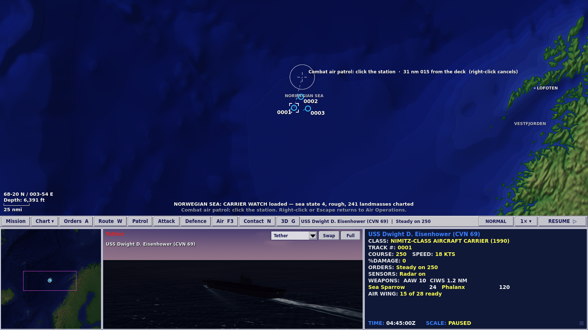
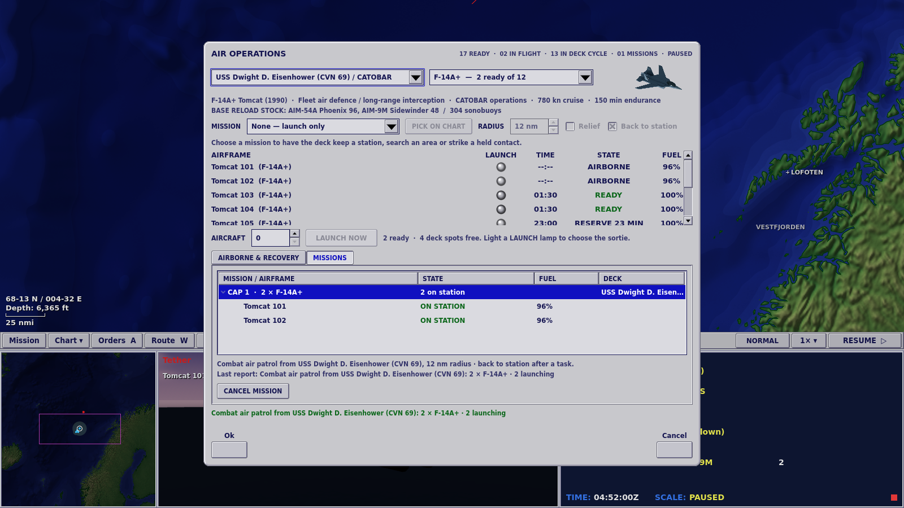
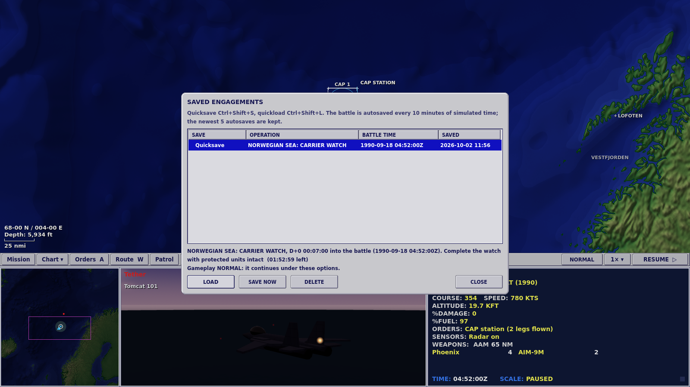
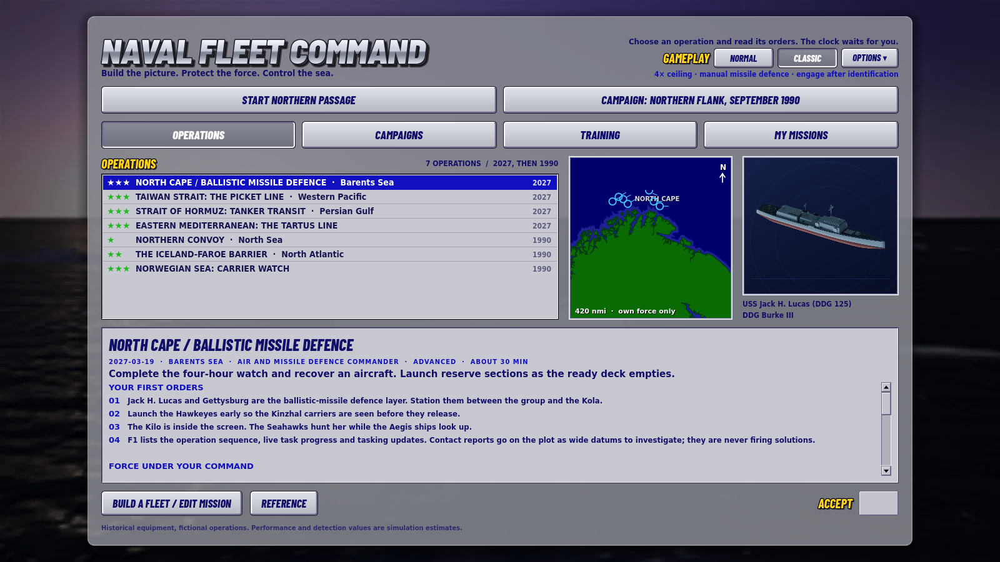
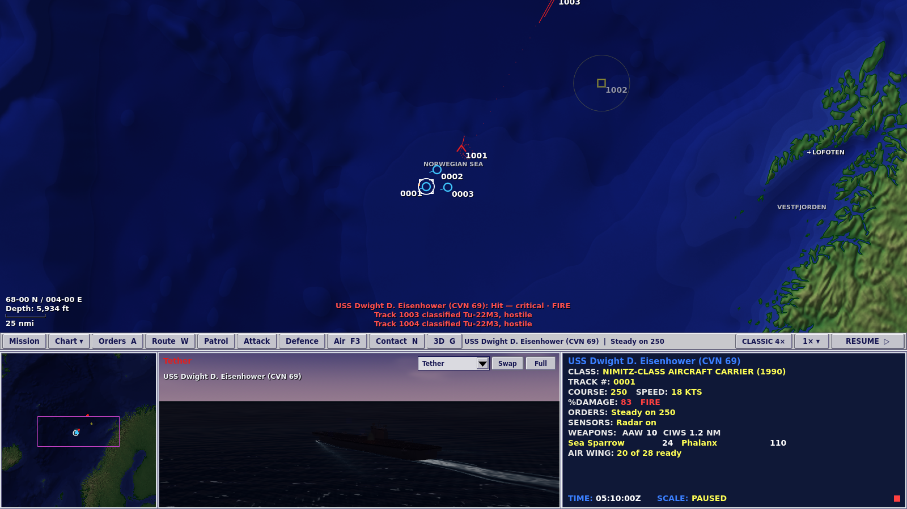

# M36: missions, saves, and an enemy with a plan

M35 made the game smaller and louder. M36 closes the gaps the M34 note ranked highest between this build and the way Fleet Command was played in 1999. Aircraft now fly missions instead of being launched one airframe at a time. Every ship and aircraft remembers its station through whatever it is doing. A battle can be saved and reloaded exactly. A group of ships can share one attack. The enemy can pursue an objective instead of the nearest target. The original's way of playing is one choice on the desk. The operations react to what the player does, and the largest battle's sensor cycle costs a third of what it did.

## What the original did

All quotations are from the original manual's [OCR text on archive.org](https://archive.org/stream/Janes_Fleet_Command/Janes_Fleet_Command_djvu.txt), checked against that text for this note, with the OCR's character errors corrected.

- **Air stations and Return to Station.** "An air station is a location in airspace where aircraft may be assigned to patrol … An aircraft becomes detached from its station if you give it an order. To return the aircraft to its air station, hook the aircraft and press SHIFT+[key]." For ships: "Detached ships are returned to the task force using the Return-to-Station command."
- **Station relief was an option, off by default.** REPLENISH AIR STATIONS: "aircraft at air stations are automatically rotated as they run low on fuel or are destroyed. If you send your aircraft on a mission, this option no longer applies." The mission editor's **Refresh Station** made "the aircraft's source object … automatically begin preparing another aircraft to take its place when that aircraft returns."
- **Missile defence was the player's job by default.** SHIPS AUTO-ENGAGE INCOMING MISSILES: "When this option is OFF, you are responsible for defending your ships from missile attack. (Defaults to OFF.)"
- **Identification could lead to engagement, if chosen.** AIRCRAFT ENGAGE HOSTILES AFTER PERFORMING VID: "your aircraft automatically engage any contact it identifies as hostile without a direct order from you. When this option is OFF, aircraft return to station after they have identified an unknown contact." (Defaults OFF.)
- **Time compression had four settings.** "At 1x (real time) … At 2x (twice real time) … At 3x (four times real time) … At 4x (eight times real time)".
- **The game saved mid-mission.** The key list includes "Save game" and "Save and Exit".

## Standing assignments and Return to Station

Every ship and aircraft now remembers where it was told to be, separately from what it is doing at the moment. A patrol box, a formation station or an air mission's station is the **standing assignment**; investigating a contact, intercepting it, attacking it, evading a torpedo or refuelling from a tanker is a **temporary task** that runs on top of it. Before M36 a temporary task replaced the patrol or the formation slot, and the player had to draw the circuit again.

- **Return to Station (`S`, or the Orders menu)** sends the hooked platforms back to their assignment: a patrol resumes at the nearest corner of its circuit, a formation member rejoins its slot on the guide, and a mission aircraft flies back to its CAP or search box. The orders line names the assignment ("CAP STATION 1", "Patrol N of Vardø") and says when a platform is off it.
- **Auto-return** (Orders → Auto-return) is off by default. With it on, a platform returns by itself after an identification, an intercept or a top-up from a tanker ends. A generation counter on each unit means a late result never drags back a platform that has since been given a new order.
- **An explicit order replaces the assignment.** Move, Set Course, Stop, Return to Base and Clear Waypoints from the player end the standing assignment; crew orders issued by automation never do.
- **When the assignment can no longer be kept, the platform says so** instead of improvising. A destroyed formation guide passes the formation and its route to the next ship, which inherits the waypoints, patrol and speed. A lost base sends the aircraft to divert under the existing recovery rules; a refused Return to Base leaves the station in place; an aircraft already returning or tanking cannot be steered back by Return to Station.

## Air missions

Air Operations (F3) has a **MISSION** row: choose CAP, reconnaissance, ASW search or strike, the aircraft type and how many, then **PICK ON CHART** for the station or target (Esc cancels the pick). A contact menu item, **Air strike…**, opens the same dialog with the contact already chosen. The **MISSIONS** tab lists every mission with its state per aircraft: queued, launching, transiting, on station, investigating, engaging, refuelling, holding, returning, recovering. **Cancel** ends a mission and brings its aircraft home.

| Mission | What the aircraft do | What they never do |
|---|---|---|
| CAP | Hold a box; investigate unknown air contacts entering it plus a 25 nm commit margin; attack HOSTILE ones, two interceptors per track | Fire at an UNKNOWN or NEUTRAL contact |
| Reconnaissance | Search an area and close to identify what they find | Fire at anything |
| ASW search | Lay a sonobuoy line at 5 nm spacing; helicopters with a dipping sonar hover at 50 m for three minutes, then move on | Drop on a contact they do not hold |
| Strike | Fly to the held target, attack it with their anti-surface weapons, return | Launch without an anti-surface weapon aboard, or at a stale plot |

Everything comes from the existing systems. A mission draws only aircraft that are on deck and ready; it never creates one. Launches go through the deck's launch spots and queue when the deck is busy; recovery waits for a spot. Fuel, bingo, tanking, diversion and the 2,700 s turnaround are unchanged. When the deck cannot fly the mission the dialog says why: base lost, no flight deck, flight operations suspended by damage, no aircraft of that type, incompatible deck, no suitable weapons or sensors, no station chosen, beyond the aircraft's radius.

**Relief is opt-in.** With **Relief** ticked, a replacement launches early enough to reach the station as the aircraft on it reach bingo fuel, so the station stays covered; without it, the station is left empty when they go home. The AI flying a side leaves mission aircraft to their mission.

The tests fly these missions from the shipped carrier operations, Carrier Watch (1990) and Carrier Qualification, and the station behaviour from the escort operation, Northern Passage. `tools/air_mission_playtest.gd` does both with real mouse and keyboard input: 49 checks at 1600 × 900, from opening Air Operations in Carrier Watch and picking a CAP station on the chart, through cancelling a mission, to sending Northern Passage's escorts back to station with `S`.

## Saved engagements

A running engagement can be saved and restored exactly. **Ctrl+Shift+S** quicksaves, **Ctrl+Shift+L** loads the quicksave, and **Ctrl+Shift+O** (or the Actions palette) opens **Saved Engagements**, which lists the quicksave, the autosaves and saves made with **SAVE NOW**, newest first, with the operation, the battle time and when it was saved. The battle autosaves every ten minutes of simulated time and keeps the newest five. The saves also open from the operations desk, which is where a reloaded browser tab lands.

**What a save holds.** The clock and every seeded random stream (sensor, weapons, damage, AI) in its exact state; every unit with its position, damage, fuel, magazines, launcher timers, task, standing assignment and generation counters; each side's track picture with ages, classification and contributors; weapons in flight; the salvo and launch queues; air missions; sonobuoys; objectives and their timers; the scenario events already fired; and, on the presentation side, the journal, the radio log, the after-action counters, the commander's groups and the view. A restored engagement opens paused, under the gameplay options it was saved with.

**How.** `SimSnapshot` walks the simulation's own objects by reflection and writes plain values, replacing references with stable ids (a unit by its id, a track by its owner and number, a weapon by its id), and restores in two passes: allocate every object, then fill them in, so references can point forward. Nothing emits signals during a restore. A coverage test fails if a manager gains a field that is neither saved nor declared transient, which is how later features in this milestone were made to save. The file is a magic number, a format byte, a SHA-256 of everything after it, then the header and the zstd-compressed engagement behind bounded lengths, written to a temporary file and renamed into place. Nothing is decoded until the checksum matches.

**What it refuses.** A file that is damaged, truncated, from another game, from a newer save version, from a scenario whose content has changed since (checked by a SHA-256 digest of the scenario), structurally wrong, with a reference to something it does not hold, or naming a platform the catalogue no longer has, is refused before anything changes, with the reason. Sixty single-byte flips of a save are all refused. If a save that passes every check still fails to restore, the running engagement is put back from a copy taken just before the load. Saving is refused before command is taken, after the engagement ends and in the middle of a simulation step.

**Evidence.** `tests/test_save.gd` runs Carrier Watch to 989.75 s, inside the Soviet force's first planned volley, saves through a file, restores into a fresh simulation with a different seed and runs both to 2,460 s. Every unit, track, weapon, queue and random stream matches byte for byte. At the save there are missiles in the air, shots queued on launchers, an aircraft on its way back to the deck, a crew on a temporary investigation, a contact report's tasking update, and a follow-on raid still to come, which the reloaded battle then sees sent by the enemy's own plot. Further cases cross a damage-heavy stretch of Northern Passage, coordinated attacks between volleys, an enemy plan's reconnaissance and first volley, Classic rules with a manual intercept in the air, and a load over a different operation. `tools/verify_save_continuation.py` repeats the comparison across separate processes for Carrier Watch, Northern Passage, Hormuz and the Taiwan Strait; all four are identical. Tests point the save directory at a scratch folder; they never touch a player's saves or commander's log, and scripted runs never autosave.

Two latent bugs surfaced on the way. Track pictures were keyed by Godot instance id, which differs between processes, so a restored picture would have filed tracks under the wrong owner; they are now keyed by unit id. And the screen's depth readout wrote into the simulation's sea-floor cache, which changed later sonar results depending on where the mouse had been; the screen now reads the cache without filling it.

## Coordinated attacks

Hook two or more ships, then either Shift+right-click a contact and choose **Group attack (N rounds)…**, or open Weapon Control (Shift+E), set **GROUP BUDGET** and press **GROUP ATTACK**. The group shares one round budget across its platforms and contacts. The orders line and the group rows on the firing board read the budget, the rounds fired, queued and in the air, and whether the group is waiting out its shared look.

- **One budget, counted honestly.** Fired, queued and airborne rounds all count against it, at every tick. Rounds are tagged with their group, so a member's own Engage or Attack beside the group is not counted against it (and is not limited by it; the side-wide total is still available).
- **Allocation.** The budget is split across the contacts, the first contact first, unless the commander allocates per contact. Each round goes to a platform that can actually engage: its held plot, ROE, fire control, magazines, launchers and channels. Refusals are re-offered to the other members, and the receipt names who fired what and why anyone did not.
- **A shared look.** Once any round of a volley has landed, nobody fires again at that contact until every round of the volley has resolved and the assessment pause has run. A platform that comes into range late waits for the look too.
- **When things go wrong.** A member that is sunk takes its unfired rounds with it and its share passes to the others; the budget is never exceeded. A contact destroyed or lost stops all spending on it. A plot gone stale returns queued rounds to the magazines until it is fresh again. Cancelling fire on one member withdraws only that member; cancelling the group returns every queued round and leaves rounds already in the air alone. A contact every member has cancelled on closes as "Fire cancelled" and its share is not moved elsewhere.

A seeded fuzz run of 16 battles with random member losses, cancels, stale plots, weapons-hold toggles and sinkings found no budget overrun, no leaked or doubled refund and no round fired at a closed contact, during a look or at a stale plot. Synchronised arrival from different bearings, which the brief marked optional, is not built. The AI does not use group attacks; it has its own plans (below).

## Enemy mission plans

A scenario can now give the opposing force a plan instead of leaving each ship to pick the nearest target. A plan has a kind and a list of units, and the AI controller runs it from its own side's track picture only.

| Kind | What the plan does |
|---|---|
| `threaten_carrier` | Scouts for the carrier, holds the strike until the scout classifies it (or a search window runs out), assembles, then attacks from separate bearings |
| `attack_shipping` | Prefers merchants, tankers, replenishment and amphibious ships over warships once they are classified |
| `protect_breakout` | Escorts screen a breakout unit along its route and engage what threatens it, not distractions |
| `defend_installation` | Holds an area around an installation and does not chase beyond a leash |

Coordination comes from three phases. **Reconnaissance**: named scouts, or an air reconnaissance mission from a plan deck, look first. **Assembly**: shooters gather at an assembly point, or wait for a package of N shooters, inside a window. **Attack**: each shooter takes a different bearing round the target. A plan-wide round budget counts queued and airborne rounds by track id, and a shared assessment pause follows each volley, as for the player's group attacks.

Target preference uses only what the side's own plot knows: a track's class and category count only once it is classified. Before that, size and domain from the plot are all the plan has. Every plan shot passes the same ROE, fire-control, track-quality, magazine and launcher checks as any other AI shot. Plans are opt-in: without `ai_plans` a scenario plays as before, with one deliberate exception. The AI's per-contact cap now counts rounds queued on launchers as well as those in the air; before, a ship could queue a salvo on top of the cap. A side effect is that a 6–8 round gun salvo now counts fully against the cap of eight, which briefly holds back other ships' missiles at that contact.

The schema is documented at the top of `scripts/systems/ai_plan.gd` and in ARCHITECTURE.md. Plan state (phase, members, target, budget tallies, the volley and assessment timers) saves with the engagement, and a continuation test saves twice in a fixture battle: while the scout is still looking and in the middle of the first volley.

## Normal and Classic

The operations desk has a **GAMEPLAY** row: **NORMAL**, **CLASSIC** and **OPTIONS ▾**. The command bar carries a chip naming the preset in force ("NORMAL", "CLASSIC 4×", "CUSTOM n×"), which opens the same options, and the briefing's meta line names it at every screen size.

| | Normal | Classic |
|---|---|---|
| Time scales | 1×, 2×, 5×, 10×, 30×, 60× | 1×, 2×, 4× |
| Missile defence | automatic | on your orders |
| After an investigation identifies a hostile | the ship holds | the ship attacks it, within the rules of engagement |
| Crew voice, ambient sound | as you left them | on |

Normal is the game exactly as it was. Changing any single option makes the preset CUSTOM. The choice is stored with the player's settings; scripted, test and validation runs always play Normal and never write settings, so the smokes and sweeps are unchanged.

**The 4× ceiling is the brief's figure, and it is not quite the 1999 game's.** The manual lists four settings: "At 1x (real time) … At 2x (twice real time) … At 3x (four times real time) … At 4x (eight times real time)". The top setting was labelled 4x and ran at eight times real time. The brief asked for a 4× ceiling, so the Classic ladder is 1×, 2×, 4× of real time, which matches the original's third setting. Matching its label to its rate instead would mean [1, 2, 4, 8]. The ladder is one constant, `GameOptions.CLASSIC_SCALES`, and every key, menu, palette row and line of help text is generated from it, so that is a one-line change.

**Manual missile defence.** On manual, a ship's area and point SAMs do not launch at an inbound round until the commander orders it. **X**, or a right-click on a detected inbound round, orders the hooked ships to engage it (or every inbound round they hold) through the same defence layers, fire-control channels, magazines and ROE as automatic defence; weapons hold refuses. Close-in guns stay automatic unless weapons are held; chaff and flares keep their own automatic/manual switch; torpedo defence stays automatic. The opposing side always defends itself automatically.

**Engagement after identification.** With the option on, an investigation that ends with the contact classified HOSTILE becomes the crew's attack, but only if the attack passes the same rejection test as a commander's attack (ROE, protected identities, a weapon with a solution). Nothing fires at an UNKNOWN or a NEUTRAL, under weapons hold, after a newer order, or from a look flown by an air mission or a reconnaissance station.

**Saves keep their rules.** A save records the options it was played under, the list shows them, and a load restores that ladder, defence mode and engagement rule for that engagement only. The player's stored preference is untouched, and the next operation is played under it.

**The 1990 campaign has its own button**: **CAMPAIGN: NORTHERN FLANK, SEPTEMBER 1990** opens the operation the campaign is waiting on. It is an alternate-history 1990 setting and is never labelled Classic; Classic is a way of playing, not a period.

**A leak closed on the way.** Any launch, hit or loss anywhere used to drop the clock to 1×, which told the player something had happened out of sight. Now only combat the player's side could observe does (own units involved, a lookout in sight, or a contact the plot holds), the same rule the chart and the 3D view already used. A round first seen by a consort off the link is announced when it reaches the commander's picture; before, it was never announced at all.

## Operations that react

Before M36 every operation ran to a fixed timetable: a five-minute opening station hold, then a follow-on raid at 2,400 s whatever had happened. A second play was a memory test. Now an **operation director** (`scripts/simulation/operation_director.gd`) runs each operation's events, and they fire on the battle itself: the convoy passing a point, what a side's own plot holds, a base's readiness, a ship hit or a battery radiating. Part of each operation's shape (windows, axes, sizes, chances, which of several variants) is drawn once per engagement from its own seeded stream. Starting an operation from the desk draws a fresh one each time; a pinned `--seed`, the tests and the tools keep the scenario's own draw, so seeded results still reproduce.

**Reports are datums, not solutions.** Coastal radar, fixed arrays, maritime patrol aircraft and drones put a contact report on the plot: a wide datum with a stated error and no class, which nothing can fire at. The radio reads the reported latitude and longitude, never the true position, and an event is skipped rather than announced when what it would report is already gone. **Tasking changes come with an order.** A bonus task or a moved handover box arrives on the radio and appears under TASKING UPDATES in the F1 board; the enemy side's decisions are never announced. The **opening hold is gone**: nothing could fail it by moving, so it was a fixed five-minute delay presented as a decision, and losing the station ship in those five minutes locked every later task. The destination holds stay, because holding the box is the delivery.

| Operation | What it reacts to, and what each engagement draws |
|---|---|
| Northern Convoy, 1990 | Where the corvette waits (across the route, by the handover box, the eastern flank); when Norwegian coastal radar reports it, unless an escort already holds it; at the route's midpoint a second contact that is either another Nanuchka or a neutral coaster, so only classification tells them apart; whether the handover box moves |
| Iceland–Faroe Barrier, 1990 | The Victor III's lane; when the fixed-array cue comes; whether the boat turns to fight once its own plot holds the loud Spruance; on some draws a second boat later |
| Carrier Watch, 1990 | Slava's station and the first raid's axis; the second raid's size and direction, sent once the Soviet plot has classified the carrier or Slava is hit, otherwise at a drawn latest time; when a Norwegian Orion reports Slava, which readies the reserve Intruders and adds the bonus task |
| North Cape, 2027 | The Kinzhal carriers' axis and the second element's latest time; when the Kilo report comes |
| Taiwan Strait, 2027 | The raid axis and windows; the follow-on bombers, brought forward when the KJ-500 holds the carrier |
| Strait of Hormuz, 2027 | Whether and from where a second swarm comes, decided on where Iran's own plot puts the convoy; whether a drone report arrives |
| Tartus, 2027 | The strike axis; when Akrotiri fixes the Bastion battery (once it radiates); the Khmeimim surge, decided on where Russia's own plot puts the amphibious group |

The draws really differ. Seeds 2, 13 and 5 give, for example, Carrier Watch's second raid as one Backfire (window 1,358 s, latest 2,982 s), a pair (1,067 s / 3,141 s) and one from the north (1,533 s / 3,149 s), and Hormuz no second swarm, a swarm from Larak, or a swarm from Qeshm. A test checks that two seeds draw different operations and that one seed always draws the same.

### The 1990 strike element

Carrier Watch's detachment grows from 24 to 28 aircraft with four **A-6E TRAM** Intruders, each carrying two **AGM-84 Harpoon** and the AN/APQ-156 radar, with GAMEPLAY_ESTIMATE performance where nothing public was verified (sources in [COLD_WAR_1990.md](COLD_WAR_1990.md) and DATA_SOURCES.md). Two are ready and two in reserve until the Orion's report on Slava readies them. A Harpoon hit on Slava is a bonus objective, and hitting her brings the next raid at once. That is the tension: the deck has four catapults, one recovery spot and a 45-minute turnaround, and every Intruder cycle is a Tomcat cycle not flown while Backfires are inbound. A 1990 STRIKE mission is accepted with Intruders and refused with Tomcats ("F-14A+ carries no strike weapons"). Slava's S-300F now has its published 25 m engagement floor, so sea-skimmers meet only her Osa-M and AK-630; even so, an alert, radiating Slava stops most rounds. Over eight seeds a strike by all four Intruders (eight rounds) hit in four.

### The enemy's plans in the shipped operations

Every operation now gives the opposing force a mission plan, through the generators. The acceptance case runs in a shipped operation: in Carrier Watch, Slava and the Backfires hold their rounds until their own sensors classify the carrier, then fire their first volley at her from bearings either side of the raid axis, past nearer escorts (`test_carrier_watch_raid_pursues_the_carrier_not_the_nearest_escort`).

| Operation | Plan |
|---|---|
| Northern Convoy | `attack_shipping`: the corvettes go for the merchant once classified; an escort inside missile reach is still fought |
| Iceland–Faroe Barrier | `protect_breakout`: the Victor III keeps its breakout; a second boat screens it at 4 nm |
| Carrier Watch | `threaten_carrier`: Slava and the raids, a package of two, three attack bearings, an eight-round budget and a seven-minute assessment |
| North Cape | `threaten_carrier`: Kasatonov, Soobrazitelny and the MiG-31K elements, with the Orlan scouting |
| Taiwan Strait | `threaten_carrier`: the Type 055 and 052D group, the Badgers and the DF-21D battery, with the KJ-500 scouting |
| Strait of Hormuz | `attack_shipping`: the Peykaap swarms go for tankers, then merchants; the submarines are left out, because deep and off the link they hold only their own sonar |
| Tartus | `defend_installation` round the battery, and `attack_shipping` by the Su-34s for the amphibious group, with the Il-38N scouting |

### Two openings per operation

`tools/opening_plans.py` flies each operation with two different scripted openings through ordinary orders, the AI flying the enemy, over seeds 2 and 13. V is victory, D defeat, with mission effectiveness.

| Operation | Plan A | Seed 2 | Seed 13 | Plan B | Seed 2 | Seed 13 |
|---|---|---|---|---|---|---|
| Northern Convoy | close escort | V 99% | V 100% | scout ahead | V 100% | V 100% |
| Iceland–Faroe Barrier | forward barrier | V 100% | V 100% | gate defence | V 100% | V 100% |
| Carrier Watch | all CAP | V 77% | V 78% | strike Slava | V 92% | V 100% |
| North Cape | forward picket | V 90% | V 87% | close screen | V 85% | V 83% |
| Taiwan Strait | forward CAP | V 80% | V 78% | strike group | V 84% | V 84% |
| Strait of Hormuz | close convoy | D 8% | V 77% | sweep ahead | V 70% | D 11% |
| Tartus | direct transit | V 83% | V 82% | screen first | V 82% | V 84% |

**Six operations have two openings that win on both seeds. Hormuz does not.** Each Hormuz opening wins one seed and loses the other. The run turns on whether the Poseidon's first sortie kills the Kilo patrolling the end of the lane, and air-dropped Mk 54s rarely hit a decoying diesel boat: about 3 hits from about 50 torpedoes across these runs. The Moudge's SAM also takes the Seahawks and the Poseidon working near the lane, and the Khalij Fars's opening salvo hits Duncan in about half the runs. Moving the Poseidon's box out of SAM range made it worse; shooting at the Moudge sank a dhow, which is a defeat; a second P-8 gave the same two wins in four. Making Hormuz reliably winnable needs either a review of light-torpedo effectiveness against a decoying submarine or a generator change that moves the Kilo, validated over more than two seeds; both change the operation's balance, so neither was done here.

The Taiwan Strait failed both openings on seed 2 until the harness flew them as a careful commander would. Each incoming round may draw at most two area-defence shots across the whole force (three on Saturation), counted over its whole flight, and ballistic rounds have no inner layer behind that. A forward Aegis ship spent the allowance on long crossing shots, so the SM-6 ships beside the carrier never fired. With the escorts closed up on Saturation and the forward ship on Conserve, both openings win. The rule itself is unchanged; it is a design question for the next milestone.

Northern Convoy rose from 79–85% to 99–100% with the enemy's plan in place. Two seeds cannot separate that from chance, but it may mean the corvettes are less dangerous holding fire for the merchant.

## Performance

The heaviest late battle is the Taiwan Strait (seed 42, both sides flown by the AI) from 2,400 s: 106 units, 66 track pictures, 412 tracks. Measured before changing anything, the sensor cycle took about 71 ms every second of simulated time, radar 27 ms and ESM 36 ms of it, against a 60× budget of 4.2 ms per quarter-second tick. At 60× the clock achieved about 8.8×, and because a frame ran up to 480 ticks before drawing, an order took about 7 s to reach the screen.

Both paths are measured in one process, interleaved, three repeats each, on an otherwise idle 4-CPU container (load average about 1). Medians, with the minimum in brackets. The original sensor passes stay in the code behind a switch, so "before" is the same battle on the same machine in the same minute.

| Measure | Before | After |
|---|---|---|
| Sensor cycle, mean | 70.8 ms (67.8) | 24.8 ms (24.4) |
| Sensor cycle, 95th percentile | 98.8 ms | 37.6 ms |
| Radar / ESM per cycle | 27.0 / 35.8 ms | 6.6 / 10.9 ms |
| Sensor cost as a share of the 60× tick budget | 425% | 149% |
| Simulation tick, mean / 95th percentile | 26.4 / 86.4 ms | 14.7 / 37.7 ms |
| Wall time for 600 simulated seconds | 63.3 s (60.5) | 35.3 s (34.9) |
| Speed stepping flat out | 9.5× | 17.0× |
| Achieved speed with the clock at 60× | 8.8× | 14.5× |
| Order to the next drawn frame at 60× | 6.84 s (worst 7.02 s) | 65 ms (worst 102 ms) |
| Final state of the battle | `5cb2c41d8169c6d9` | `5cb2c41d8169c6d9` |

"After" in the last two rows is the optimised cycle with the frame budget below. Separately: the optimised cycle without the budget reached 15.5× at 60× but still took 3.84 s from order to frame; the original cycle with the budget took 110 ms at 8.5×. The command is `godot --headless --path . --script tools/measure_sensor_cycle.gd -- --paths=reference,optimized --repeats=3 --fresh`.

**What changed in the sensor cycle.** Nothing a player can see except speed: seeded outcomes are bit-identical. Each unit's signature, emissions, power and heights are worked out once a cycle instead of once per pair; each side scans lists of the other sides' engageable units instead of every unit, stowed aircraft included; a pair beyond unjammed reach is dropped before the arithmetic (a jammer can only shorten reach); radar and ESM share one terrain walk per sight line; and a sight line whose lowest point, less the earth's bulge, clears the chart's tallest cell by a metre is not walked at all. The original passes stay behind `SensorManager.reference_path`, and the tests compare the two field by field over a mixed chart, 12 seeded random worlds, Hormuz and Tartus across a save and restore, the enemy-plan fixture and a group attack. 13,500 random sight lines over the nine charts give the same answers with and without the terrain shortcut.

**What changed in the clock.** A frame now stops stepping once it has spent 50 ms (always after at least one tick) and drops the backlog, so a heavy battle slows the clock instead of freezing the screen. The ticks are the same fixed 0.25 s, so the battle is the same: the measurement tool replays each clocked run tick by tick and finds it identical with and without the budget.

**What did not change.** Reporting a held, unchanged pair less often would have saved more, but it changes random-number draws and therefore outcomes, so it was left out, as were three other changes that were not value-transparent. The remaining cost is now spread: about 14 ms of each cycle is the reports themselves, and the unit and AI updates cost about as much per tick as the sensors. The nine-mission cut in M35 made no individual battle faster; the numbers above are all from the same battle.

## Where this build deliberately differs from 1999

- **A CAP identifies unknown aircraft but only intercepts what the plot already holds as hostile.** The 1999 option engaged after a visual identification; here that is the Classic "engage after identification" option, and it applies to any platform's investigation, ships included. Reconnaissance never fires under either.
- **Relief is chosen per mission**, not as a global game option, so one CAP can be kept up while a strike element goes out unrelieved.
- **There are no alert states.** Airframes are ready, in turnaround or in reserve; a queued launch waits for a ready airframe and a free catapult. The 1999 Alert 30/15/5 model is not built.
- **A refuelling top-up always returns the aircraft to its station.** The crew left for fuel, not the commander; auto-return covers identification and intercept.
- **Close-in guns, decoys and torpedo defence stay automatic under manual missile defence.** Only area and point SAMs wait for an order.
- **The Classic ceiling is 4× real time, as briefed**, where the original's top setting ran at 8×.
- **Saves are a full snapshot of the simulation**, checked by checksum and refused whole if anything is wrong, rather than a mission-editor state.

## What is still missing, ranked

1. **Rally points and launch alert states.** The 1999 deck model (Alert 30/15/5, a rally point per launching platform) gave launch timing a texture this build does not have.
2. **A tutorial.** Northern Passage and Carrier Qualification teach by doing; nothing walks a new player through stations, missions or saves.
3. **Debrief replay.** The saves make it possible to reconstruct a battle; there is no replay viewer.
4. **Auto-identification of fast air and EMCON at start**, the two remaining 1999 game options.
5. **The AI does not use group attacks** and the player's group attacks have no synchronised arrival from separate bearings.
6. **Report pacing and unit/AI cost.** Sensor reports and the unit and AI updates now cost about as much per tick as the rest of the sensor cycle; 60× is still out of reach late in the Taiwan Strait (about 14.5× achieved).

## Not verified

- **Speech and ambient sound were not heard.** The container has no speech-dispatcher, and every suite uses a recording sink and the dummy audio driver.
- **No human playtest.** Every interface check drives real mouse and keyboard events, but no person has played the new missions, the Classic preset or the reacting operations.
- **The frame budget's cost in a window** was measured headless (15.5× to 14.5× achieved at 60×); drawing time in a real window lowers both.
- **Browser storage** was checked in headless Chromium: a save survives a reload and a deletion persists after a few seconds. Real browsers' storage quotas and private windows were not tested.

## Validation

Final runs on this tree, in a cloud container under Xvfb with software rendering. The full record is [validation-m36.json](validation-m36.json).

| Check | Result |
|---|---|
| Regression tests | 882 passed, 0 failed (723 at M35) |
| Runner self-check | pass |
| Command screen, aviation | 50 and 19 checks pass |
| Fleet workshop, 1600 and 1280 wide | 44 checks pass at each |
| Weapon control, 1600 and 1280 wide | 38 checks pass at each, group attacks included (30 at M35) |
| Command Watch, 1280 and 1920 wide | 46 checks pass at each |
| Contact intent, attack and readout, 1280 and 1920 wide | 80 checks pass at each |
| Air missions, stations and saves (new), 1280 and 1920 wide | 54 checks pass at each, by real mouse and keyboard |
| Northern Passage graphical, 1280 and 1920 wide | 32 checks pass at each |
| Northern Passage policies | 7 of 7 pass with M35's outcomes and times; the seed 31 replay is identical |
| Save and reload in a separate process | identical in all four operations checked: Carrier Watch, Northern Passage, Hormuz, Taiwan Strait |
| Scenario sweep, 9 missions at seeds 2 and 13 | 18 of 18 reach 6,000 s with no errors and no grounded hulls |
| Generators | the five builders, run twice, reproduce `data/` byte for byte |
| Opening plans, two per operation at seeds 2 and 13 | both openings win on both seeds in six operations; in Hormuz each wins one seed of two |
| Browser package | rebuilt, 56.4 MB to 57.3 MB; boots in headless Chromium in 11 s with no page or console errors; a quicksave survives a page reload, loads from the desk, and its deletion survives another reload |
| Performance | the table under Performance, measured on an idle machine |

**Review.** Each of the five tracks was built on its own branch and then reviewed by a separate agent that tried to break it before fixing what it confirmed. A report-only reviewer covered stations, air missions and save/load. The main findings, all fixed with a test that fails without the fix unless noted:

- **Stations, air missions and saves (14 findings).** A mission cancelled while its airframes were on the catapults left them flying with no orders. Twenty of sixty single-byte flips of a save loaded as a different battle with no message, and a structurally damaged save restored half a battle and reported success. A validated save that failed to restore destroyed the running engagement. A strike kept launching at a contact the plot scored as destroyed; relief plus a tanker put two airframes on a one-airframe CAP; two missions booked the same reserve airframes; a CAP was accepted that no airframe could be armed for. Picking a station on the chart was not treated as a dialog, so the pause could be lost. Snapshots shared packed arrays with the live battle. One finding was kept as designed: a tanker top-up always returns the aircraft to its station.
- **Coordinated attacks (6 fixed, 4 rejected).** A late shooter skipped the shared assessment; the firing board fired at a stale plot and cancelled other ships' groups; two endings were misreported. Rejected with reasons: a member's own standing attack is not counted in the group budget (individual controls are kept by design), and three behaviours shared with the existing standing attack.
- **Enemy plans (6 fixed).** A strike waited forever when its scouts classified nothing; a ship told to hold a point ashore re-issued a move every second; a contact that only threatened a plan drew the plan's whole budget; a member deck flew its own scout beside the plan's reconnaissance mission.
- **Classic options (7 fixed).** A right-click meant for an inbound round could land on an own interceptor beside it and become a move order; after loading a Classic save the desk showed Classic while new operations played Normal; the briefing hid the preset at 1280 × 720.
- **Sensor performance.** No defect was found. The equivalence tests were extended to random worlds after a deliberately broken optimisation passed the original test.
- **Operations (5 fixed).** Two enemy-side decisions read the true position of the player's ships; an enemy-side message reached the player's tasking list; a tasking change could happen without its order; a drone report could arrive after both drones were down; a restored save's variation seed leaked into the next started operation.

Integration found five more: Ctrl+Shift+O and Ctrl+Shift+L did nothing on the operations desk, where a reloaded browser tab lands (found by the new browser check); reading a damaged save could raise an engine error before its checksum was checked; an inbound round first seen by a consort off the link was never announced to the commander (this predates M36); one test relied on running before any test that loads a coastline; and one save test's chosen moment no longer had rounds in the air once the operations reacted to the battle.

## Sources

- *Jane's Fleet Command* reference manual (Sonalysts / Jane's Combat Simulations, 1999), [archive.org OCR](https://archive.org/stream/Janes_Fleet_Command/Janes_Fleet_Command_djvu.txt). Quoted sections: Game Options; Time Compression; Air Stations; Return to Station; Mission Editor (Refresh Station); Keyboard Commands.
- A-6E TRAM and AGM-84 period sources are listed in [COLD_WAR_1990.md](COLD_WAR_1990.md) and DATA_SOURCES.md.

No Jane's or Sonalysts art, text, names or assets are used in the game. The quotations above are research notes for this record only.
