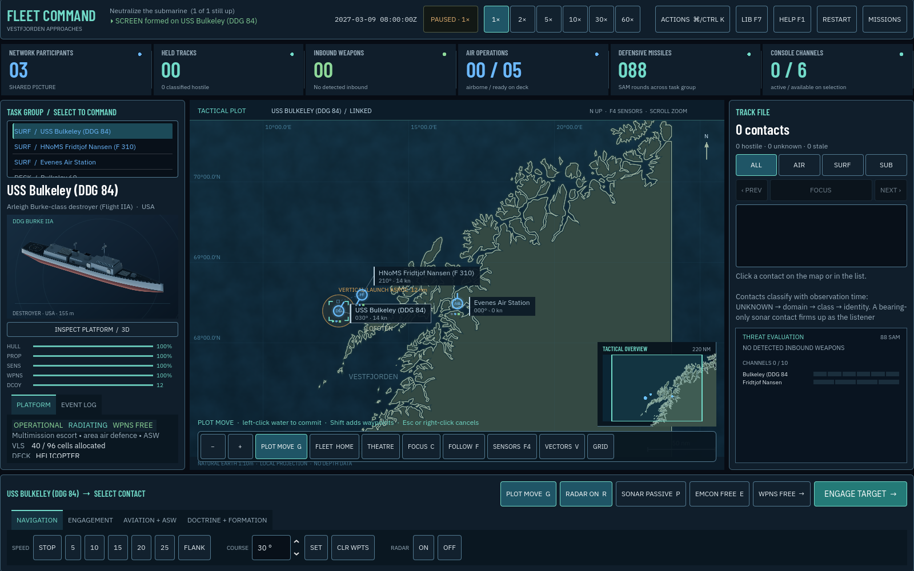

# M17 Command Deck UX — 11 September 2026

## Outcome

This pass shortens the core play loop to **notice → focus → act → acknowledge** while preserving the simulation/presentation boundary. UI code still emits ordinary `Order` objects through `Main`; no sensor, weapon, AI, or truth-visibility rules were weakened for convenience.

## Map and picture management

- **Plot Move (G)** is a persistent, visible interaction mode. Left-click commits, Shift chains waypoints, and Escape or right-click cancels. The live route preview shows the intended leg and turns red beyond the first land contact.
- Right-drag is now only navigation; it cannot accidentally issue a move on open water. Option-drag, middle-drag, high-resolution wheel input, and macOS pan/magnify gestures are supported.
- The **Tactical Overview** is built from own units and the reference console's visible `Track` objects only. It shows the main viewport and supports click/drag recenter plus wheel zoom without revealing hostile unit truth.
- **Focus** frames a single platform, a spread group, or a shooter-target pair appropriately. **Follow**, **Fleet**, and **Theatre** provide clear camera-recovery paths.
- Map layer buttons and shortcuts share one state path, so Sensors, Vectors, Trails, Terrain, Key, and Grid cannot disagree with their controls.
- Friendly command brackets use cyan; the hooked target uses amber/red. Header and symbol-key pixels no longer fall through into map commands.

## Actions and gameplay flow

- A persistent command dock surfaces Plot Move, radar, sonar, EMCON, weapons posture, and Engagement before the specialist tabs. ON/OFF and mixed group states remain visible.
- The track file orders held contacts by identity, freshness, distance, then stable ID. Visible Previous/Next controls and N / Shift-N cycle and focus the stack.
- Hooking a contact opens the engagement solution, preserving the existing legal-shot, range, channel, and time-of-flight explanation.
- Every manual group order gets an outcome receipt with accepted/refused counts. Capability mismatches, specialist-system rejections, and rejected moves are no longer reported as successes or left silent.
- The inbound banner is a real button: it includes the earliest time to impact and focuses the most urgent detected weapon and threatened platform.
- The Actions palette (Command-K / Control-K) searches labels, descriptions, states, shortcuts, and disabled reasons. It is fully operable with arrows, Enter, Escape, and Tab focus navigation.
- Mission, briefing, editor, gallery, report, and palette surfaces isolate their keyboard input from the live map. Closing a non-terminal modal restores the simulation's previous pause state.

## Accessibility decisions

- Primary interactive targets use at least 44 × 44 logical design pixels at the 1,600 × 1,000 reference canvas; secondary controls use at least 38 logical pixels. Godot uniformly scales that canvas in smaller windows, so physical targets shrink at 1,152 × 720; full keyboard access and focus treatment remain available there.
- Previously mouse-only buttons, lists, toggles, menu controls, editor controls, and report actions now participate in keyboard focus.
- Long briefing and after-action text can receive focus and scroll from the keyboard, while modal focus cycles stay inside the active surface.
- Cyan focus borders, stronger neutral borders, selected-row contrast, non-colour identity shapes, explicit text states, and action descriptions reinforce meaning beyond colour alone.
- Tab remains reserved for standard focus traversal; priority contacts use N / Shift-N and visible buttons.
- Every palette action exposes its current state or a plain-language reason when unavailable.

## Validation

- **224 tests passed, 0 failed** in Godot 4.7.2, including 16 M17 regressions for priority ordering/wrap, overview transform round trips, layer synchronization, selection-state normalization, move-mode arming/cancel and mixed-platform terrain legality, unobstructed fit geometry, filtered contact cycling, ON/OFF/MIXED action state, stowed-aircraft gating, downstream execution receipts, and palette filtering/activation.
- Native command deck inspected at **1,600 × 1,000** and in a **1,152 × 720 scaled laptop window**. The smaller-window capture confirms that the complete toolbar, overview, track controls, command dock, and navigation controls remain present without horizontal clipping; it is a uniform scale check, not a claim of 44 physical pixels at that size.
- Native Actions-palette capture verifies the dimmed modal, search focus, result count, enabled/disabled presentation, current state, shortcuts, detail text, and close action.
- The native integration smoke passes **24 checks** covering gallery interaction/render lifecycle, mission-menu focus isolation, palette focus and pause restoration, and briefing pause/restore behavior.
- The rebuilt Web package was served locally and exercised through mission selection, briefing, Take Command, and the Actions palette. The WebGL command deck rendered correctly and the browser console contained no warnings or errors.
- `git diff --check` passes. The Web `.pck` was rebuilt from this source against the repository's existing Godot 4.7.2 web runtime (47,909,508 bytes; SHA-256 `9fda562e5016426ebabb9dcbc679bf2eff155fd1ef7ade4bc4192c7b858fbcc6`).

The test runner still reports the pre-existing reference-cycle cleanup warning at shutdown (561 ObjectDB instances and 132 resources in the full suite); all assertions pass.
