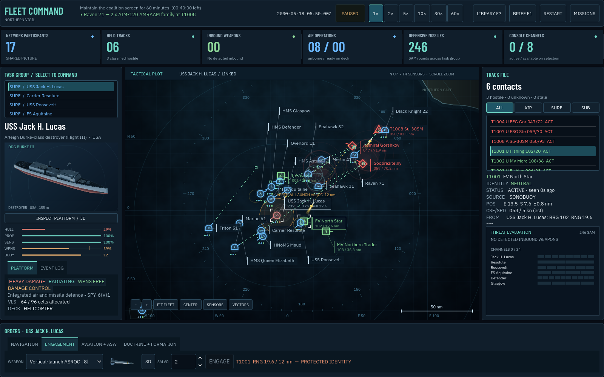
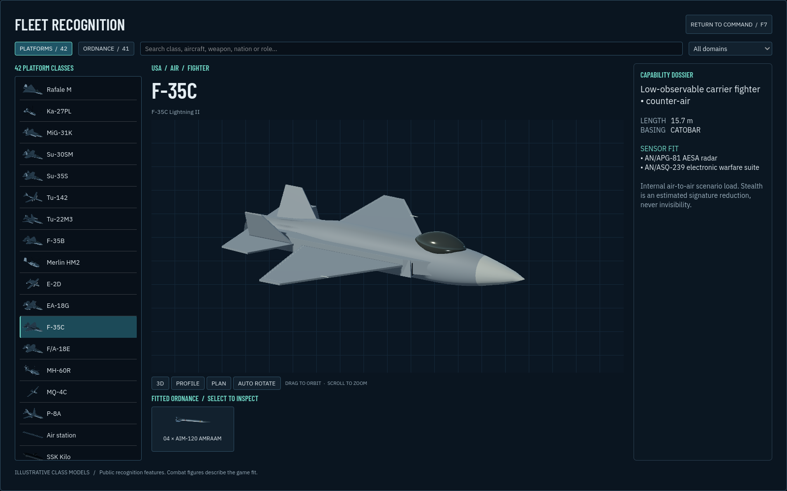
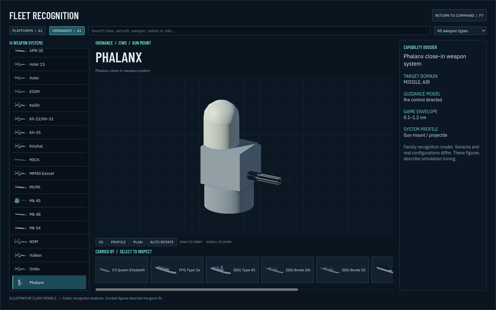
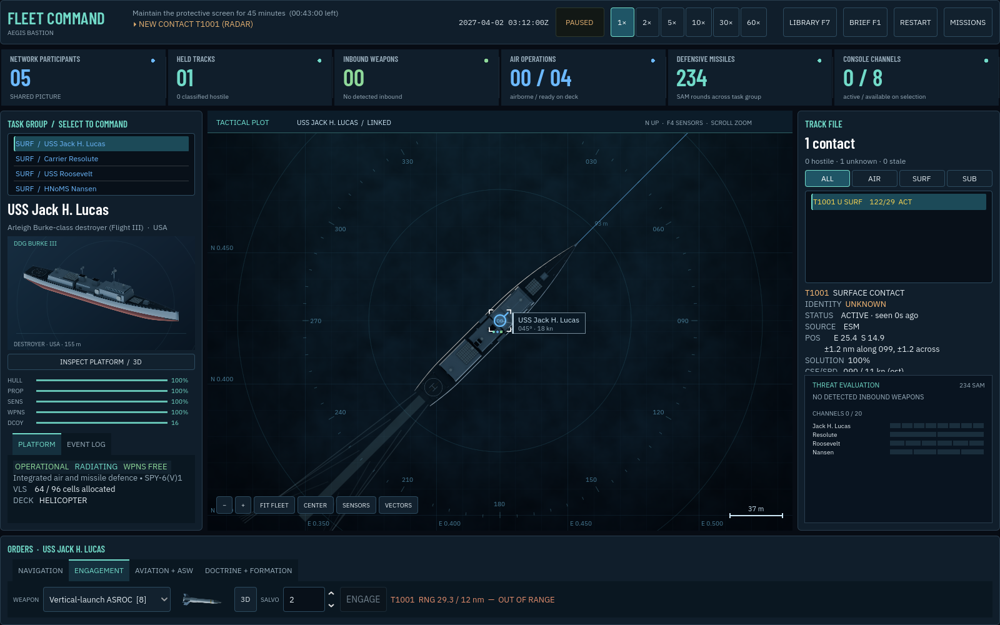
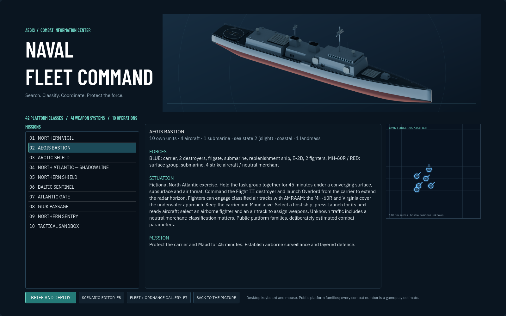

# M14 visual release

The fleet now has 83 original, inspectable models: 42 ships, aircraft, submarines and shore platforms, plus 41 weapon systems. The gallery connects platforms, their loadouts and the platforms carrying each weapon. The command display uses colour recognition cards and plans, dedicated fonts, clearer watch/readiness information and direct inspection controls.

## Verification

- **190 tests pass.** Existing movement, detection, tracking, combat, aviation, damage, mission, terrain and save-data checks remain green. Asset tests load all 83 models, validate normalized bounds and material budgets, check beauty/thumbnail coverage and verify ship/aircraft plan proportions. Additional tests cover close-scale labels and the privacy of observed weapon trails.
- **18 native UI integration checks pass.** Search and empty results, loadout navigation, model loading, profile/plan presets, drag orbit, zoom limits, reset, tall-model framing, pause restoration and hidden-viewport shutdown are exercised in the actual application tree.
- **The exported game package passes the same 18 UI checks.** It was launched with the native Godot engine from an empty directory using `--main-pack`, so the checks use the packaged resources. Ship, aircraft, gun and close-zoom screenshots were captured from that package without script or resource-loading errors.
- **Web export succeeds.** The PCK is approximately 31 MiB; the WebAssembly engine is approximately 38 MiB. The browser-specific runtime was not revalidated. An earlier isolated Chrome launch was rejected by automatic approval review because of an account usage limit; native package validation is not a claim of browser verification.
- The full catalogue remains modest: the largest mesh has 23,196 triangles, each asset stays within 20 material surfaces, lists use 240 × 128 thumbnails, and the 3D viewport stops updating when hidden.

Existing shutdown reference-cycle warnings remain in the simulation/test harness. No weapon performance, guidance or damage parameters changed in this visual release.

## Views

## Controls

Open F7 or use **Inspect Platform / 3D** on the selected unit. Drag to orbit, wheel to zoom, double-click to reset, and use the profile/plan or auto-rotate controls. Click a loadout card to inspect that weapon, or a carrying-platform card to return. F7/Escape closes the gallery and restores the mission's prior pause state.

The map has zoom, fit, centre, sensor and velocity-vector buttons. Velocity vectors normally appear for selected units/tracks; **Vectors** shows all 30-minute predictions. At close scale the scale bar and range-ring labels use metres. Contact and fleet lists preserve scroll position during refreshes. The map's knowledge rules still apply: the gallery never identifies an unknown contact, and a weapon trail begins only with an observation on the current console.
